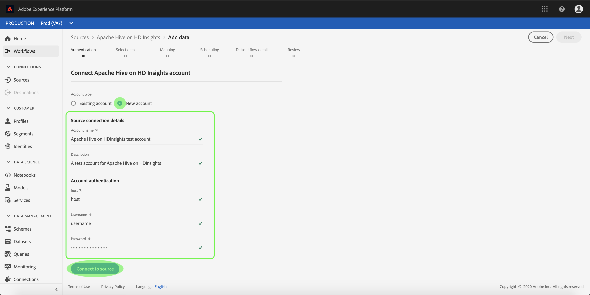

# 在UI中的Azure HDInsights源连接器上创建Apache Hive

> [!NOTE]
> Azure HDInsights连接器上的Apache Hive处于测试阶段。 功能和文档可能会发生更改。

Adobe Experience Platform中的源连接器提供按计划收集外部源数据的能力。 本教程提供了在Azure HDInsights源连接器上使用平台用户界面创建Apache Hive的步骤。

## 入门指南

本教程需要对Adobe Experience Platform的以下组件有充分的了解：

* [体验数据模型(XDM)系统](../../../../../xdm/home.md): Experience Platform组织客户体验数据的标准化框架。
   * [模式合成基础](../../../../../xdm/schema/composition.md): 了解XDM模式的基本构件，包括模式构成的主要原则和最佳做法。
   * [模式编辑器教程](../../../../../xdm/tutorials/create-schema-ui.md): 了解如何使用模式编辑器UI创建自定义模式。
* [实时客户用户档案](../../../../../profile/home.md): 基于来自多个来源的聚集数据提供统一、实时的消费者用户档案。

如果您已经有有效的配置单元连接，您可以跳过此文档的其余部分，继续学习有关配置 [数据流的教程](../../dataflow/databases.md)

### 收集所需的凭据

要在平台上访问您的Hive帐户，必须提供以下值：

| 凭据 | 描述 |
| ---------- | ----------- |
| `host` | 配置服务器的IP地址或主机名。 |
| `username` | 用于访问Hive服务器的用户名。 |
| `password` | 与用户对应的口令。 |

有关入门的详细信息，请参 [阅此配置文档](https://cwiki.apache.org/confluence/display/Hive/Tutorial#Tutorial-GettingStarted)。

## 连接您的配置单元帐户

收集所需凭据后，您可以按照以下步骤创建新的Hive帐户以连接到平台。

登录到 <a href="https://platform.adobe.com" target="_blank">Adobe Experience Platform</a> ，然后从左 **侧导航栏** 中 *选择“源* ”以访问“源”工作区。 “目 *录* ”屏幕显示您可以为其创建入站帐户的各种源，每个源显示与它们关联的现有帐户和数据集流的数量。

您可以从屏幕左侧的目录中选择适当的类别。 或者，您也可以使用搜索选项找到要使用的特定源。

在“数 *据库* ”类别下 **，选** 择“配置单元”以在屏幕右侧显示一个信息栏。 信息栏提供所选源的简短描述以及与源或视图其文档的选项。 要创建新的入站连接，请选择“ **连接源”**。

此时 *将显示“连接到配置* ”页面。 在此页上，您可以使用新凭据或现有凭据。

### 新帐户

如果您使用新凭据，请选择“ **新帐户**”。 在显示的输入表单上，提供名称、可选说明和配置单凭据的连接。 完成后，选 **择** Connect，然后允许一段时间建立新帐户。

### 现有帐户

要连接现有帐户，请选择要连接的配置单元帐户，然后选择下 **一步** 以继续。

## 后续步骤

按照本教程，您已建立了与您的Hive帐户的连接。 您现在可以继续阅读下一个教程， [并配置数据流以将数据引入平台](../../dataflow/databases.md)。