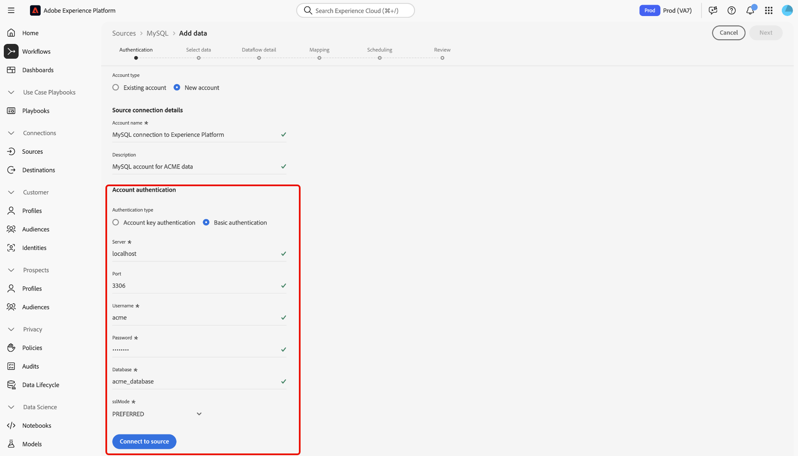
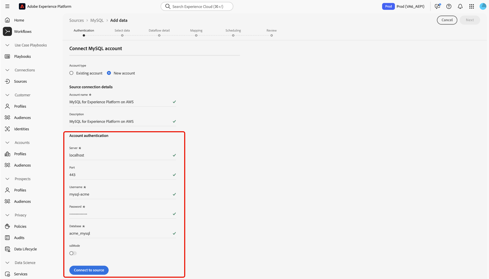

# 在用户界面中创建[!DNL MySQL]源连接

阅读本指南，了解如何使用Experience Platform用户界面中的源工作区将您的[!DNL MySQL]数据库连接到Adobe Experience Platform。

## 快速入门

本教程需要对以下Adobe Experience Platform组件有一定的了解：

* [[!DNL Experience Data Model (XDM)] 系统](../../../../../xdm/home.md)： Experience Platform用于组织客户体验数据的标准化框架。
   * [架构组合的基础知识](../../../../../xdm/schema/composition.md)：了解XDM架构的基本构建块，包括架构组合中的关键原则和最佳实践。
   * [架构编辑器教程](../../../../../xdm/tutorials/create-schema-ui.md)：了解如何使用架构编辑器UI创建自定义架构。
* [[!DNL Real-Time Customer Profile]](../../../../../profile/home.md)：根据来自多个源的汇总数据，提供统一的实时使用者个人资料。

如果您已经有[!DNL MySQL]连接，则可以跳过本文档的其余部分，并转到有关[配置数据流](../../dataflow/databases.md)的教程。

### 收集所需的凭据

有关身份验证的信息，请阅读[[!DNL MySQL] 概述](../../../../connectors/databases/mysql.md#prerequisites)。

## 导航源目录

在Experience Platform UI中，从左侧导航中选择&#x200B;**[!UICONTROL 源]**&#x200B;以访问&#x200B;*[!UICONTROL 源]*&#x200B;工作区。 选择类别或使用搜索栏查找您的源。

若要连接到[!DNL MySQL]，请转到&#x200B;*[!UICONTROL 数据库]*&#x200B;类别，选择&#x200B;**[!UICONTROL MySQL]**&#x200B;源卡，然后选择&#x200B;**[!UICONTROL 设置]**。

>[!TIP]
>
>当给定的源尚未具有经过身份验证的帐户时，源目录中的源会显示&#x200B;**[!UICONTROL 设置]**&#x200B;选项。 创建经过身份验证的帐户后，此选项将更改为&#x200B;**[!UICONTROL 添加数据]**。

## 使用现有帐户 {#existing}

若要使用现有帐户，请选择&#x200B;**[!UICONTROL 现有帐户]**，然后选择要使用的[!DNL MySQL]帐户。

## 创建新帐户 {#new}

要创建新帐户，请选择&#x200B;**[!UICONTROL 新帐户]**，然后提供名称并选择性地为您的帐户添加描述。

### 连接到Azure上的Experience Platform {#azure}

您可以使用帐户密钥或基本身份验证将[!DNL MySQL]数据库连接到Azure上的Experience Platform。

>[!BEGINTABS]

>[!TAB 帐户密钥身份验证]

若要使用帐户密钥身份验证，请选择&#x200B;**[!UICONTROL 帐户密钥身份验证]**，提供您的[连接字符串](../../../../connectors/databases/mysql.md#azure)，然后选择&#x200B;**[!UICONTROL 连接到源]**。

>[!TAB 基本身份验证]

若要使用基本身份验证，请选择&#x200B;**[!UICONTROL 基本身份验证]**，提供[身份验证凭据](../../../../connectors/databases/mysql.md#azure)的值，然后选择&#x200B;**[!UICONTROL 连接到源]**。

>[!ENDTABS]

### 连接到Amazon Web Services上的Experience Platform (AWS) {#aws}

>[!AVAILABILITY]
>
>本节适用于在Amazon Web Services (AWS)上运行的Experience Platform的实施。 在AWS上运行的Experience Platform当前仅对有限数量的客户可用。 要了解有关支持的Experience Platform基础架构的更多信息，请参阅[Experience Platform multi-cloud概述](../../../../../landing/multi-cloud.md)。

要创建新的[!DNL MySQL]帐户并连接到AWS上的Experience Platform，请确保您处于VA6沙盒中，然后提供身份验证所需的[凭据](../../../../connectors/databases/mysql.md#aws)。

## 为[!DNL MySQL]数据创建数据流

现在您已成功连接[!DNL MySQL]数据库，您现在可以[创建数据流并将数据库中的数据摄取到Experience Platform](../../dataflow/databases.md)。
