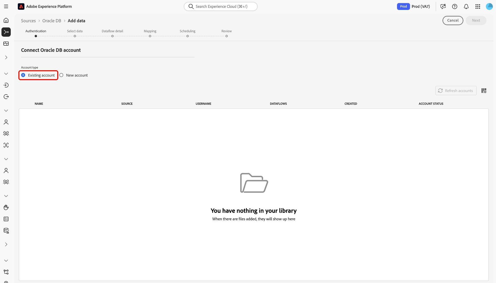

# 在UI中创建Oracle源连接器

Adobe Experience Platform中的源连接器提供按计划收集外部源数据的能力。 本教程提供了使用平台用户界面创建Oracle源连接器的步骤。

## 入门指南

本教程需要对Adobe Experience Platform的以下组件有充分的了解：

* [体验数据模型(XDM)系统](../../../../../xdm/home.md): Experience Platform组织客户体验数据的标准化框架。
   * [模式合成基础](../../../../../xdm/schema/composition.md): 了解XDM模式的基本构件，包括模式构成的主要原则和最佳做法。
   * [模式编辑器教程](../../../../../xdm/tutorials/create-schema-ui.md): 了解如何使用模式编辑器UI创建自定义模式。
* [实时客户用户档案](../../../../../profile/home.md): 基于来自多个来源的聚集数据提供统一、实时的消费者用户档案。

如果您已经有有效的Oracle DB连接，您可以跳过此文档的其余部分，继续学习有关配置 [数据流的教程](../../dataflow/databases.md)。

### 收集所需的凭据

要在Platform上访问您的Oracle帐户，必须提供以下值：

| 凭据 | 描述 |
| ---------- | ----------- |
| `connectionString` | 用于连接到Oracle的连接字符串。 Oracle连接字符串模式为： `Host=<host>;Port=<port>;Sid=<sid>;User Id=<username>;Password=<password>`. |
| `connectionSpec.id` | 创建连接所需的唯一标识符。 Oracle的连接规范ID为 `d6b52d86-f0f8-475f-89d4-ce54c8527328`。 |

有关快速入门的详细信息，请参 [阅此Oracle文档](https://docs.oracle.com/database/121/ODPNT/featConnecting.htm#ODPNT199)。

## 连接您的Oracle帐户

收集所需凭据后，您可以按照以下步骤创建新的Oracle帐户以连接到平台。

登录到 [Adobe Experience Platform](https://platform.adobe.com) ，然后从左 **[!UICONTROL 侧导航栏]** 中 *[!UICONTROL 选择“源]* ”以访问“源”工作区。 “目 *[!UICONTROL 录]* ”屏幕显示您可以为其创建入站帐户的各种源，每个源显示与它们关联的现有帐户和数据集流的数量。

您可以从屏幕左侧的目录中选择适当的类别。 或者，您也可以使用搜索选项找到要使用的特定源。

在“数 *据库* ”类别 **[!UICONTROL 下]** ，选择Oracle DB **，然** 后单击+图标(+)以创建新的Oracle连接器。

此时 *[!UICONTROL 将显示“连接到Oracle]* DB”页。 在此页上，您可以使用新凭据或现有凭据。

### 新帐户

如果您使用新凭据，请选择“ **[!UICONTROL 新帐户]**”。 在显示的输入表单上，提供一个名称、一个可选说明和您的Oracle凭据的连接。 完成后，选 **[!UICONTROL 择]** Connect，然后允许一段时间建立新帐户。

### 现有帐户

要连接现有帐户，请选择要连接的Oracle帐户，然后选择下 **[!UICONTROL 一步]** 以继续。

## 后续步骤

按照本教程，您已建立了与Oracle帐户的连接。 您现在可以继续阅读下一个教程， [并配置数据流以将数据引入平台](../../dataflow/databases.md)。