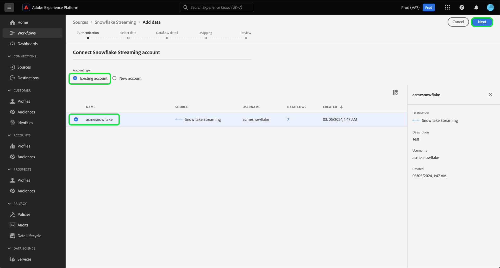

# 使用UI将数据从[!DNL Snowflake]数据库流式传输到Experience Platform

按照本指南了解如何使用用户界面将数据从[!DNL Snowflake]数据库流式传输到Adobe Experience Platform。

## 快速入门

本教程需要对以下Experience Platform组件有一定的了解：

* [[!DNL Experience Data Model (XDM)] 系统](../../../../../xdm/home.md)： [!DNL Experience Platform]用于组织客户体验数据的标准化框架。
   * [架构组合的基础知识](../../../../../xdm/schema/composition.md)：了解XDM架构的基本构建块，包括架构组合中的关键原则和最佳实践。
   * [架构编辑器教程](../../../../../xdm/tutorials/create-schema-ui.md)：了解如何使用架构编辑器UI创建自定义架构。
* [[!DNL Real-Time Customer Profile]](../../../../../profile/home.md)：根据来自多个源的汇总数据，提供统一的实时使用者个人资料。

### 身份验证

阅读 [!DNL Snowflake] 流式数据](../../../../connectors/databases/snowflake-streaming.md)的[必备项设置指南，以了解从[!DNL Snowflake]将流式数据摄取到Experience Platform之前需要完成的步骤的相关信息。

## 使用[!DNL Snowflake Streaming]源将[!DNL Snowflake]数据流式传输到Experience Platform

在Experience Platform UI中，从左侧导航中选择&#x200B;**[!UICONTROL 源]**&#x200B;以访问[!UICONTROL 源]工作区。 您可以从屏幕左侧的目录中选择相应的类别。 或者，您可以使用搜索选项查找您要使用的特定源。

在&#x200B;*数据库*&#x200B;类别下，选择&#x200B;**[!DNL Snowflake Streaming]**，然后选择&#x200B;**[!UICONTROL 添加数据]**。

>[!TIP]
>
>源目录中没有经过身份验证的帐户的源将显示&#x200B;**[!UICONTROL 设置]**&#x200B;选项。 一旦存在经过身份验证的帐户，此选项将更改为&#x200B;**[!UICONTROL 添加数据]**。

此时会显示&#x200B;**[!UICONTROL 连接Snowflake流帐户]**&#x200B;页面。 在此页上，您可以使用新的或现有的身份证明。

>[!BEGINTABS]

>[!TAB 创建新帐户]

要创建新帐户，请选择&#x200B;**[!UICONTROL 新帐户]**，并提供名称、可选描述和您的凭据。

完成后，选择&#x200B;**[!UICONTROL 连接到源]**，然后留出一些时间来建立新连接。

| 凭据 | 描述 |
| --- | --- |
| 帐户 | [!DNL Snowflake]帐户的名称。 有关帐户名称的约定，请阅读[[!DNL Snowflake Streaming] 身份验证指南](../../../../connectors/databases/snowflake-streaming.md#gather-required-credentials)。 |
| 仓库 | [!DNL Snowflake]仓库的名称。 仓库管理[!DNL Snowflake]中查询的执行。 每个[!DNL Snowflake]仓库彼此独立，必须单独访问才能将数据导入Experience Platform。 |
| 数据库 | [!DNL Snowflake]数据库的名称。 该数据库包含您要带入Experience Platform的数据。 |
| 架构 | （可选）与您的[!DNL Snowflake]帐户关联的数据库架构。 |
| 用户名 | [!DNL Snowflake]帐户的用户名。 |
| 密码 | [!DNL Snowflake]帐户的密码。 |
| 角色 | （可选）可以为给定连接提供给用户的自定义角色。 如果未提供，此值默认为`public`。 |

有关帐户创建的更多信息，请参阅[!DNL Snowflake Streaming]概述中有关[配置角色设置](../../../../connectors/databases/snowflake-streaming.md#configure-role-settings)的部分。

>[!TAB 使用现有帐户]

若要使用现有帐户，请选择&#x200B;**[!UICONTROL 现有帐户]**，然后从现有帐户目录中选择所需的帐户。

选择&#x200B;**[!UICONTROL 下一步]**&#x200B;以继续。

>[!ENDTABS]

## 选择数据 {#select-data}

>[!IMPORTANT]
>
>* 时间戳列必须存在于源表中，才能创建流数据流。 Experience Platform需要时间戳才能知道何时摄取数据以及何时对增量数据进行流式处理。 您可以为现有连接逆向添加时间戳列并创建新数据流。
>
>* 确保示例源数据文件中的数据字段的大小写符合[!DNL Snowflake]关于标识符的大小写解析的指南。 有关详细信息，请阅读标识符大小写](https://docs.snowflake.com/en/sql-reference/identifiers-syntax#label-identifier-casing)上的[[!DNL Snowflake] 文档。

出现[!UICONTROL 选择数据]步骤。 在此步骤中，您必须选择要导入到Experience Platform中的数据，配置时间戳和时区，并提供用于摄取原始数据的示例源数据文件。

使用屏幕左侧的数据库目录，并选择要导入到Experience Platform的表。

接下来，选择表的时间戳列类型。 您可以在两种类型的时间戳列之间进行选择： `TIMESTAMP_NTZ`或`TIMESTAMP_LTZ`。 如果选择列类型为`TIMESTAMP_NTZ`，则还必须提供时区。 列应具有非null约束。 有关详细信息，请阅读有关[限制和常见问题解答](../../../../connectors/databases/snowflake-streaming.md#limitations-and-frequently-asked-questions)的部分。

您还可以在此步骤中配置回填设置。 回填可确定最初摄取的数据。 如果启用了回填，则指定路径中的所有当前文件将在第一次计划摄取期间摄取。 如果没有，则只摄取在第一次引入运行与开始时间之间加载的文件。 将不会摄取在开始时间之前加载的文件。

选择&#x200B;**[!UICONTROL 回填]**&#x200B;切换开关以启用回填。

最后，选择&#x200B;**[!UICONTROL 选择文件]**&#x200B;以上传样本源数据以帮助创建映射集，该映射集将在以后的步骤中用于将原始数据映射到Experience Data Model (XDM)。

完成后，选择&#x200B;**[!UICONTROL 下一步]**&#x200B;以继续。

## 提供数据集和数据流详细信息 {#provide-dataset-and-dataflow-details}

接下来，您必须提供有关数据集和数据流的信息。

### 数据集详细信息 {#dataset-details}

数据集是用于数据集合的存储和管理结构，通常是表格，其中包含架构（列）和字段（行）。成功引入Experience Platform的数据将作为数据集保留在数据湖中。 在此步骤中，您可以创建新数据集或使用现有数据集。

>[!BEGINTABS]

>[!TAB 使用新数据集]

要使用新数据集，请选择&#x200B;**[!UICONTROL 新数据集]**，然后为您的数据集提供名称和可选描述。 您还必须选择数据集所遵循的体验数据模型(XDM)架构。

| 新数据集详细信息 | 描述 |
| --- | --- |
| 输出数据集名称 | 新数据集的名称。 |
| 描述 | （可选）新数据集的简短概述。 |
| 架构 | 您的组织中存在的架构的下拉列表。 您还可以在源配置过程之前创建自己的架构。 有关详细信息，请参阅[在UI](../../../../../xdm/tutorials/create-schema-ui.md)中创建XDM架构的指南。 |

>[!TAB 使用现有数据集]

如果您已经有一个现有数据集，请选择&#x200B;**[!UICONTROL 现有数据集]**，然后使用&#x200B;**[!UICONTROL 高级搜索]**&#x200B;选项查看组织中所有数据集的窗口，包括其各自的详细信息，例如是否允许将这些数据集摄取到Real-time Customer Profile。

>[!ENDTABS]

+++选择相关步骤以启用配置文件摄取、错误诊断和部分摄取。

如果您的数据集启用了实时客户个人资料，那么在此步骤中，您可以切换&#x200B;**[!UICONTROL 个人资料数据集]**&#x200B;以启用您的数据以进行个人资料摄取。 您还可以使用此步骤启用&#x200B;**[!UICONTROL 错误诊断]**&#x200B;和&#x200B;**[!UICONTROL 部分摄取]**。

* **[!UICONTROL 错误诊断]**：选择&#x200B;**[!UICONTROL 错误诊断]**&#x200B;以指示源生成错误诊断，以便以后在监视数据集活动和数据流状态时可以引用这些诊断。
* **[!UICONTROL 部分摄取]**：部分批次摄取是摄取包含错误的数据的能力，最多可摄取特定可配置阈值。 此功能允许您成功地将所有准确的数据提取到Experience Platform中，同时将所有不正确的数据与有关其无效原因的信息单独进行批处理。

+++

### 数据流详细信息 {#dataflow-details}

配置数据集后，您必须提供有关数据流的详细信息，包括名称、可选描述和警报配置。

| 数据流配置 | 描述 |
| --- | --- |
| 数据流名称 | 数据流的名称。  默认情况下，这将使用正在导入的文件的名称。 |
| 描述 | （可选）数据流的简短说明。 |
| 警报 | Experience Platform可生成用户可以订阅的基于事件的警报。 这些选项需要一个正在运行的数据流来触发它们。 有关详细信息，请阅读[警报概述](../../alerts.md) <ul><li>**源数据流运行开始**：选择此警报以在数据流运行开始时接收通知。</li><li>**源数据流运行成功**：选择此警报以在数据流结束且没有任何错误时接收通知。</li><li>**源数据流运行失败**：选择此警报以在数据流运行结束时发生任何错误时接收通知。</li></ul> |

完成后，选择&#x200B;**[!UICONTROL 下一步]**&#x200B;以继续。

## 将字段映射到XDM架构 {#mapping}

出现[!UICONTROL 映射]步骤。 使用映射界面将源数据映射到相应的架构字段，然后再将该数据摄取到Experience Platform，然后选择&#x200B;**[!UICONTROL 下一步]**。 有关如何使用映射界面的详细指南，请阅读[数据准备UI指南](../../../../../data-prep/ui/mapping.md)以了解更多信息。

## 查看您的数据流 {#review}

数据流创建过程的最后一步是在执行数据流之前对其进行检查。 使用&#x200B;**[!UICONTROL 查看]**&#x200B;步骤可在新数据流运行之前查看其详细信息。 详细信息按以下类别分组：

* **连接**：显示源类型、所选源文件的相关路径以及该源文件中的列数。
* **分配数据集和映射字段**：显示要将源数据摄取到哪个数据集，包括数据集所遵循的架构。

查看数据流后，选择&#x200B;**[!UICONTROL 完成]**，然后等待一些时间来创建数据流。

## 后续步骤

通过完成本教程，您已成功为[!DNL Snowflake]数据创建了流数据流。 有关其他资源，请阅读下面的文档。

### 监测数据流

创建数据流后，您可以监视通过它摄取的数据，以查看有关摄取率、成功和错误的信息。 有关如何监视流数据流的详细信息，请访问有关[在UI中监视流数据流的教程](../../monitor-streaming.md)。

### 更新您的数据流

要更新数据流计划、映射和常规信息的配置，请访问有关[在UI中更新源数据流的教程](../../update-dataflows.md)。

### 删除您的数据流

您可以删除不再必需的数据流或使用&#x200B;**[!UICONTROL 数据流]**&#x200B;工作区中提供的&#x200B;**[!UICONTROL 删除]**&#x200B;功能错误地创建的数据流。 有关如何删除数据流的详细信息，请访问有关[在UI中删除数据流](../../delete.md)的教程。
