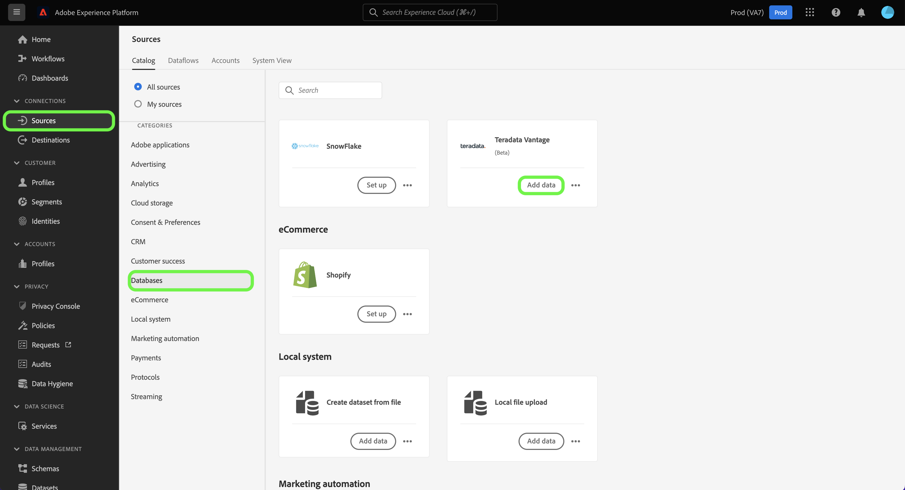
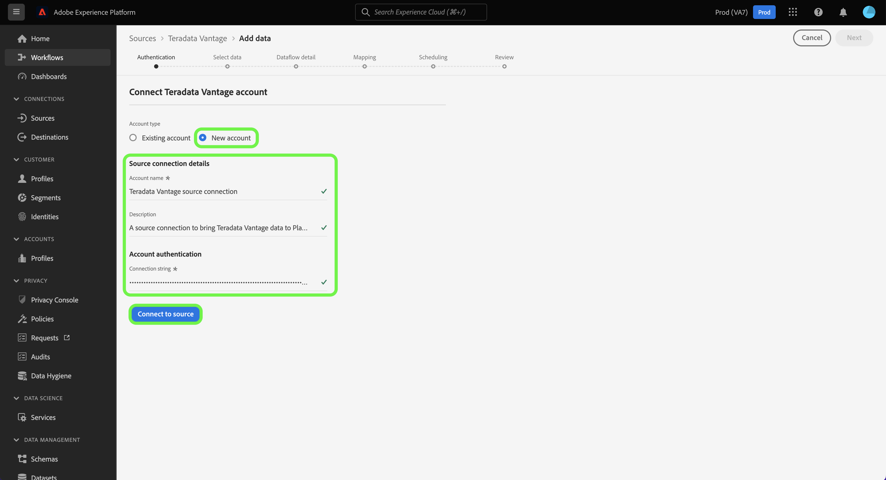

# 在用户界面中创建[!DNL Teradata Vantage]源连接

本教程提供了使用Adobe Experience Platform用户界面创建[!DNL Teradata Vantage]源连接器的步骤。

## 快速入门

本教程需要对以下Experience Platform组件有一定的了解：

* [源](../../../../home.md)： Experience Platform允许从各种源摄取数据，同时让您能够使用Experience Platform服务来构建、标记和增强传入数据。
* [沙盒](../../../../../sandboxes/home.md)： Experience Platform提供了将单个Experience Platform实例划分为多个单独的虚拟环境的虚拟沙盒，以帮助开发和改进数字体验应用程序。

### 收集所需的凭据

要在Experience Platform上访问您的[!DNL Teradata Vantage]帐户，必须提供以下身份验证值：

| 凭据 | 描述 |
| ---------- | ----------- |
| 连接字符串 | 连接字符串是一个字符串，它提供有关数据源以及如何连接到该数据源的信息。 [!DNL Teradata Vantage]的连接字符串模式为`DBCName={SERVER};Uid={USERNAME};Pwd={PASSWORD}`。 |

有关入门的详细信息，请参阅此[[!DNL Teradata Vantage] 文档](https://docs.teradata.com/r/Teradata-VantageTM-Advanced-SQL-Engine-Security-Administration/July-2021/Setting-Up-the-Administrative-Infrastructure/Controlling-Access-to-the-Operating-System/Working-with-OS-Level-Security-Options)。

## 连接您的[!DNL Teradata Vantage]帐户

在Experience Platform UI中，从左侧导航中选择&#x200B;**[!UICONTROL 源]**&#x200B;以访问[!UICONTROL 源]工作区。 您可以从屏幕左侧的目录中选择相应的类别。 或者，您可以使用搜索选项查找您要使用的特定源。

在[!UICONTROL 数据库]类别下，选择&#x200B;**[!UICONTROL Teradata优势]**，然后选择&#x200B;**[!UICONTROL 设置]**。

>[!TIP]
>
>当给定的源尚未具有经过身份验证的帐户时，源目录中的源会显示&#x200B;**[!UICONTROL 设置]**&#x200B;选项。 一旦存在经过身份验证的帐户，此选项将更改为&#x200B;**[!UICONTROL 添加数据]**。

此时会显示&#x200B;**[!UICONTROL 连接到Teradata Vantage]**&#x200B;页面。 在此页上，您可以使用新凭据或现有凭据。

### 现有账户

若要连接现有帐户，请选择您要连接的[!DNL Teradata Vantage]帐户，然后选择&#x200B;**[!UICONTROL 下一步]**&#x200B;以继续。

### 新帐户

如果您正在使用新凭据，请选择&#x200B;**[!UICONTROL 新帐户]**。 在显示的输入表单上，提供名称、可选描述和您的[!DNL Teradata Vantage]凭据。 完成后，选择&#x200B;**[!UICONTROL 连接]**，然后留出一些时间来建立新连接。

## 后续步骤

通过学习本教程，您已建立与Teradata Vantage帐户的连接。 您现在可以继续下一教程，并[配置数据流以将数据导入Experience Platform](../../dataflow/databases.md)。
