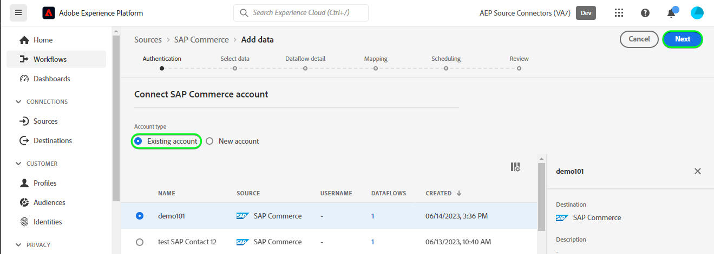

# 在用户界面中创建[!DNL SAP Commerce]源连接

以下教程将指导您完成使用Adobe Experience Platform用户界面创建[!DNL SAP Commerce]源连接以引入[[!DNL SAP] 订阅账单](https://www.sap.com/products/financial-management/subscription-billing.html)联系人和客户数据的步骤。

## 快速入门 {#getting-started}

本教程需要对以下Experience Platform组件有一定的了解：

* [[!DNL Experience Data Model (XDM)] 系统](../../../../../xdm/home.md)： [!DNL Experience Platform]用于组织客户体验数据的标准化框架。
   * [架构组合的基础知识](../../../../../xdm/schema/composition.md)：了解XDM架构的基本构建块，包括架构组合中的关键原则和最佳实践。
   * [架构编辑器教程](../../../../../xdm/tutorials/create-schema-ui.md)：了解如何使用架构编辑器UI创建自定义架构。
* [[!DNL Real-Time Customer Profile]](../../../../../profile/home.md)：根据来自多个源的汇总数据，提供统一的实时使用者个人资料。

如果您已经拥有有效的[!DNL SAP Commerce]帐户，则可以跳过本文档的其余部分，并转到有关[配置数据流](../../dataflow/ecommerce.md)的教程。

### 收集所需的凭据 {#gather-credentials}

为了将[!DNL SAP Commerce]连接到Experience Platform，您必须提供以下连接属性的值：

| 凭据 | 描述 |
| --- | --- |
| 客户端 ID | 服务键中`clientId`的值。 |
| 客户端密码 | 服务键中`clientSecret`的值。 |
| 令牌端点 | 服务键中`url`的值，它将类似于`https://subscriptionbilling.authentication.eu10.hana.ondemand.com`。 |
| 区域 | 您的数据中心位置。 该区域存在于`url`中，其值类似于`eu10`或`us10`。 例如，如果`url`是`https://eu10.revenue.cloud.sap/api`，您将需要`eu10`。 |

有关详细信息，请参阅[[!DNL SAP Commerce] 文档](https://help.sap.com/docs/CLOUD_TO_CASH_OD/987aec876092428f88162e438acf80d6/c5fcaf96daff4c7a8520188e4d8a1843.html)。

### 创建Experience Platform架构 {#create-platform-schema}

在创建[!DNL SAP Commerce]源连接之前，还必须确保首先创建一个Experience Platform架构以用于您的源。 有关如何创建架构的完整步骤，请参阅有关[创建Experience Platform架构](../../../../../xdm/schema/composition.md)的教程。

展开以下部分以查看模式示例。

+++ 查看架构示例

```
{
  "_extconndev": {
    "addresses": [
      {
        "addressUUID": "{ADDRESS_UUID}",
        "city": "Burnaby",
        "country": "Canada",
        "email": "chandni@acme.com",
        "houseNumber": "27",
        "isDefault": false,
        "phone": "123-456-7890",
        "postalCode": "V3J 1X9",
        "state": "British Columbia",
        "street": "Beresford"
      }
    ],
    "changedAt": "1687204041",
    "changedBy": "vero@acme.com",
    "contactNumber": "123-456-7980",
    "corporateInfo": {
      "company": "acme"
    },
    "createAt": "1687204041",
    "createdBy": "vero@acme.com",
    "customReferences": [
      {
        "id": "Sample value",
        "typeCode": "Sample value"
      }
    ],
    "customerNumber": "Sample value",
    "customerType": "Sample value",
    "defaultAddress": {
      "addressUUID": "Sample value",
      "city": "North Vancouver",
      "country": "Canada",
      "email": "chandni@acme.come",
      "houseNumber": "34",
      "isDefault": false,
      "phone": "123-456-7890",
      "postalCode": "V7H 2P1",
      "state": "British Columbia",
      "street": "Maple"
    },
    "externalObjectReferences": [
      {
        "externalId": "{EXTERNAL_ID}",
        "externalIdTypeCode": "{EXTERNAL_ID_TYPE_CODE}",
        "externalSystemId": "{EXTERNAL_SYSTEM_ID}"
      }
    ],
    "markets": [
      {
        "active": false,
        "country": "USA",
        "currency": "USD",
        "marketId": "Sample value",
        "priceinfo": {
          "incoterms": "{INCO_TERMS}",
          "incotermsLocation": "{INCO_TERMS_LOCATION}",
          "priceGroup": "{PRICE_GROUP}",
          "priceListType": "{PRICE_LIST_TYPE}"
        },
        "salesArea": {
          "distributionChannel": "{DISTRIBUTION_CHANNEL}",
          "division": "{DIVISION}",
          "salesOrganization": "{SALES_ORGANIZATION}"
        }
      }
    ],
    "personalInfo": {
      "firstName": "Chandni",
      "lastName": "Kaur"
    }
  },
  "_id": "/uri-reference",
  "_repo": {
    "createDate": "2004-10-23T12:00:00-06:00",
    "modifyDate": "2004-10-23T12:00:00-06:00"
  },
  "createdByBatchID": "/uri-reference",
  "modifiedByBatchID": "/uri-reference",
  "personID": "{PERSON_ID}",
  "repositoryCreatedBy": "kevin@acme.com",
  "repositoryLastModifiedBy": "kevin@acme.com"
}
```

+++

## 连接您的[!DNL SAP Commerce]帐户 {#connect-account}

在Experience Platform UI中，从左侧导航栏中选择&#x200B;**[!UICONTROL 源]**&#x200B;以访问[!UICONTROL 源]工作区。 [!UICONTROL Catalog]屏幕显示您可以用来创建帐户的各种源。

您可以从屏幕左侧的目录中选择相应的类别。 或者，您可以使用搜索选项查找您要使用的特定源。

在&#x200B;*电子商务*&#x200B;类别下，选择&#x200B;**[!UICONTROL SAP Commerce]**，然后选择&#x200B;**[!UICONTROL 添加数据]**。

具有SAP Commerce卡的目录

此时会显示&#x200B;**[!UICONTROL Connect SAP Commerce帐户]**&#x200B;页。 在此页上，您可以使用新凭据或现有凭据。

### 现有账户 {#existing-account}

要使用现有帐户，请选择要用于创建新数据流的[!DNL SAP Commerce]帐户，然后选择&#x200B;**[!UICONTROL 下一步]**&#x200B;以继续。



### 新帐户 {#new-account}

如果要创建新帐户，请选择&#x200B;**[!UICONTROL 新建帐户]**，然后提供名称、可选描述和凭据。 完成后，选择&#x200B;**[!UICONTROL 连接到源]**，然后留出一些时间来建立新连接。


### 选择数据 {#select-data}

最后，您必须选择要摄取到Experience Platform的对象类型。

| 对象类型 | 描述 |
| --- | --- |
| `Customers` | 具有订阅的实体。 |
| `Contacts` | 客户的联系详细信息。 |

>[!BEGINTABS]

>[!TAB 客户]

若要摄取客户数据，请选择&#x200B;**[!UICONTROL 客户]**&#x200B;作为您的对象类型，然后选择&#x200B;**[!UICONTROL 下一步]**。


>[!TAB 联系人]

若要摄取联系人数据，请选择&#x200B;**[!UICONTROL 联系人]**&#x200B;作为对象类型，然后选择&#x200B;**[!UICONTROL 下一步]**。


>[!ENDTABS]

## 后续步骤 {#next-steps}

通过学习本教程，您已建立与[!DNL SAP Commerce]帐户的连接。 您现在可以继续下一教程，并[配置数据流以将数据导入Experience Platform](../../dataflow/ecommerce.md)。

## 其他资源 {#additional-resources}

以下各节提供了在使用[!DNL SAP Commerce]源时可以参考的其他资源。

### 映射 {#mapping}

Experience Platform根据您选择的目标架构或数据集，为自动映射的字段提供智能推荐。 您可以手动调整映射规则以适合您的用例。 根据需要，您可以选择直接映射字段，或使用数据准备函数转换源数据以派生计算值或计算值。 有关使用映射器界面和计算字段的全面步骤，请参阅[数据准备UI指南](../../../../../data-prep/ui/mapping.md)。

数据流的映射配置将因架构和您选择要摄取的对象类型而异。

>[!BEGINTABS]

>[!TAB 客户]

对于客户数据，[!DNL SAP Commerce]使用[&#x200B; API的](https://api.sap.com/api/BusinessPartner_APIs/path/GET_customers)客户[和](https://api.sap.com/api/BusinessPartner_APIs/path/GET_relationships-customer-contacts)客户联系人关系[!DNL SAP Business Partners]端点检索数据

以下是客户数据的[!DNL SAP Commerce]数据流映射配置示例：

| 目标字段 | 描述 |
| --- | --- |
| `customerNumber` | 客户的编号。 |
| `corporateInfo` | 客户的编号。 |
| `customerType` | 客户类型。 |
| `createdAt` | 指示客户创建时间的时间戳。 |
| `changedAt` | 指示客户上次更新的时间戳。 |
| `markets[*].country` | 客户市场，作为数组对象进行检索。 |
| `addresses[*].email` | 与客户多个地址关联的电子邮件，检索为数组对象。 |
| `addresses[*].city` | 与客户多个地址关联的城市，检索为数组对象。 |
| `addresses[*].addressUUID` | 与客户多个地址关联的ID，作为数组对象进行检索。 |
| `externalObjectReferences[*].externalSystemId` | 附加数据，检索为数组对象。 |
| `externalObjectReferences[*].externalId` | 附加数据，检索为数组对象。 |
| `customReferences[*].id` | 附加数据，检索为数组对象。 |
| `customReferences[*].typeCode` | 附加数据，检索为数组对象。 |


>[!TAB 联系人]

对于联系人数据，[!DNL SAP Commerce]使用[&#x200B; API的](https://api.sap.com/api/BusinessPartner_APIs/path/GET_contacts)联系人[!DNL SAP Business Partners]端点检索数据。

以下是联系数据的[!DNL SAP Commerce]数据流映射配置示例：

| 目标字段 | 描述 |
| --- | --- |
| `contactNumber` | 联系人的电话号码。 |
| `createdAt` | 指示联系人创建时间的时间戳。 |
| `changedAt` | 指示上次更新联系人的时间的时间戳。 |
| `personalInfo.lastName` | 联系人的姓氏。 |
| `personalInfo.firstName` | 联系人的名字。 |
| `externalObjectReferences[*].externalSystemId` | 附加数据，检索为数组对象。 |
| `externalObjectReferences[*].externalId` | 附加数据，检索为数组对象。 |
| `externalObjectReferences[*].externalIdTypeCode` | 附加数据，检索为数组对象。 |


>[!ENDTABS]
