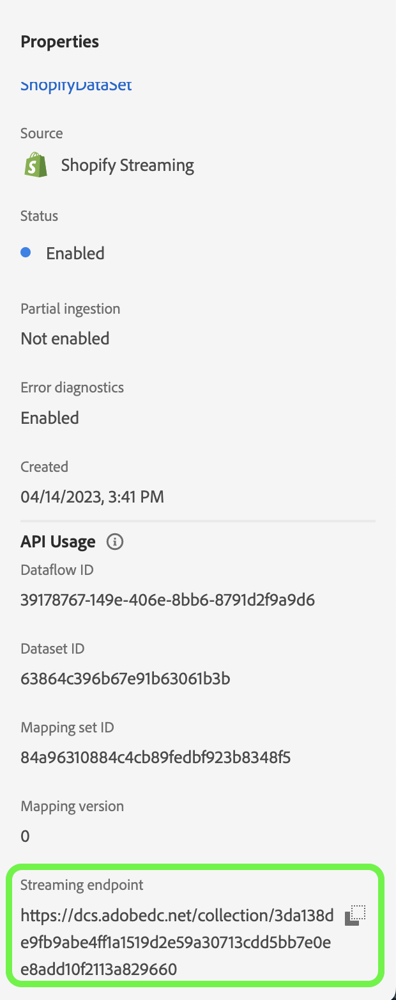

# 使用UI为[!DNL Shopify Streaming]数据创建源连接和数据流

本教程提供了使用Experience Platform用户界面创建[!DNL Shopify Streaming]源连接和数据流的步骤。

## 快速入门 {#getting-started}

本教程需要对以下Experience Platform组件有一定的了解：

* [[!DNL Experience Data Model (XDM)] 系统](../../../../../xdm/home.md)： [!DNL Experience Platform]用于组织客户体验数据的标准化框架。
   * [架构组合的基础知识](../../../../../xdm/schema/composition.md)：了解XDM架构的基本构建块，包括架构组合中的关键原则和最佳实践。
   * [架构编辑器教程](../../../../../xdm/tutorials/create-schema-ui.md)：了解如何使用架构编辑器UI创建自定义架构。
* [[!DNL Real-Time Customer Profile]](../../../../../profile/home.md)：根据来自多个源的汇总数据，提供统一的实时使用者个人资料。

>[!IMPORTANT]
>
>本教程要求您已完成[!DNL Shopify Streaming]帐户的先决条件设置。 有关设置帐户的步骤，请阅读[[!DNL Shopify Streaming] 概述](../../../../connectors/ecommerce/shopify-streaming.md)。

## 连接您的[!DNL Shopify Streaming]帐户

在Experience Platform UI中，从左侧导航栏中选择&#x200B;**[!UICONTROL 源]**&#x200B;以访问[!UICONTROL 源]工作区。 [!UICONTROL Catalog]屏幕显示您可以用来创建帐户的各种源。

您可以从屏幕左侧的目录中选择相应的类别。 或者，您可以使用搜索选项查找您要使用的特定源。

在&#x200B;**电子商务**&#x200B;类别下，选择[!DNL Shopify Streaming]，然后选择&#x200B;**[!UICONTROL 添加数据]**。

## 选择数据

此时将显示&#x200B;**[!UICONTROL 选择数据]**&#x200B;步骤，该步骤为您提供了一个界面来选择将带到Experience Platform的数据。

* 界面的左侧是一个浏览器，允许您查看帐户内的可用数据流；
* 界面的右侧部分允许您预览JSON文件中最多100行数据。

选择&#x200B;**[!UICONTROL 上载文件]**&#x200B;以从本地系统上载JSON文件。 或者，您也可以将要上传的JSON文件拖放到[!UICONTROL 拖放文件]面板。

上传文件后，预览界面会更新，以显示您上传的架构预览。 预览界面允许您检查文件的内容和结构。 您还可以使用[!UICONTROL 搜索字段]实用工具访问架构中的特定项目。

完成后，选择&#x200B;**[!UICONTROL 下一步]**。

## 数据流详细信息

此时将显示&#x200B;**数据流详细信息**&#x200B;步骤，该步骤为您提供了使用现有数据集或为数据流建立新数据集的选项，以及提供数据流名称和描述的机会。 在此步骤中，您还可以配置配置文件摄取、错误诊断、部分摄取和警报的设置。

完成后，选择&#x200B;**[!UICONTROL 下一步]**。

## 映射

此时将显示[!UICONTROL 映射]步骤，该步骤为您提供了一个接口，用于将源架构中的源字段映射到目标架构中相应的目标XDM字段。

Experience Platform根据您选择的目标架构或数据集，为自动映射的字段提供智能推荐。 您可以手动调整映射规则以适合您的用例。 根据需要，您可以选择直接映射字段，或使用数据准备函数转换源数据以派生计算值或计算值。 有关使用映射器界面和计算字段的全面步骤，请参阅[数据准备UI指南](https://experienceleague.adobe.com/docs/experience-platform/data-prep/ui/mapping.html?lang=zh-Hans)。

成功映射源数据后，选择&#x200B;**[!UICONTROL 下一步]**。

## 审查

将显示&#x200B;**[!UICONTROL 审核]**&#x200B;步骤，允许您在创建新数据流之前对其进行审核。 详细信息分为以下类别：

* **[!UICONTROL 连接]**：显示源类型、所选源文件的相关路径以及该源文件中的列数。
* **[!UICONTROL 分配数据集和映射字段]**：显示要将源数据摄取到哪个数据集，包括数据集所遵循的架构。

查看数据流后，选择&#x200B;**[!UICONTROL 完成]**，然后等待一些时间来创建数据流。

## 获取您的流端点URL

创建流数据流后，您现在可以检索流端点URL。 此端点将用于订阅您的webhook，允许您的流源与Experience Platform通信。

要检索您的流端点，请转到刚刚创建的数据流的[!UICONTROL 数据流活动]页面，并从[!UICONTROL 属性]面板的底部复制端点。

## 后续步骤

通过学习本教程，您已建立到[!DNL Shopify Streaming]帐户的源连接和数据流。 有关如何使用API连接[!DNL Shopify Streaming]帐户的说明，请阅读有关[创建源连接和数据流的教程，以使用流服务API](../../../api/create/ecommerce/shopify-streaming.md)流式传输 [!DNL Shopify] 数据。
