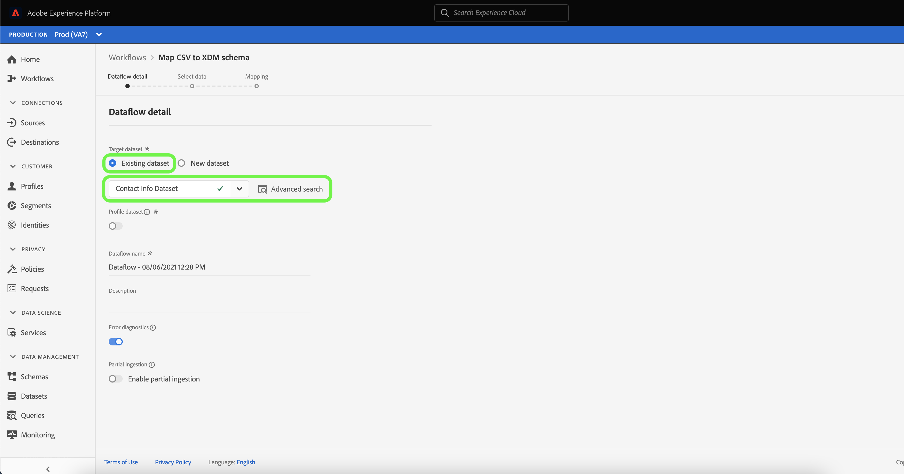

# 在UI中创建本地文件上传源连接器

本教程提供了创建本地文件上传源连接器以使用用户界面将本地文件摄取到平台的步骤。

## 快速入门

本教程需要对Platform的以下组件有一定的了解：

* [[!DNL Experience Data Model (XDM)] 系统](../../../../../xdm/home.md):Platform用来组织客户体验数据的标准化框架。
   * [架构组合的基础知识](../../../../../xdm/schema/composition.md):了解XDM模式的基本构建块，包括模式组合中的关键原则和最佳实践。
   * [模式编辑器教程](../../../../../xdm/tutorials/create-schema-ui.md):了解如何使用模式编辑器UI创建自定义模式。
* [[!DNL Real-time Customer Profile]](../../../../../profile/home.md):根据来自多个来源的汇总数据提供统一的实时客户资料。

## 将本地文件上传到平台

在平台UI中，从左侧导航栏中选择&#x200B;**[!UICONTROL Sources]**&#x200B;以访问[!UICONTROL Sources]工作区。 [!UICONTROL Catalog]屏幕显示可为其创建帐户的各种源。

您可以从屏幕左侧的目录中选择相应的类别。 或者，您可以使用搜索选项找到要处理的特定源。

在[!UICONTROL 本地系统]类别下，选择&#x200B;**[!UICONTROL 本地文件上载]**，然后选择&#x200B;**[!UICONTROL 配置]**。

### 使用现有数据集

在[!UICONTROL 数据流详细信息]页面中，您可以选择是要将CSV数据摄取到现有数据集还是新数据集。

要将CSV数据摄取到现有数据集，请选择&#x200B;**[!UICONTROL 现有数据集]**。 您可以使用[!UICONTROL 高级搜索]选项检索现有数据集，也可以通过在下拉菜单中滚动浏览现有数据集列表来检索。

选择数据集后，为数据流提供名称和可选描述。

在此过程中，您还可以启用[!UICONTROL 错误诊断]和[!UICONTROL 部分摄取]。 [!UICONTROL 错误诊] 断允许为数据流中发生的任何错误记录生成详细的错误消息，而 [!UICONTROL 部] 分摄取允许您摄取包含错误的数据，最高可以达到您手动定义的特定阈值。有关更多信息，请参阅[部分批量摄取概述](../../../../../ingestion/batch-ingestion/partial.md)。

### 使用新数据集

要将CSV数据摄取到新数据集，请选择&#x200B;**[!UICONTROL New dataset]** ，然后提供输出数据集名称和可选描述。 接下来，使用[!UICONTROL 高级搜索]选项或通过滚动下拉菜单中现有架构的列表，选择要映射到的架构。

选择架构后，为数据流提供名称和可选描述，然后对数据流应用所需的[!UICONTROL 错误诊断]和[!UICONTROL 部分摄取]设置。 完成后，选择&#x200B;**[!UICONTROL Next]**。

### 选择数据

此时将显示[!UICONTROL 选择数据]步骤，该步骤为您提供一个接口，用于上载本地文件并预览其结构和内容。 选择&#x200B;**[!UICONTROL 选择文件]**&#x200B;以从本地系统上传CSV文件。 或者，也可以将要上传的CSV文件拖放到[!UICONTROL 拖放文件]面板中。

>[!TIP]
>
>本地文件上传当前仅支持CSV文件。 每个文件的最大文件大小为1 GB。

上传文件后，预览界面会随之更新，以显示文件的内容和结构。

根据您的文件，您可以为源数据选择列分隔符，如制表符、逗号、管道分隔符或自定义列分隔符。 选择&#x200B;**[!UICONTROL 分隔符]**&#x200B;下拉箭头，然后从菜单中选择相应的分隔符。

完成后，选择&#x200B;**[!UICONTROL Next]**。

### 映射

此时将显示[!UICONTROL 映射]步骤，为您提供一个界面，用于将源架构中的源字段映射到目标架构中相应的目标XDM字段。

#### 预览数据

选择&#x200B;**[!UICONTROL 预览数据]**&#x200B;可查看选定数据集中最多100行示例数据的映射结果。

在预览期间，标识列将作为第一个字段按优先级排列，因为它是验证映射结果时必需的关键信息。 完成后，选择&#x200B;**[!UICONTROL 关闭]**。

#### 添加计算字段

计算量度字段允许根据输入架构中的属性创建值。 然后，可以将这些值分配给目标架构中的属性，并提供名称和说明，以便更便于引用。

选择&#x200B;**[!UICONTROL 添加计算字段]**&#x200B;按钮以继续。

出现[!UICONTROL 创建计算字段]面板。 左侧对话框包含计算字段中支持的字段、函数和运算符。 选择一个选项卡以开始向表达式编辑器添加函数、字段或运算符。

| 选项卡 | 描述 |
| --------- | ----------- |
| 函数 | 函数选项卡列出了可用于转换数据的函数。 要进一步了解可在计算字段中使用的函数，请阅读[上使用数据准备（映射器）函数](../../../../../data-prep/functions.md)的指南。 |
| 字段 | 字段选项卡列出了源架构中可用的字段和属性。 |
| 运算符 | 运算符选项卡列出了可用于转换数据的运算符。 |

选择表达式编辑器以手动添加字段、函数和运算符。 创建计算字段后，选择&#x200B;**[!UICONTROL 保存]**&#x200B;以继续。

#### 筛选源架构映射树

要过滤源架构，请选择&#x200B;**[!UICONTROL 所有源字段]**，然后从下拉菜单中选择要映射的特定字段。

下表显示了源架构树的排序选项：

| 源字段 | 描述 |
| --- | --- |
| [!UICONTROL 所有源字段] | 此选项显示源架构的所有源字段。 默认情况下，会显示此选项。 |
| [!UICONTROL 必填字段] | 此选项过滤源架构以仅显示完成映射所需的字段。 |
| [!UICONTROL 标识字段] | 此选项过滤源架构，以仅显示标记为“身份”的字段。 |
| [!UICONTROL 映射的字段] | 此选项过滤源架构以仅显示已映射的字段。 |
| [!UICONTROL 未映射的字段] | 此选项过滤源架构以仅显示尚未映射的字段。 |
| [!UICONTROL 包含推荐的字段] | 此选项过滤源架构以仅显示包含映射推荐的字段。 |

#### 智能推荐

Platform会根据您选择的目标架构或数据集，自动为自动映射的字段提供智能推荐。 您可以手动调整映射规则以适合您的用例。

要接受所有自动生成的映射值，请选择&#x200B;**[!UICONTROL 接受所有目标字段]**。

有时，源架构有多个推荐可用。 发生这种情况时，映射卡会显示最突出的推荐，后跟一个蓝色圆圈，其中包含可用的其他推荐数量。 选择灯泡图标将显示其他推荐的列表。 您可以选中要映射到的推荐旁边的复选框，以选择其中一个替代推荐。

或者，您也可以选择手动将源架构映射到目标架构。 为此，请将鼠标悬停在要映射的源架构上，然后选择加号(`+`)图标。

出现&#x200B;**[!UICONTROL 将源映射到目标字段]**&#x200B;弹出窗口。 从此处，您可以选择要映射的字段，然后选择&#x200B;**[!UICONTROL Save]**&#x200B;以添加新映射。

完成后，选择&#x200B;**[!UICONTROL 已完成]**。

## 监控数据摄取

映射和创建CSV文件后，您可以使用监控仪表板监控通过其摄取的数据。 有关更多信息，请参阅有关[在UI](../../../../../dataflows/ui/monitor-sources.md)中监视源数据流的教程。

## 后续步骤

通过阅读本教程，您已成功将平面CSV文件映射到XDM架构，并将其摄取到平台。 现在，下游[!DNL Platform]服务（如[!DNL Real-time Customer Profile]）可以使用此数据。 有关更多信息，请参阅[[!DNL Real-time Customer Profile]](../../../../../profile/home.md)概述。
