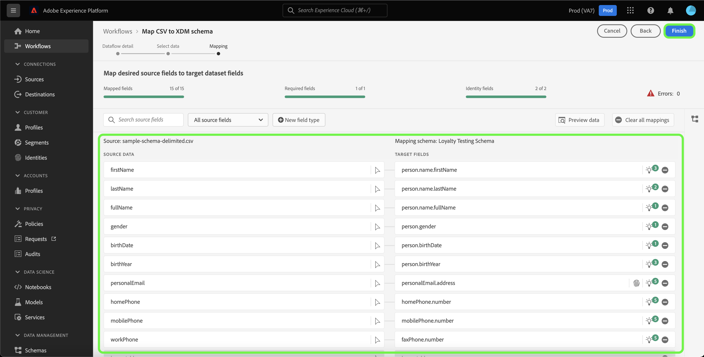

# 在UI中创建本地文件上传源连接器

本教程提供了使用用户界面创建本地文件上传源连接器以将本地文件摄取到Platform的步骤。

## 快速入门

本教程需要深入了解Platform的以下组件：

* [[!DNL Experience Data Model (XDM)] 系统](../../../../../xdm/home.md)：Platform用于组织客户体验数据的标准化框架。
   * [模式组合基础](../../../../../xdm/schema/composition.md)：了解XDM架构的基本构建基块，包括架构构成中的关键原则和最佳实践。
   * [架构编辑器教程](../../../../../xdm/tutorials/create-schema-ui.md)：了解如何使用架构编辑器UI创建自定义架构。
* [[!DNL Real-Time Customer Profile]](../../../../../profile/home.md)：根据来自多个来源的汇总数据提供统一的实时使用者个人资料。

## 将本地文件上传到Platform

在Platform UI中，选择 **[!UICONTROL 源]** 以访问 [!UICONTROL 源] 工作区。 此 [!UICONTROL 目录] 屏幕显示您可以为其创建帐户的各种源。

您可以从屏幕左侧的目录中选择相应的类别。 或者，您可以使用搜索选项查找要使用的特定源。

在 [!UICONTROL 本地系统] 类别，选择 **[!UICONTROL 本地文件上传]**，然后选择 **[!UICONTROL 添加数据]**.

### 使用现有数据集

此 [!UICONTROL 数据流详细信息] 页面允许您选择是将CSV数据摄取到现有数据集还是新数据集。

要将CSV数据摄取到现有数据集，请选择 **[!UICONTROL 现有数据集]**. 您可以使用检索现有数据集 [!UICONTROL 高级搜索] 选项中进行选择，或者通过滚动下拉菜单中的现有数据集列表来进行选择。

选择数据集后，为数据流提供名称和可选描述。

在此过程中，您还可以启用 [!UICONTROL 错误诊断] 和 [!UICONTROL 部分摄取]. [!UICONTROL 错误诊断] 为数据流中发生的任何错误记录启用详细的错误消息生成，而 [!UICONTROL 部分摄取] 允许您摄取包含错误的数据，摄取到手动定义的特定阈值为止。 请参阅 [部分批量摄取概述](../../../../../ingestion/batch-ingestion/partial.md) 了解更多信息。

### 使用新数据集

要将CSV数据摄取到新数据集，请选择 **[!UICONTROL 新建数据集]** 然后提供输出数据集名称和可选描述。 接下来，使用选择要映射到的架构 [!UICONTROL 高级搜索] 选项中进行选择，或者通过滚动下拉菜单中的现有架构列表来进行选择。

选择架构后，提供数据流的名称和可选描述，然后应用 [!UICONTROL 错误诊断] 和 [!UICONTROL 部分摄取] 数据流所需的设置。 完成后，选择 **[!UICONTROL 下一个]**.

### 选择数据

此 [!UICONTROL 选择数据] 此时将显示步骤，为您提供用于上传本地文件并预览其结构和内容的界面。 选择 **[!UICONTROL 选择文件]** 以从本地系统上传CSV文件。 或者，您也可以将要上传的CSV文件拖放到 [!UICONTROL 拖放文件] 面板。

>[!TIP]
>
>本地文件上传当前仅支持CSV文件。 每个文件的最大文件大小为1 GB。

上传文件后，预览界面会更新以显示文件的内容和结构。

根据您的文件，可以为源数据选择列分隔符，例如制表符、逗号、管道或自定义列分隔符。 选择 **[!UICONTROL 分隔符]** 下拉箭头，然后从菜单中选择相应的分隔符。

完成后，选择 **[!UICONTROL 下一个]**.

## 映射

此 [!UICONTROL 映射] 步骤随即显示，为您提供了一个界面，用于将源架构中的源字段映射到目标架构中相应的目标XDM字段。

根据需要，您可以选择直接映射字段，或使用数据准备函数转换源数据以派生计算值或计算值。 有关使用映射界面的完整步骤，请参阅 [数据准备UI指南](../../../../../data-prep/ui/mapping.md).

映射集准备就绪后，选择 **[!UICONTROL 完成]** 并留出一些时间以便创建新数据流。

## 监测数据提取

映射和创建CSV文件后，您可以使用监视仪表板监视通过它摄取的数据。 有关更多信息，请参阅以下教程： [在UI中监控源数据流](../../../../../dataflows/ui/monitor-sources.md).

## 后续步骤

通过阅读本教程，您已成功将平面CSV文件映射到XDM架构并将其摄取到Platform。 此数据现在可供下游使用 [!DNL Platform] 服务，例如 [!DNL Real-Time Customer Profile]. 请参阅概述，了解 [[!DNL Real-Time Customer Profile]](../../../../../profile/home.md) 了解更多信息。
