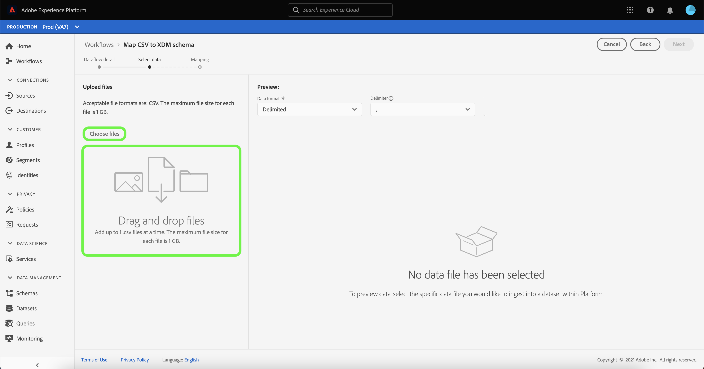

# 在UI中创建本地文件上传源连接器

本教程提供了创建本地文件上传源连接器以使用用户界面将本地文件摄取到平台的步骤。

## 快速入门

本教程需要对Platform的以下组件有一定的了解：

* [[!DNL Experience Data Model (XDM)] 系统](../../../../../xdm/home.md):Platform用来组织客户体验数据的标准化框架。
   * [架构组合的基础知识](../../../../../xdm/schema/composition.md):了解XDM模式的基本构建块，包括模式组合中的关键原则和最佳实践。
   * [模式编辑器教程](../../../../../xdm/tutorials/create-schema-ui.md):了解如何使用模式编辑器UI创建自定义模式。
* [[!DNL Real-Time Customer Profile]](../../../../../profile/home.md):根据来自多个来源的汇总数据提供统一的实时客户资料。

## 将本地文件上传到平台

在平台UI中，选择 **[!UICONTROL 源]** 从左侧导航栏访问 [!UICONTROL 源] 工作区。 的 [!UICONTROL 目录] 屏幕会显示您可以为其创建帐户的各种源。

您可以从屏幕左侧的目录中选择相应的类别。 或者，您可以使用搜索选项找到要处理的特定源。

在 [!UICONTROL 本地系统] 类别，选择 **[!UICONTROL 本地文件上传]**，然后选择 **[!UICONTROL 添加数据]**.

### 使用现有数据集

的 [!UICONTROL 数据流详细信息] 页面允许您选择是将CSV数据摄取到现有数据集还是新数据集。

要将CSV数据摄取到现有数据集，请选择 **[!UICONTROL 现有数据集]**. 您可以使用 [!UICONTROL 高级搜索] 选项，或者通过在下拉菜单中滚动浏览现有数据集列表来配置。

选择数据集后，为数据流提供名称和可选描述。

在此过程中，您还可以启用 [!UICONTROL 错误诊断] 和 [!UICONTROL 部分摄取]. [!UICONTROL 错误诊断] 为数据流中发生的任何错误记录启用详细的错误消息生成，而 [!UICONTROL 部分摄取] 允许您摄取包含错误的数据，最多可达您手动定义的特定阈值。 请参阅 [部分批量摄取概述](../../../../../ingestion/batch-ingestion/partial.md) 以了解更多信息。

### 使用新数据集

要将CSV数据摄取到新数据集，请选择 **[!UICONTROL 新数据集]** 然后，提供输出数据集名称和可选描述。 接下来，使用 [!UICONTROL 高级搜索] 选项或通过滚动下拉菜单中的现有架构列表来迁移。

选择架构后，为数据流提供名称和可选描述，然后应用 [!UICONTROL 错误诊断] 和 [!UICONTROL 部分摄取] 数据流所需的设置。 完成后，选择 **[!UICONTROL 下一个]**.

### 选择数据

的 [!UICONTROL 选择数据] 步骤，为您提供一个界面来上载本地文件并预览其结构和内容。 选择 **[!UICONTROL 选择文件]** 从本地系统上传CSV文件。 或者，您也可以将要上传的CSV文件拖放到 [!UICONTROL 拖放文件] 的上界。

>[!TIP]
>
>本地文件上传当前仅支持CSV文件。 每个文件的最大文件大小为1 GB。

上传文件后，预览界面会随之更新，以显示文件的内容和结构。

根据您的文件，您可以为源数据选择列分隔符，如制表符、逗号、管道分隔符或自定义列分隔符。 选择 **[!UICONTROL 分隔符]** 下拉箭头，然后从菜单中选择相应的分隔符。

完成后，选择 **[!UICONTROL 下一个]**.

## 映射

的 [!UICONTROL 映射] 此时会显示步骤，为您提供一个界面，用于将源架构中的源字段映射到目标架构中相应的目标XDM字段。

根据您的需要，您可以选择直接映射字段，或使用数据准备函数转换源数据以导出计算值或计算值。 有关使用映射界面的完整步骤，请参阅 [数据准备UI指南](../../../../../data-prep/ui/mapping.md).

映射集准备就绪后，选择 **[!UICONTROL 完成]** 并且需要片刻时间才能创建新数据流。

## 监测数据提取

映射和创建CSV文件后，您可以使用监控仪表板监控通过其摄取的数据。 有关更多信息，请参阅 [在UI中监控源数据流](../../../../../dataflows/ui/monitor-sources.md).

## 后续步骤

通过阅读本教程，您已成功将平面CSV文件映射到XDM架构，并将其摄取到平台。 此数据现在可供下游使用 [!DNL Platform] 诸如 [!DNL Real-Time Customer Profile]. 请参阅 [[!DNL Real-Time Customer Profile]](../../../../../profile/home.md) 以了解更多信息。
