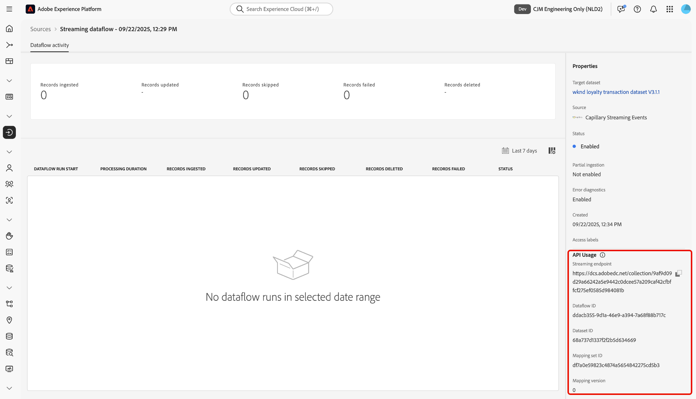

# 使用UI将[!DNL Capillary Streaming Events]连接到Experience Platform

>[!AVAILABILITY]
>
>[!DNL Capillary Streaming Events]源为测试版。 有关使用测试版标记源的更多信息，请阅读源概述中的[条款和条件](../../../../home.md#terms-and-conditions)。

阅读本指南，了解如何使用Experience Platform用户界面中的源工作区将您的[!DNL Capillary]数据库连接到Adobe Experience Platform。

## 快速入门

本教程需要对以下Experience Platform组件有一定的了解：

* [[!DNL Experience Data Model (XDM)] 系统](../../../../../xdm/home.md)： Experience Platform用于组织客户体验数据的标准化框架。
   * [架构组合的基础知识](../../../../../xdm/schema/composition.md)：了解XDM架构的基本构建块，包括架构组合中的关键原则和最佳实践。
   * [架构编辑器教程](../../../../../xdm/tutorials/create-schema-ui.md)：了解如何使用架构编辑器UI创建自定义架构。
* [[!DNL Real-Time Customer Profile]](../../../../../profile/home.md)：根据来自多个源的汇总数据，提供统一的实时使用者个人资料。

## 导航源目录

在Experience Platform UI中，从左侧导航中选择&#x200B;**[!UICONTROL 源]**&#x200B;以访问&#x200B;*[!UICONTROL 源]*&#x200B;工作区。 在&#x200B;*[!UICONTROL 类别]*&#x200B;面板中选择相应的类别或者，使用搜索栏导航到要使用的特定源。

若要使用[!DNL Capillary]，请选择&#x200B;**[!UICONTROL 忠诚度]**&#x200B;下的&#x200B;*[!UICONTROL 毛细管流事件]*&#x200B;源卡，然后选择&#x200B;**[!UICONTROL 添加数据]**。

>[!TIP]
>
>当给定的源尚未具有经过身份验证的帐户时，源目录中的源会显示&#x200B;**[!UICONTROL 设置]**&#x200B;选项。 创建经过身份验证的帐户后，此选项将更改为&#x200B;**[!UICONTROL 添加数据]**。

## 选择数据

接下来，使用&#x200B;*[!UICONTROL Select data]*&#x200B;接口上传示例JSON文件以定义源架构。 在此步骤中，您可以使用预览界面查看有效载荷的文件结构。 完成后，选择&#x200B;**[!UICONTROL 下一步]**。

## 数据流详细信息

接下来，您必须提供有关数据集和数据流的信息。

### 数据集详细信息

数据集是用于数据集合的存储和管理结构，通常是表格，其中包含架构（列）和字段（行）。成功引入Experience Platform的数据将作为数据集保留在数据湖中。

在此步骤中，您可以使用现有数据集或创建新数据集。

>[!NOTE]
>
>无论您是使用现有数据集还是创建新数据集，都必须确保为配置文件&#x200B;**引入启用数据集**。

+++选择相关步骤以启用配置文件摄取、错误诊断和部分摄取。

如果您的数据集启用了实时客户个人资料，那么在此步骤中，您可以切换&#x200B;**[!UICONTROL 个人资料数据集]**&#x200B;以启用您的数据以进行个人资料摄取。 您还可以使用此步骤启用&#x200B;**[!UICONTROL 错误诊断]**&#x200B;和&#x200B;**[!UICONTROL 部分摄取]**。

* **[!UICONTROL 错误诊断]**：选择&#x200B;**[!UICONTROL 错误诊断]**&#x200B;以指示源生成错误诊断，以便以后在监视数据集活动和数据流状态时可以引用这些诊断。
* **[!UICONTROL 部分摄取]**：部分批次摄取是摄取包含错误的数据的能力，最多可摄取特定可配置阈值。 此功能允许您成功地将所有准确的数据提取到Experience Platform中，同时将所有不正确的数据与有关其无效原因的信息单独进行批处理。

+++

### 数据流详细信息

配置数据集后，您必须提供有关数据流的详细信息，包括名称、可选描述和警报配置。

| 数据流配置 | 描述 |
| --- | --- |
| 数据流名称 | 数据流的名称。  默认情况下，这将使用正在导入的文件的名称。 |
| 描述 | （可选）数据流的简短说明。 |
| 警报 | Experience Platform可生成用户可以订阅的基于事件的警报，这些选项允许正在运行的数据流触发这些警报。  有关详细信息，请阅读[警报概述](../../alerts.md) <ul><li>**源数据流运行开始**：选择此警报以在数据流运行开始时接收通知。</li><li>**源数据流运行成功**：选择此警报以在数据流结束且没有任何错误时接收通知。</li><li>**源数据流运行失败**：选择此警报以在数据流运行结束时发生任何错误时接收通知。</li></ul> |

{style="table-layout:auto"}

## 映射

在将数据摄取到Experience Platform之前，使用映射界面将源数据映射到相应的架构字段。 有关详细信息，请阅读UI[中的](../../../../../data-prep/ui/mapping.md)映射指南。

>[!TIP]
>
>您可以在准备映射数据时，为[和](../../../../images/tutorials/create/capillary/mappings.zip)下载[!DNL Capillary]事件和配置文件映射[将文件导入数据准备](../../../../../data-prep/ui/mapping.md#import-mapping)。

## 审查

此时将显示&#x200B;*[!UICONTROL 审核]*&#x200B;步骤，允许您在创建数据流之前查看其详细信息。 详细信息分为以下类别：

* **[!UICONTROL 连接]**：显示帐户名、源平台和源名。
* **[!UICONTROL 分配数据集并映射字段]**：显示目标数据集和数据集所遵循的架构。

确认详细信息正确后，选择&#x200B;**[!UICONTROL 完成]**。

## 检索流端点URL

创建连接后，将显示源详细信息页面。 此页面显示新创建连接的详细信息，包括以前运行的数据流、ID和流端点URL。

