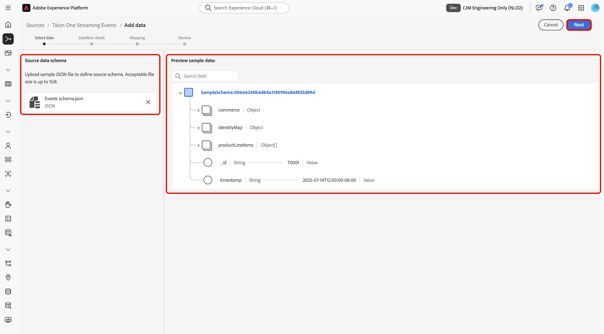
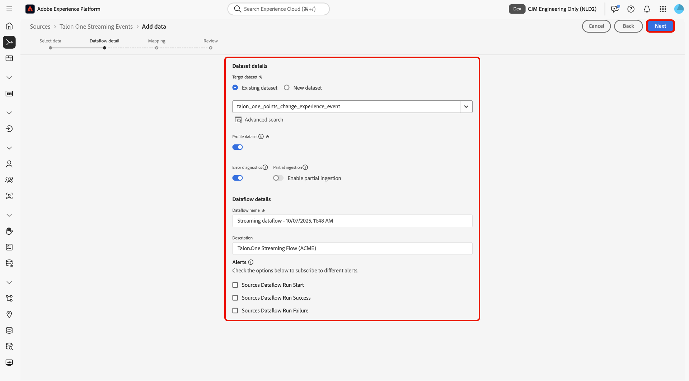
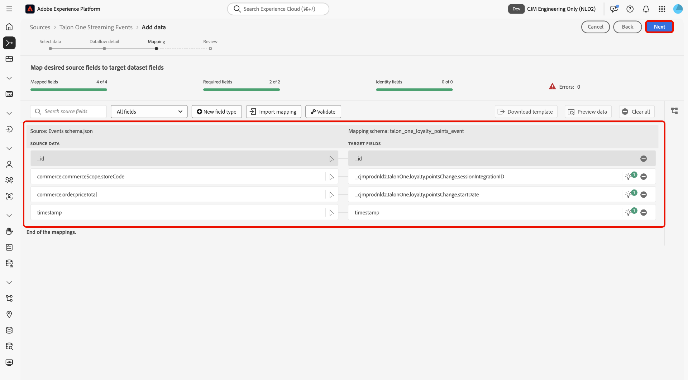

# 使用UI将[!DNL Talon.One]数据流式传输到Experience Platform

>[!AVAILABILITY]
>
>[!DNL Talon.One]源为测试版。 有关使用测试版标记源的更多信息，请阅读源概述中的[条款和条件](../../../../home.md#terms-and-conditions)。

阅读本指南，了解如何使用UI中的源工作区将您的数据从[!DNL Talon.One]连接并流式传输到Adobe Experience Platform。

## 快速入门

本教程需要对以下Experience Platform组件有一定的了解：

* [[!DNL Experience Data Model (XDM)] 系统](../../../../../xdm/home.md)： Experience Platform用于组织客户体验数据的标准化框架。
   * [架构组合的基础知识](../../../../../xdm/schema/composition.md)：了解XDM架构的基本构建块，包括架构组合中的关键原则和最佳实践。
   * [架构编辑器教程](../../../../../xdm/tutorials/create-schema-ui.md)：了解如何使用架构编辑器UI创建自定义架构。
* [[!DNL Real-Time Customer Profile]](../../../../../profile/home.md)：根据来自多个源的汇总数据，提供统一的实时使用者个人资料。

>[!IMPORTANT]
>
>请阅读[[!DNL Talon.One] 概述](../../../../connectors/loyalty/talon-one.md)，了解将帐户连接到Experience Platform之前需要完成的先决步骤。

## 导航源目录

在Experience Platform UI中，从左侧导航中选择&#x200B;**[!UICONTROL Sources]**&#x200B;以访问&#x200B;*[!UICONTROL Sources]*&#x200B;工作区。 在&#x200B;*[!UICONTROL Categories]*&#x200B;面板中选择相应的类别。 或者，使用搜索栏导航到要使用的特定源。

若要从[!DNL Talon.One]流式传输数据，请选择&#x200B;**[!UICONTROL Talon.One Streaming Events]**&#x200B;下的&#x200B;*[!UICONTROL Loyalty]*&#x200B;源卡，然后选择&#x200B;**[!UICONTROL Add data]**。

>[!TIP]
>
>当给定的源尚未拥有经过身份验证的帐户时，源目录中的源会显示&#x200B;**[!UICONTROL Set up]**&#x200B;选项。 创建经过身份验证的帐户后，此选项将更改为&#x200B;**[!UICONTROL Add data]**。

## 选择数据

接下来，使用&#x200B;*[!UICONTROL Select data]*&#x200B;接口上传示例JSON文件以定义源架构。 在此步骤中，您可以使用预览界面查看有效载荷的文件结构。 完成后，选择&#x200B;**[!UICONTROL Next]**。

## 数据流详细信息

接下来，您必须提供有关数据集和数据流的信息。

### 数据集详细信息

数据集是用于数据集合的存储和管理结构，通常是表格，其中包含架构（列/字段）和记录（行）。 成功引入Experience Platform的数据将作为数据集保留在数据湖中。

在此步骤中，您可以使用现有数据集或创建新数据集。

>[!NOTE]
>
>无论您是使用现有数据集还是创建新数据集，都必须确保为配置文件&#x200B;**引入启用数据集**。

+++选择相关步骤以启用配置文件摄取、错误诊断和部分摄取。

如果您的数据集启用了实时客户个人资料，那么在此步骤中，您可以切换&#x200B;**[!UICONTROL Profile dataset]**&#x200B;以启用数据以进行个人资料摄取。 您还可以使用此步骤启用&#x200B;**[!UICONTROL Error diagnostics]**&#x200B;和&#x200B;**[!UICONTROL Partial ingestion]**。

* **[!UICONTROL Error diagnostics]**：选择&#x200B;**[!UICONTROL Error diagnostics]**&#x200B;以指示源生成错误诊断，以便以后在监视数据集活动和数据流状态时可以引用。
* **[!UICONTROL Partial ingestion]**：部分批次摄取是摄取包含错误的数据（最多到特定可配置阈值）的能力。 此功能允许您成功地将所有准确的数据提取到Experience Platform中，同时将所有不正确的数据与有关其无效原因的信息单独进行批处理。

+++

### 数据流详细信息

配置数据集后，您必须提供有关数据流的详细信息，包括名称、可选描述和警报配置。

| 数据流配置 | 描述 |
| --- | --- |
| 数据流名称 | 数据流的名称。 默认情况下，这将使用正在导入的文件的名称。 |
| 描述 | （可选）数据流的简短说明。 |
| 警报 | Experience Platform可生成用户可以订阅的基于事件的警报，这些选项允许正在运行的数据流触发这些警报。  有关详细信息，请阅读[警报概述](../../alerts.md) <ul><li>**源数据流运行开始**：选择此警报以在数据流运行开始时接收通知。</li><li>**源数据流运行成功**：选择此警报以在数据流结束且没有任何错误时接收通知。</li><li>**源数据流运行失败**：选择此警报以在数据流运行结束时发生任何错误时接收通知。</li></ul> |

{style="table-layout:auto"}

## 映射

在将数据摄取到Experience Platform之前，使用映射界面将源数据映射到相应的架构字段。 有关详细信息，请阅读UI[中的](../../../../../data-prep/ui/mapping.md)映射指南。

<!--
>[!TIP]
>
>You can download the [Events and Profile mappings](../../../../images/tutorials/create/capillary/mappings.zip) for [!DNL Capillary] and [import the files to Data Prep](../../../../../data-prep/ui/mapping.md#import-mapping) when you are ready to map your data.
-->

## 审阅

此时将显示&#x200B;*[!UICONTROL Review]*&#x200B;步骤，允许您在创建数据流之前查看其详细信息。 详细信息分为以下类别：

* **[!UICONTROL Connection]**：显示帐户名称、源平台和源名称。
* **[!UICONTROL Assign dataset and map fields]**：显示目标数据集以及该数据集所遵循的架构。

确认详细信息正确后，选择&#x200B;**[!UICONTROL Finish]**。

## 检索流端点URL

创建连接后，将显示源详细信息页面。 此页面显示新创建连接的详细信息，包括以前运行的数据流、ID和流端点URL。

## 监测数据流

创建数据流后，您可以监视通过它摄取的数据，以查看有关摄取率、成功和错误的信息。 有关如何监视数据流的详细信息，请参阅有关UI[中](../../monitor-streaming.md)监视帐户和数据流的教程。

## 已知限制

为确保准确的数据摄取，您应将[!DNL Talon.One]的会员积分更改、层级升级和层级降级通知中的数据发送到连接器。 由于会员积分更改通知不包含层信息，因此您必须将这些通知发送到单独的用户档案数据集。 如果在同一数据集中将点更改数据与层升级或降级通知结合使用，则层信息将丢失或被null值覆盖。 层升级和降级通知可以使用相同的数据集，因为两者都包含层详细信息。 摄取后，配置文件合并规则将自动更新合并的配置文件以反映最新的点和层信息。