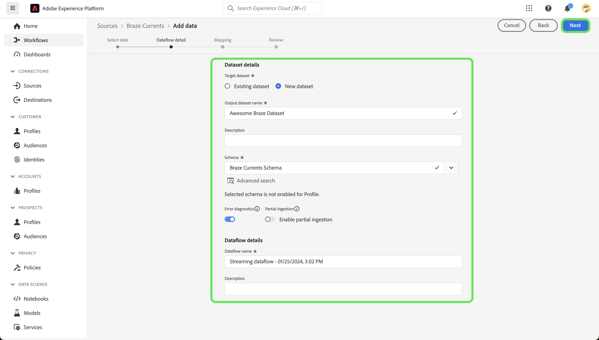

# 在用户界面中创建[!DNL Braze Currents]源连接

>[!NOTE]
>
>[!DNL Braze Currents]源为测试版。 有关使用测试版标记源的更多信息，请阅读[源概述](../../../../home.md#terms-and-conditions)。

[!DNL Braze]支持消费者和品牌之间以客户为中心的实时互动。 [!DNL Braze Currents]是来自Braze平台的参与事件的实时数据流，它是[!DNL Braze]平台中最可靠但最精细的导出。

阅读以下教程，了解如何在UI中将[!DNL Braze]帐户中的参与事件数据引入Adobe Experience Platform。

## 先决条件

要完成本指南中的步骤，您将需要：

* 登录到[Adobe Experience Platform](https://platform.adobe.com)并拥有创建新的流源连接的权限。
* 登录您的[[!DNL Braze] 仪表板](https://dashboard.braze.com/sign_in)、未使用的[Currences Connector许可证](https://www.braze.com/docs/user_guide/data_and_analytics/braze_currents)以及创建连接器的权限。 有关详细信息，请阅读设置[&#x200B; [!DNL Currents]的](https://www.braze.com/docs/user_guide/data_and_analytics/braze_currents/setting_up_currents/#requirements)要求。

## 快速入门

本教程需要对以下Adobe Experience Platform组件有一定的了解：

* [[!DNL Experience Data Model (XDM)] 系统](../../../../../xdm/home.md)： [!DNL Experience Platform]用于组织客户体验数据的标准化框架。
   * [架构组合的基础知识](../../../../../xdm/schema/composition.md)：了解XDM架构的基本构建块，包括架构组合中的关键原则和最佳实践。
   * [架构编辑器教程](../../../../../xdm/tutorials/create-schema-ui.md)：了解如何使用架构编辑器UI创建自定义架构。
* [[!DNL Real-Time Customer Profile]](../../../../../profile/home.md)：根据来自多个源的汇总数据，提供统一的实时使用者个人资料。

本教程还需要对[[!DNL Braze] 电流](https://www.braze.com/docs/user_guide/data_and_analytics/braze_currents)有实际了解。

如果您已经有[!DNL Braze]连接，则可以跳过本文档的其余部分，并转到有关[配置数据流](../../dataflow/marketing-automation.md)的教程。

## 创建 XDM 架构

>[!TIP]
>
>如果您是第一次创建[!DNL Braze Currents]连接，则必须创建体验数据模型(XDM)架构。 如果您已经为[!DNL Braze Currents]创建了架构，则可以跳过此步骤并继续[将您的帐户连接到Experience Platform](#connect)。

在Experience Platform UI中，使用左侧导航，然后选择&#x200B;**[!UICONTROL Schemas]**&#x200B;以访问[!UICONTROL Schemas]工作区。 接下来，选择&#x200B;**[!UICONTROL Create schema]**，然后选择&#x200B;**[!UICONTROL Experience Event]**。 要继续，请选择&#x200B;**[!UICONTROL Next]**。

提供架构的名称和描述。 然后，使用[!UICONTROL Composition]面板配置架构属性。 在[!UICONTROL Field groups]下，选择&#x200B;**[!UICONTROL Add]**&#x200B;并添加[!UICONTROL Braze Currents User Event]字段组。 完成后，选择&#x200B;**[!UICONTROL Save]**。

有关架构的详细信息，请参阅[在UI中创建架构的指南](../../../../../xdm/tutorials/create-schema-ui.md)。

## 将您的[!DNL Braze]帐户连接到Experience Platform {#connect}

在Experience Platform UI中，从左侧导航中选择&#x200B;**[!UICONTROL Sources]**&#x200B;以访问[!UICONTROL Sources]工作区。 您可以从屏幕左侧的目录中选择相应的类别。 或者，您可以使用搜索选项查找您要使用的特定源。

在&#x200B;*营销自动化*&#x200B;类别下，选择&#x200B;**[!UICONTROL Braze Currents]**，然后选择&#x200B;**[!UICONTROL Add data]**。

接下来，上载提供的[铜线电流示例文件](https://github.com/Appboy/currents-examples/blob/master/sample-data/Adobe/adobe_examples.json)。 此文件包含Braze可能作为事件的一部分发送的所有可能字段。

上传文件后，必须提供数据流详细信息，包括有关数据集和要映射到的架构的信息。  如果这是您首次连接钎焊电流源，请创建新数据集。  否则，您可以使用引用Braze架构的任何现有数据集。  如果创建新数据集，请使用我们在上一节中创建的架构。

然后，使用映射界面配置数据的映射。

映射将具有以下需要解决的问题。

在源数据中，*id*&#x200B;将错误地映射到&#x200B;*_braze.appID*。 您必须在架构的根级别将目标映射字段更改为&#x200B;*_id*。 接下来，确保&#x200B;*properties.is_amp*&#x200B;映射到&#x200B;*_braze.messaging.email.isAMP*。

接下来，删除&#x200B;*time*&#x200B;到&#x200B;*timestamp*&#x200B;的映射，然后选择添加(`+`)图标，然后选择&#x200B;**[!UICONTROL Add calculated field]**。 在提供的框中，输入&#x200B;*time \* 1000*&#x200B;并选择&#x200B;**[!UICONTROL Save]**。

添加新的计算字段后，选择新源字段旁边的&#x200B;**[!UICONTROL Map target field]**，并将其映射到架构根级别的&#x200B;*时间戳*。 然后，您应该选择&#x200B;**[!UICONTROL Validate]**&#x200B;以确保没有其他错误。

>[!IMPORTANT]
>
>钎焊时间戳不是以毫秒为单位表示，而是以秒为单位表示。 为了准确反映Experience Platform中的时间戳，您需要创建以毫秒为单位的计算字段。 “time * 1000”的计算将正确地转换为毫秒，适合映射到Experience Platform中的时间戳字段。
>
>

完成后，选择&#x200B;**[!UICONTROL Next]**。 使用“审阅”页确认数据流的详细信息，然后选择&#x200B;**[!UICONTROL Finish]**。

### 收集所需的凭据

创建连接后，必须收集以下凭据值，随后将在硬仪表板上提供这些值，以将数据发送到Experience Platform。 有关详细信息，请阅读有关导航到Currences[!DNL Braze]的[&#x200B; &#x200B;](https://www.braze.com/docs/user_guide/data_and_analytics/braze_currents/setting_up_currents/#step-2-navigate-to-currents)指南。

| 字段 | 描述 |
| --- | --- |
| 客户端 ID | 与您的Experience Platform源关联的客户端ID。 |
| 客户端密码 | 与您的Experience Platform源关联的客户端密钥。 |
| 租户ID | 与您的Experience Platform源关联的租户ID。 |
| 沙盒名称 | 与您的Experience Platform源关联的沙盒。 |
| 数据流 ID | 与您的Experience Platform源关联的数据流ID。 |
| 流端点 | 与您的Experience Platform源关联的流端点。 **注意**： [!DNL Braze]自动将其转换为批处理流终结点。 |

### 配置[!DNL Braze Currents]将数据流式传输到数据源

在[!DNL Braze Dashboard]中，导航到合作伙伴集成&#x200B;**->**&#x200B;数据导出，然后选择&#x200B;**[!DNL Create New Current]**。 系统将提示您提供连接器的名称、有关连接器的通知的联系信息以及上面列出的凭据。 选择要接收的事件，或者配置任何所需的字段排除/转换，然后选择&#x200B;**[!DNL Launch Current]**。

## 后续步骤

通过学习本教程，您已建立与[!DNL Braze]帐户的连接。 您现在可以继续下一教程，并[配置数据流以将营销自动化系统数据引入 [!DNL Experience Platform]](../../dataflow/marketing-automation.md)。
