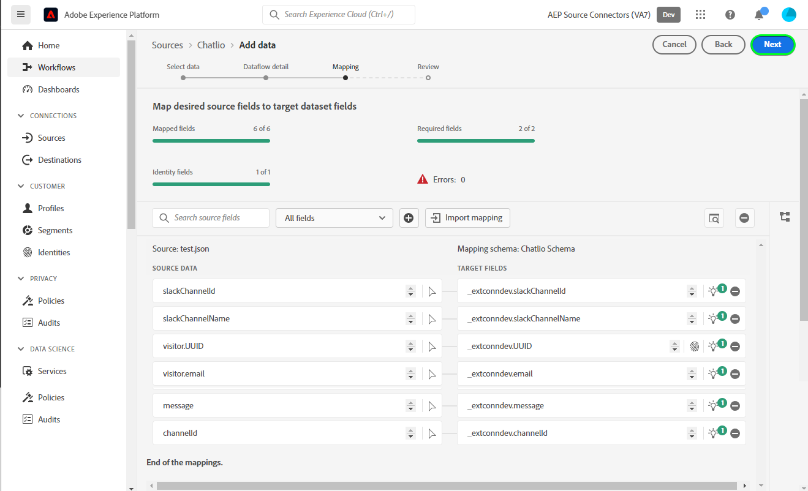

# 在用户界面中创建[!DNL Chatlio]源连接

>[!NOTE]
>
>[!DNL Chatlio]源为测试版。 有关使用测试版标记源的更多信息，请阅读[源概述](../../../../home.md#terms-and-conditions)。

本教程提供了使用Adobe Experience Platform用户界面创建[!DNL Chatlio]源连接的步骤。

## 快速入门 {#getting-started}

本教程需要对以下Experience Platform组件有一定的了解：

* [[!DNL Experience Data Model (XDM)] 系统](../../../../../xdm/home.md)： [!DNL Experience Platform]用于组织客户体验数据的标准化框架。
   * [架构组合的基础知识](../../../../../xdm/schema/composition.md)：了解XDM架构的基本构建块，包括架构组合中的关键原则和最佳实践。
   * [架构编辑器教程](../../../../../xdm/tutorials/create-schema-ui.md)：了解如何使用架构编辑器UI创建自定义架构。
* [[!DNL Real-Time Customer Profile]](../../../../../profile/home.md)：根据来自多个源的汇总数据，提供统一的实时使用者个人资料。

## 先决条件 {#prerequisites}

以下部分提供了在创建[!DNL Chatlio]源连接之前需要完成的先决条件的信息。

### 用于为[!DNL Chatlio]定义源架构的JSON示例 {#prerequisites-json-schema}

在创建[!DNL Chatlio]源连接之前，您需要提供源架构。 您可以使用下面的JSON。

```
{
  "visitor": {
    "email": "test@example.com",
    "UUID": "2d3f4260-2235-903b-0a82-a23d326cc257"
  },
   "message": "Hi",
  "channelId": "C04J7M7LCMQ",
  "slackChannelName": "aep",
  "slackChannelId": "C04JVR71WKS"
}
```

### 为[!DNL Chatlio]创建Experience Platform架构 {#create-platform-schema}

您还必须确保创建一个Experience Platform架构以用于您的源。 阅读有关[创建Experience Platform架构](../../../../../xdm/schema/composition.md)的教程，了解有关如何创建架构的完整步骤。


## 连接您的[!DNL Chatlio]帐户 {#connect-account}

在Experience Platform UI中，从左侧导航中选择&#x200B;**[!UICONTROL 源]**&#x200B;以访问[!UICONTROL 源]工作区，并查看Experience Platform中可用的源目录。

使用&#x200B;*[!UICONTROL 类别]*&#x200B;菜单按类别筛选源。 或者，在搜索栏中输入源名称，以从目录查找特定源。

转到[!UICONTROL 营销自动化]类别以查看[!DNL Chatlio]源卡。 要开始，请选择&#x200B;**[!UICONTROL 添加数据]**。


## 选择数据 {#select-data}

此时将显示&#x200B;**[!UICONTROL 选择数据]**&#x200B;步骤，该步骤为您提供了一个界面以选择要带入Experience Platform的数据。

* 界面的左侧是一个浏览器，允许您查看帐户内的可用数据流；
* 界面的右侧部分允许您预览JSON文件中最多100行数据。

选择&#x200B;**[!UICONTROL 上载文件]**&#x200B;以从本地系统上载JSON文件。 或者，您也可以将要上传的JSON文件拖放到[!UICONTROL 拖放文件]面板。


上传文件后，预览界面会更新，以显示您上传的架构预览。 预览界面允许您检查文件的内容和结构。 您还可以使用[!UICONTROL 搜索字段]实用工具访问架构中的特定项目。

完成后，选择&#x200B;**[!UICONTROL 下一步]**。


## 数据流详细信息 {#dataflow-detail}

此时将显示&#x200B;**数据流详细信息**&#x200B;步骤，该步骤为您提供了使用现有数据集或为数据流建立新数据集的选项，以及提供数据流名称和描述的机会。 在此步骤中，您还可以配置配置文件摄取、错误诊断、部分摄取和警报的设置。

完成后，选择&#x200B;**[!UICONTROL 下一步]**。


## 映射 {#mapping}

此时将显示[!UICONTROL 映射]步骤，该步骤为您提供了一个接口，用于将源架构中的源字段映射到目标架构中相应的目标XDM字段。

Experience Platform根据您选择的目标架构或数据集，为自动映射的字段提供智能推荐。 您可以手动调整映射规则以适合您的用例。 根据需要，您可以选择直接映射字段，或使用数据准备函数转换源数据以派生计算值或计算值。 有关使用映射器界面和计算字段的全面步骤，请参阅[数据准备UI指南](../../../../../data-prep/ui/mapping.md)。

下面列出的映射是强制性的，应在继续执行[!UICONTROL 审阅]阶段之前进行设置。

| 目标字段 | 描述 |
| --- | --- |
| `UUID` | 事件的[!DNL Chatlio]标识符。 |

成功映射源数据后，选择&#x200B;**[!UICONTROL 下一步]**。



## 审查 {#review}

将显示&#x200B;**[!UICONTROL 审核]**&#x200B;步骤，允许您在创建新数据流之前对其进行审核。 详细信息分为以下类别：

* **[!UICONTROL 连接]**：显示源类型、所选源文件的相关路径以及该源文件中的列数。
* **[!UICONTROL 分配数据集和映射字段]**：显示要将源数据摄取到哪个数据集，包括数据集所遵循的架构。

查看数据流后，选择&#x200B;**[!UICONTROL 完成]**，然后等待一些时间来创建数据流。


## 获取您的流端点URL {#get-streaming-endpoint-url}

创建流数据流后，您现在可以检索流端点URL。 此端点将用于订阅您的webhook，允许您的流源与Experience Platform通信。

要构造用于在[!DNL Chatlio]上配置webhook的URL，您必须检索以下内容：

* **[!UICONTROL 数据流ID]**
* **[!UICONTROL 流式处理终结点]**

要检索&#x200B;**[!UICONTROL 数据流ID]**&#x200B;和&#x200B;**[!UICONTROL 流式处理终结点]**，请转到刚刚创建的数据流的[!UICONTROL 数据流活动]页面，并从[!UICONTROL 属性]面板的底部复制详细信息。


在检索到流端点和数据流ID后，请基于以下模式构建URL： ```{STREAMING_ENDPOINT}?x-adobe-flow-id={DATAFLOW_ID}```。 例如，构建的webhook URL可能如下所示： ``https://dcs.adobedc.net/collection/d56b47ee3985104beaf724efcd78a3e1a863d720471a482bebac0acc1ab95983``

## 在[!DNL Chatlio]中设置webhook {#set-up-webhook}

创建webhook URL后，您现在可以使用[!DNL Chatlio]用户界面设置webhook。

登录您的[[!DNL Chatlio]](https://chatlio.com/)帐户，并按照[设置和安装指南](https://chatlio.com/docs/setup/)创建构件。

创建构件后，导航到构件的设置页面以将webhook URL添加到该构件。


接下来，选择&#x200B;**[!DNL Behavior]**&#x200B;选项卡，并将您的webhook URL添加到&#x200B;*[!DNL Webhook when a new conversation starts]*&#x200B;字段以及要订阅的任何其他webhook事件字段。


>[!TIP]
>
>您可以为[!DNL Chatlio] webhook订阅各种不同的活动。 有关不同事件的详细信息，请参阅[[!DNL Chatlio] 事件文档](https://chatlio.com/docs/webhooks/)。

## 后续步骤 {#next-steps}

通过完成本教程，您已成功配置流式数据流以将您的[!DNL Chatlio]数据引入Experience Platform。 要监视正在摄取的数据，请参阅关于使用Experience Platform UI监视流式数据流的[指南](../../monitor-streaming.md)。

## 其他资源 {#additional-resources}

以下各节提供了在使用[!DNL Chatlio]源时可以参考的其他资源。

### 验证 {#validation}

要验证您是否已正确设置源，并且正在摄取[!DNL Chatlio]条消息，请执行以下步骤：

* 您可以检查[!DNL Chatlio] **[!UICONTROL 报告]** > **[!UICONTROL 聊天历史记录]**&#x200B;页面以识别[!DNL Chatlio]正在捕获的事件。


* 在Experience Platform UI中，选择源目录上[!DNL Chatlio]卡片菜单旁边的&#x200B;**[!UICONTROL 查看数据流]**。 接下来，选择&#x200B;**[!UICONTROL 预览数据集]**&#x200B;以验证为您在[!DNL Chatlio]中配置的Webhook摄取的数据。


有关[!DNL Chatlio]的其他信息，请访问[[!DNL Chatlio] 文档](https://chatlio.com/docs/)和[常见问题解答](https://chatlio.com/pricing/#FAQ)。
