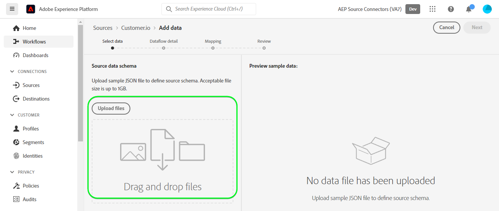
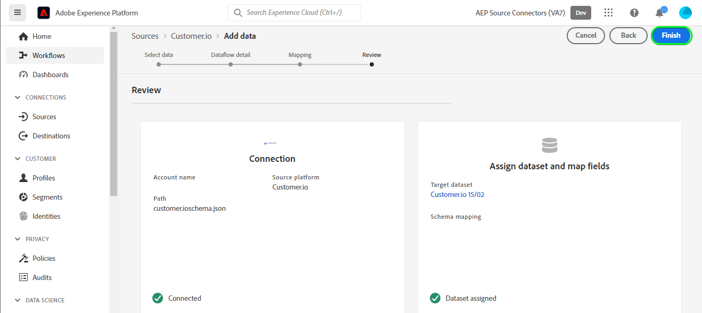

# 创建 [!DNL Customer.io] UI中的源连接和数据流

>[!NOTE]
>
>的 [!DNL Customer.io] 来源为测试版。 请阅读 [源概述](../../../../home.md#terms-and-conditions) 有关使用测试版标记的源的详细信息。

本教程提供了创建 [!DNL Customer.io] 源连接和数据流。

## 快速入门 {#getting-started}

本教程需要对Experience Platform的以下组件有一定的了解：

* [[!DNL Experience Data Model (XDM)] 系统](../../../../../xdm/home.md):标准化框架， [!DNL Experience Platform] 组织客户体验数据。
   * [架构组合的基础知识](../../../../../xdm/schema/composition.md):了解XDM模式的基本构建块，包括模式组合中的关键原则和最佳实践。
   * [模式编辑器教程](../../../../../xdm/tutorials/create-schema-ui.md):了解如何使用模式编辑器UI创建自定义模式。
* [[!DNL Real-Time Customer Profile]](../../../../../profile/home.md):根据来自多个来源的汇总数据提供统一的实时客户资料。

## 先决条件 {#prerequisites}

以下部分提供了在创建 [!DNL Customer.io] 源连接。

### 用于定义源架构的JSON示例 [!DNL Customer.io] {#prerequisites-json-schema}

在创建 [!DNL Customer.io] 源连接时，您需要提供源架构。 您可以使用以下JSON。

```
{
  "event_id": "01E4C4CT6YDC7Y5M7FE1GWWPQJ",
  "object_type": "customer",
  "metric": "subscribed",
  "timestamp": 1613063089,
  "data": {
    "customer_id": "42",
    "email_address": "test@example.com",
    "identifiers": {
      "id": "42",
      "email": "test@example.com",
      "cio_id": "d9c106000001"
    }
  }
}
```

### 为创建平台模式 [!DNL Customer.io] {#create-platform-schema}

您还必须确保创建一个用于源的平台架构。 请参阅 [创建平台模式](../../../../../xdm/schema/composition.md) 有关如何创建架构的完整步骤。


## 连接 [!DNL Customer.io] 帐户 {#connect-account}

在平台UI中，选择 **[!UICONTROL 源]** 从左侧导航访问 [!UICONTROL 源] 工作区，并查看Experience Platform中可用的源目录。

使用 *[!UICONTROL 类别]* 菜单来按类别筛选源。 或者，在搜索栏中输入源名称，以从目录中查找特定源。

转到 [!UICONTROL 营销自动化] 类别以查看 [!DNL Customer.io] 源卡。 要开始，请选择 **[!UICONTROL 添加数据]**.


## 选择数据 {#select-data}

的 **[!UICONTROL 选择数据]** 步骤，为您提供一个界面以选择要引入平台的数据。

* 界面的左侧是一个浏览器，用于查看您帐户中的可用数据流；
* 界面的右侧部分允许您从JSON文件预览多达100行数据。

选择 **[!UICONTROL 上传文件]** 从本地系统上传JSON文件。 或者，您也可以将要上传的JSON文件拖放到 [!UICONTROL 拖放文件] 的上界。



上传文件后，预览界面会随之发生更新，以显示您上传的架构的预览。 预览界面允许您检查文件的内容和结构。 您还可以使用 [!UICONTROL 搜索字段] 用于从架构中访问特定项目的实用程序。

完成后，选择 **[!UICONTROL 下一个]**.


## 数据流详细信息 {#dataflow-detail}

的 **数据流详细信息** 此步骤将显示，为您提供使用现有数据集或为数据流建立新数据集的选项，以及提供数据流名称和描述的机会。 在此步骤中，您还可以配置用于配置文件摄取、错误诊断、部分摄取和警报的设置。

完成后，选择 **[!UICONTROL 下一个]**.


## 映射 {#mapping}

的 [!UICONTROL 映射] 此时会显示步骤，为您提供一个界面，用于将源架构中的源字段映射到目标架构中相应的目标XDM字段。

Platform根据您选择的目标架构或数据集，为自动映射的字段提供智能推荐。 您可以手动调整映射规则以适合您的用例。 根据您的需要，您可以选择直接映射字段，或使用数据准备函数转换源数据以导出计算值或计算值。 有关使用映射器界面和计算字段的完整步骤，请参阅 [数据准备UI指南](../../../../../data-prep/ui/mapping.md).

下面列出的所有映射都是必需的，在继续到 [!UICONTROL 审阅] 舞台。

| 目标字段 | 描述 |
| --- | --- |
| `object_type` | 对象类型，请参阅 [!DNL Customer.io] [事件](https://customer.io/docs/webhooks/#events) 文档。 |
| `id` | 对象的标识符。 |
| `email` | 与对象关联的电子邮件地址。 |
| `event_id` | 事件的唯一标识符。 |
| `cio_id` | 的 [!DNL Customer.io] 事件的标识符。 |
| `metric` | 事件类型。 有关更多信息，请参阅 [!DNL Customer.io] [事件](https://customer.io/docs/webhooks/#events) 支持类型的文档。 |
| `timestamp` | 事件发生时的时间戳。 |

>[!IMPORTANT]
>
>不映射 `cio_id` 执行 [!DNL Customer.io] 网页钩 `test mode` 因为不会从发送任何关联字段 [!DNL Customer.io].

成功映射源数据后，选择 **[!UICONTROL 下一个]**.


## 请查看 {#review}

的 **[!UICONTROL 审阅]** 步骤，允许您在创建新数据流之前查看新数据流。 详细信息按以下类别分组：

* **[!UICONTROL 连接]**:显示源类型、所选源文件的相关路径以及该源文件中的列数。
* **[!UICONTROL 分配数据集和映射字段]**:显示源数据被摄取到的数据集，包括该数据集附加的架构。

审核数据流后，选择 **[!UICONTROL 完成]** 并为创建数据流留出一些时间。



## 获取流端点URL {#get-streaming-endpoint}

创建流数据流后，您现在可以检索流端点URL。 此端点将用于订阅您的Webhook，从而允许您的流源与Experience Platform通信。

以构建用于在上配置Webhook的URL [!DNL Customer.io] 您必须检索以下内容：

* **[!UICONTROL 数据流ID]**
* **[!UICONTROL 流端点]**

检索 **[!UICONTROL 数据流ID]** 和 **[!UICONTROL 流端点]**，转到 [!UICONTROL 数据流活动] 数据流的页面，并从 [!UICONTROL 属性] 的上界。


在检索到流端点和数据流ID后，请根据以下模式构建URL: ```{STREAMING_ENDPOINT}?x-adobe-flow-id={DATAFLOW_ID}```. 例如，构建的Webhook URL可能如下所示： ``https://dcs.adobedc.net/collection/febc116d22ba0ea2868e9c93b199375302afb8a589617700991bb8f3f0341ad7?x-adobe-flow-id=439b3fc4-3042-4a3a-b5e0-a494898d3fb0``

## 在中设置报告网页挂接 [!DNL Customer.io] {#set-up-webhook}

创建Webhook URL后，您现在可以使用 [!DNL Customer.io] 用户界面。 有关设置报告Web挂接的步骤，请阅读 [[!DNL Customer.io] 指南](https://customer.io/docs/webhooks/#setup) 设置Web挂接。

在 [!DNL Customer.io] 用户界面，输入 [webhook URL](#get-streaming-endpoint-url) 在 [!DNL WEBHOOK ENDPOINT] 字段。


>[!TIP]
>
>您可以为报表WebHook订阅各种不同事件。 当 [!DNL Customer.io] 满足操作事件触发条件。 有关不同事件的更多信息，请参阅 [[!DNL Customer.io] 事件文档](https://customer.io/docs/webhooks/#events).

## 后续步骤 {#next-steps}

在本教程之后，您已成功配置了流数据流以将 [!DNL Customer.io] Experience Platform。 要监视正在摄取的数据，请参阅 [使用Platform UI监控流数据流](../../monitor-streaming.md).

## 其他资源 {#additional-resources}

以下部分提供了在使用 [!DNL Customer.io] 来源。

### 护栏 {#guardrails}

有关护栏的信息，请参阅 [[!DNL Customer.io] 超时和失败页面](https://customer.io/docs/webhooks/#timeouts-and-failures).

### 验证 {#validation}

验证是否已正确设置源和 [!DNL Customer.io] 正在摄取消息，请执行以下步骤：

* 您可以检查 [!DNL Customer.io] **[!UICONTROL 活动日志]** 页面以标识捕获的事件 [!DNL Customer.io].


* 在平台UI中，选择 **[!UICONTROL 查看数据流]** 旁边 [!DNL Customer.io] 源目录的卡片菜单。 接下来，选择 **[!UICONTROL 预览数据集]** 验证为您在 [!DNL Customer.io].


