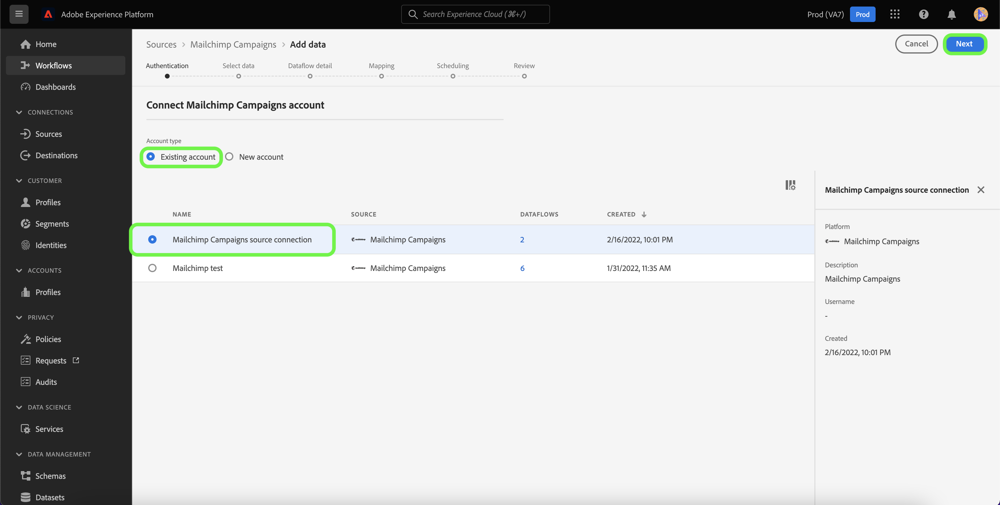
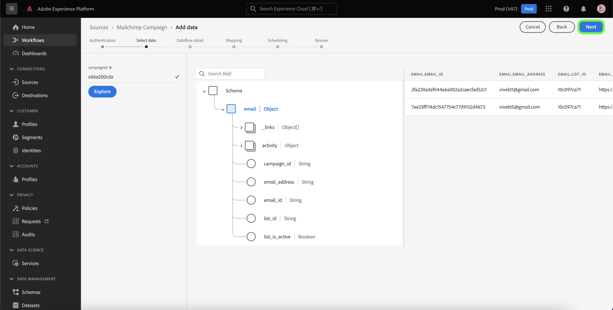

# 创建 [!DNL Mailchimp Campaigns] 源连接（使用Platform UI）

本教程提供了创建 [!DNL Mailchimp] 源连接器到引入 [!DNL Mailchimp Campaigns] 使用用户界面将数据发送到Adobe Experience Platform。

## 快速入门

本指南要求您对Adobe Experience Platform的以下组件有一定的了解：

* [源](../../../../home.md):平台允许从各种源摄取数据，同时让您能够使用构建、标记和增强传入数据 [!DNL Platform] 服务。
* [沙箱](../../../../../sandboxes/home.md):Platform提供将单个Platform实例分区为单独虚拟环境的虚拟沙盒，以帮助开发和改进数字体验应用程序。

## 收集所需的凭据

为了把 [!DNL Mailchimp Campaigns] 数据到平台时，您必须首先提供与您的 [!DNL Mailchimp] 帐户。

的 [!DNL Mailchimp Campaigns] 源支持OAuth 2刷新代码和基本身份验证，请参阅下表以了解有关这些身份验证类型的更多信息。

### OAuth 2刷新代码

| 凭据 | 描述 |
| --- | --- |
| Host | 用于连接到MailChimp API的根URL。 根URL的格式为 `https://{DC}.api.mailchimp.com`，其中 `{DC}` 表示与您的帐户对应的数据中心。 |
| 授权测试URL | 连接时，授权测试URL用于验证凭据 [!DNL Mailchimp] 到平台。 如果未提供，则在创建源连接步骤期间会自动检查凭据。 |
| 访问令牌 | 用于验证源的相应访问令牌。 基于OAuth的身份验证需要此设置。 |

有关使用OAuth 2验证您的 [!DNL Mailchimp] 帐户到平台，请参阅此 [[!DNL Mailchimp] 有关使用OAuth 2的文档](https://mailchimp.com/developer/marketing/guides/access-user-data-oauth-2/).

### 基本身份验证

| 凭据 | 描述 |
| --- | --- |
| 主机 | 用于连接到MailChimp API的根URL。 根URL的格式为 `https://{DC}.api.mailchimp.com`，其中 `{DC}` 表示与您的帐户对应的数据中心。 |
| 用户名 | 与您的MailChimp帐户对应的用户名。 基本身份验证需要此功能。 |
| 密码 | 与您的MailChimp帐户对应的密码。 基本身份验证需要此功能。 |

## 连接 [!DNL Mailchimp Campaigns] 帐户到平台

在平台UI中，选择 **[!UICONTROL 源]** 从左侧导航栏访问 [!UICONTROL 源] 工作区。 的 [!UICONTROL 目录] 屏幕会显示您可以创建帐户的各种源。

您可以从屏幕左侧的目录中选择相应的类别。 或者，您可以使用搜索选项找到要处理的特定源。

在 [!UICONTROL 营销自动化] 类别，选择 **[!UICONTROL Mailchimp营销活动]**，然后选择 **[!UICONTROL 添加数据]**.

的 **[!UICONTROL 连接Mailchimp Campaigns帐户]** 页面。 在本页中，您可以选择是访问现有帐户，还是选择创建新帐户。

### 现有帐户

要使用现有帐户，请选择 [!DNL Mailchimp Campaigns] 创建新数据流的帐户，然后选择 **[!UICONTROL 下一个]** 以继续。

### 新帐户

如果要创建新帐户，请选择 **[!UICONTROL 新帐户]**，然后为您的 [!DNL Mailchimp Campaigns] 源连接详细信息。

#### 使用OAuth 2进行身份验证

要使用OAuth 2，请选择 [!UICONTROL OAuth 2刷新代码]，为您的主机、授权测试URL和访问令牌提供值，然后选择 **[!UICONTROL 连接到源]**. 请稍候验证凭据，然后选择 **[!UICONTROL 下一个]** 以继续。

#### 使用基本身份验证进行身份验证

要使用基本身份验证，请选择 [!UICONTROL 基本身份验证]，为主机、用户名和密码提供值，然后选择 **[!UICONTROL 连接到源]**. 请稍候验证凭据，然后选择 **[!UICONTROL 下一个]** 以继续。

### 选择 [!DNL Mailchimp Campaigns] 数据

在您的源进行身份验证后，您必须提供 `campaignId` 与 [!DNL Mailchimp Campaigns] 帐户。

在 [!UICONTROL 选择数据] page，输入 `campaignId` 然后选择 **[!UICONTROL 探索]**.

该页面将更新为交互式架构树，通过该树可以浏览和检查数据的层次结构。 选择 **[!UICONTROL 下一个]** 以继续。

## 后续步骤

使用 [!DNL Mailchimp] 已验证帐户，且您的 [!DNL Mailchimp Campaigns] 选定数据时，您现在可以开始创建数据流以将数据引入平台。 有关如何创建数据流的详细步骤，请参阅 [创建数据流以将营销自动化数据引入平台](../../dataflow/marketing-automation.md).
