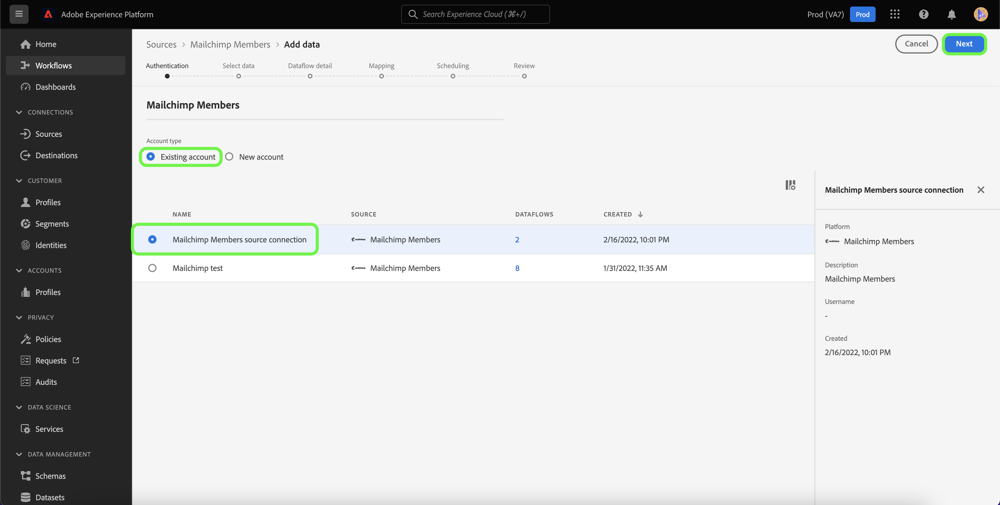

# 使用Experience Platform UI创建[!DNL Mailchimp Members]源连接

本教程提供了使用用户界面创建[!DNL Mailchimp]源连接器以将[!DNL Mailchimp Members]数据摄取到Adobe Experience Platform的步骤。

## 快速入门

本指南要求您对 Adobe Experience Platform 的以下组件有一定了解：

* [源](../../../../home.md)： Experience Platform允许从各种源摄取数据，同时允许您使用[!DNL Experience Platform]服务来构建、标记和增强传入数据。
* [沙盒](../../../../../sandboxes/home.md)： Experience Platform提供了将单个Experience Platform实例划分为多个单独的虚拟环境的虚拟沙盒，以帮助开发和改进数字体验应用程序。

## 收集所需的凭据

为了将[!DNL Mailchimp Members]数据导入Experience Platform，您必须首先提供与[!DNL Mailchimp]帐户对应的相应身份验证凭据。

[!DNL Mailchimp Members]源支持OAuth 2刷新代码和基本身份验证。 有关这些身份验证类型的详细信息，请参见下表。

### OAuth 2刷新代码

| 凭据 | 描述 |
| --- | --- |
| 域 | 用于连接到MailChimp API的根URL。 根URL的格式为`https://{DC}.api.mailchimp.com`，其中`{DC}`表示与您的帐户对应的数据中心。 |
| 授权测试URL | 将[!DNL Mailchimp]连接到Experience Platform时，授权测试URL用于验证凭据。 如果未提供，则会在源连接创建步骤中自动检查凭据。 |
| 访问令牌 | 用于对源进行身份验证的相应访问令牌。 基于OAuth的身份验证需要此项。 |

有关使用OAuth 2向Experience Platform验证您的[!DNL Mailchimp]帐户的详细信息，请参阅有关使用OAuth 2](https://mailchimp.com/developer/marketing/guides/access-user-data-oauth-2/)的此[[!DNL Mailchimp] 文档。

### 基本身份验证

| 凭据 | 描述 |
| --- | --- |
| 域 | 用于连接到MailChimp API的根URL。 根URL的格式为`https://{DC}.api.mailchimp.com`，其中`{DC}`表示与您的帐户对应的数据中心。 |
| 用户名 | 与您的MailChimp帐户对应的用户名。 这是基本身份验证所必需的。 |
| 密码 | 与您的MailChimp帐户对应的密码。 这是基本身份验证所必需的。 |

## 将您的[!DNL Mailchimp Members]帐户连接到Experience Platform

在Experience Platform UI中，从左侧导航栏中选择&#x200B;**[!UICONTROL 源]**&#x200B;以访问[!UICONTROL 源]工作区。 [!UICONTROL Catalog]屏幕显示您可以用来创建帐户的各种源。

您可以从屏幕左侧的目录中选择相应的类别。 或者，您可以使用搜索选项查找您要使用的特定源。

在[!UICONTROL 营销自动化]类别下，选择&#x200B;**[!UICONTROL Mailchimp营销活动]**，然后选择&#x200B;**[!UICONTROL 添加数据]**。

此时会显示&#x200B;**[!UICONTROL Connect Mailchimp营销活动帐户]**&#x200B;页面。 在此页面中，您可以选择是访问现有帐户，还是选择创建新帐户。

### 现有账户

要使用现有帐户，请选择要用于创建新数据流的[!DNL Mailchimp Members]帐户，然后选择&#x200B;**[!UICONTROL 下一步]**&#x200B;以继续。

### 新帐户

如果您正在创建新帐户，请选择&#x200B;**[!UICONTROL 新帐户]**，然后为您的[!DNL Mailchimp Members]源连接详细信息提供名称和描述。

#### 使用OAuth 2进行身份验证

要使用OAuth 2，请选择[!UICONTROL OAuth 2刷新代码]，为您的域、授权测试URL和访问令牌提供值，然后选择&#x200B;**[!UICONTROL 连接到源]**。 请稍等片刻让您的凭据进行验证，然后选择&#x200B;**[!UICONTROL 下一步]**&#x200B;以继续。

#### 使用基本身份验证进行身份验证

若要使用基本身份验证，请选择[!UICONTROL 基本身份验证]，提供域、用户名和密码的值，然后选择&#x200B;**[!UICONTROL 连接到源]**。 请稍等片刻让您的凭据进行验证，然后选择&#x200B;**[!UICONTROL 下一步]**&#x200B;以继续。

### 选择[!DNL Mailchimp Members]数据

在您的源进行身份验证后，您必须提供与[!DNL Mailchimp Members]帐户对应的`listId`。

在[!UICONTROL 选择数据]页面上，输入您的`listId`，然后选择&#x200B;**[!UICONTROL 浏览]**。

该页面将更新为交互式架构树，允许您浏览和检查数据的层次结构。 选择&#x200B;**[!UICONTROL 下一步]**&#x200B;以继续。

## 后续步骤

在对[!DNL Mailchimp]帐户进行身份验证并选择[!DNL Mailchimp Members]数据后，您现在可以开始创建数据流以将数据导入Experience Platform。 有关如何创建数据流的详细步骤，请参阅有关[创建数据流以将营销自动化数据引入Experience Platform](../../dataflow/marketing-automation.md)的文档。
