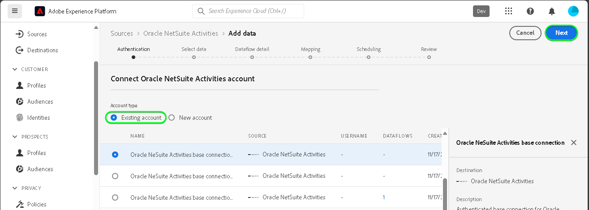

# 创建 [!DNL Oracle NetSuite Activities] UI中的源连接

>[!NOTE]
>
>此 [!DNL Oracle NetSuite Activities] 源为测试版。 请参阅 [源概述](../../../../home.md#terms-and-conditions) 有关使用测试版标记源代码的更多信息。

阅读以下教程，了解如何从引入事件数据 [!DNL Oracle NetSuite Activities] Adobe Experience Platform帐户。

## 快速入门 {#getting-started}

本教程需要对以下Experience Platform组件有一定的了解：

* [[!DNL Experience Data Model (XDM)] 系统](../../../../../xdm/home.md)：用于实现此目标的标准化框架 [!DNL Experience Platform] 组织客户体验数据。
   * [模式组合基础](../../../../../xdm/schema/composition.md)：了解XDM架构的基本构建基块，包括架构构成中的关键原则和最佳实践。
   * [架构编辑器教程](../../../../../xdm/tutorials/create-schema-ui.md)：了解如何使用架构编辑器UI创建自定义架构。
* [[!DNL Real-Time Customer Profile]](../../../../../profile/home.md)：根据来自多个来源的汇总数据提供统一的实时使用者个人资料。

如果您已经拥有有效的 [!DNL Oracle NetSuite] 帐户，您可以跳过本文档的其余部分，并继续阅读上的教程 [配置数据流](../../dataflow/marketing-automation.md).

>[!TIP]
>
>阅读 [[!DNL Oracle NetSuite] 概述](../../../../connectors/marketing-automation/oracle-netsuite.md) 有关如何检索身份验证凭据的信息。

## 连接您的 [!DNL Oracle NetSuite] 帐户 {#connect-account}

在Platform UI中，选择 **[!UICONTROL 源]** 从左侧导航访问 [!UICONTROL 源] 工作区。 您可以从屏幕左侧的目录中选择相应的类别。 或者，您可以使用搜索选项查找您要使用的特定源。

在 *营销自动化* 类别，选择 **[!DNL Oracle NetSuite Activities]**，然后选择 **[!UICONTROL 添加数据]**.

此 **[!UICONTROL ConnectOracleNetSuite活动帐户]** 页面。 在此页上，您可以使用新凭据或现有凭据。

>[!IMPORTANT]
>
>刷新令牌将在七天后过期。 令牌过期后，您必须使用更新后的令牌在Experience Platform上创建帐户。 如果您没有使用更新的令牌创建新帐户，则可能会看到以下错误消息： `The request could not be processed. Error from flow provider: The request could not be processed. Rest call failed with client error, status code 401 Unauthorized, please check your activity settings.`

### 现有帐户 {#existing-account}

要使用现有帐户，请选择 [!DNL Oracle NetSuite Activities] 要用于创建新数据流的帐户，然后选择 **[!UICONTROL 下一个]** 以继续。

### 新帐户 {#new-account}

如果要创建新帐户，请选择 **[!UICONTROL 新帐户]**，然后提供名称、可选描述和您的凭据。 完成后，选择 **[!UICONTROL 连接到源]** 然后等待一段时间以建立新连接。

## 后续步骤 {#next-steps}

通过学习本教程，您已建立与的连接 [!DNL Oracle NetSuite Activities] 帐户。 您现在可以继续下一教程和 [配置数据流以将数据引入Platform](../../dataflow/marketing-automation.md).

## 其他资源 {#additional-resources}

以下各节提供了在使用时，您可以参考的其他资源 [!DNL Oracle NetSuite Activities] 源。

### 映射 {#mapping}

Platform根据您选择的目标架构或数据集，为自动映射的字段提供智能推荐。 您可以手动调整映射规则以适合您的用例。 根据需要，您可以选择直接映射字段，或使用数据准备函数转换源数据以派生计算值或计算值。 有关使用映射器界面和计算字段的全面步骤，请参阅 [数据准备UI指南](../../../../../data-prep/ui/mapping.md).

>[!NOTE]
>
>显示的字段取决于您的订阅 [!DNL Oracle NetSuite] 帐户有权访问。 例如，如果您无权访问计费，则不会看到与计费相关的字段。

### 正在计划 {#scheduling}

安排您的 [!DNL Oracle NetSuite Activities] 数据流进行摄取，必须选择以下频率和间隔配置：

| 频度 | 间隔 |
| --- | --- |
| `Once` | 1 |

检索数据时， [!DNL Oracle NetSuite] 将上次修改或创建日期作为日期格式（而非时间戳）进行响应。 因此，调度限制为一天。

为您的计划提供值后，选择 **[!UICONTROL 下一个]**.

