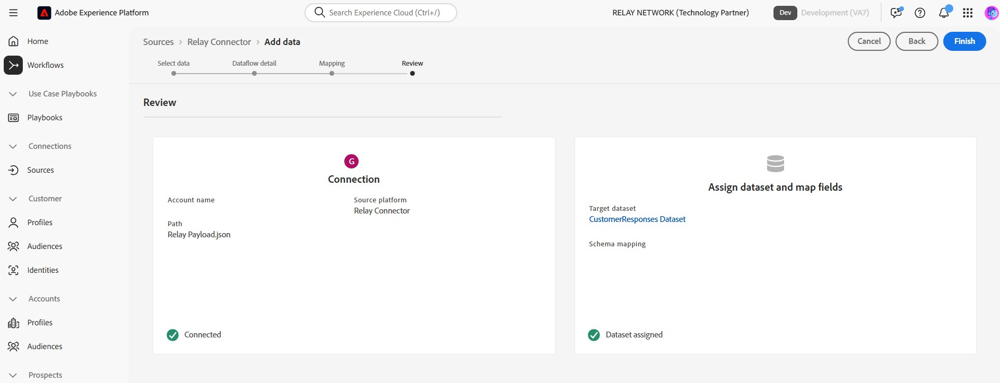

# 在UI中将中继连接到Experience Platform

>[!NOTE]
>
>[!DNL Relay Connector]源为测试版。 有关使用测试版标记源的更多信息，请阅读[源概述](../../../../home.md#terms-and-conditions)。

借助[!DNL Relay Connector]，您可以在客户历程中最有意义的时刻为其提供个性化体验，通过创建入站连接以将事件从[!DNL Relay Network]集成流入Adobe Experience Platform，帮助您建立更强大的关系并提高忠诚度和价值。

阅读本指南，了解如何在Experience Platform UI的源工作区中使用[!DNL Relay Connector]。

>[!IMPORTANT]
>
>此文档页面由&#x200B;*[!DNL Relay Network]*&#x200B;团队维护。 如有任何查询或更新请求，请直接通过&#x200B;*[[!DNL Relay Network]](https://www.relaynetwork.com/)或电子邮件[info@relaynetwork.com](mailto:info@relaynetwork.com)*&#x200B;联系他们。

## 连接您的[!DNL Relay Connector]源

在Experience Platform UI中，从左侧导航栏中选择&#x200B;**[!UICONTROL 源]**&#x200B;以访问[!UICONTROL 源]工作区。 [!UICONTROL Catalog]屏幕显示您可以用来创建帐户的各种源。 您可以从屏幕左侧的目录中选择相应的类别，或者使用搜索选项查找特定源。

在&#x200B;*[!UICONTROL 营销自动化]*&#x200B;类别下，选择[!DNL Relay Connector]源卡并选择&#x200B;**[!UICONTROL 添加数据]**。

>[!TIP]
>
>当不存在经过身份验证的帐户时，源目录中的源会显示&#x200B;**[!UICONTROL 设置]**&#x200B;选项。 帐户通过身份验证后，此选项将更改为&#x200B;**[!UICONTROL 添加数据]**。

### 选择数据

出现&#x200B;**[!UICONTROL 连接中继连接器源]**&#x200B;接口。 使用&#x200B;*[!UICONTROL 选择数据]*&#x200B;界面浏览或指定源数据架构。 或者，您可以上传示例JSON文件来定义源架构。

>[!NOTE]
>
>可接受的文件大小高达1GB。

上传数据后，您可以使用[!UICONTROL 预览示例数据]部分来预览数据。

### 数据流详细信息

接下来，使用&#x200B;*[!UICONTROL 数据流详细信息]*&#x200B;接口为您的数据流提供&#x200B;**名称**&#x200B;和&#x200B;**可选描述**。 此外，选择要使用的&#x200B;**[!UICONTROL 目标数据集]**。 您可以创建新数据集或使用现有数据集。

### 映射

您可以使用自动映射功能将源字段映射到XDM架构字段（该功能根据字段的名称匹配字段），或者创建自定义映射以实现更精确的控制。 如果需要，您还可以应用连接、格式设置或重命名等转换，以确保数据完全适合目标架构。 有关映射的详细信息，请阅读[数据准备UI指南](../../../../../data-prep/ui/mapping.md)。

>[!TIP]
>
>有关中继将发送到源的事件类型和数据值的详细信息，请阅读[[!DNL Relay Network] 推送事件](https://docs.relaynetwork.com/docs/push-events)文档。 此信息将帮助您正确设计&#x200B;**体验事件架构**。

### 审查

最后，查看所有配置，包括您的&#x200B;**源、数据集和映射**。 完成后，选择&#x200B;**完成**&#x200B;以创建数据流。

### 检索您的流端点URL

创建数据流后，您将在数据流页面右侧的&#x200B;*属性*&#x200B;部分中找到&#x200B;**流终结点URL**&#x200B;和其他相关详细信息。

使用这些值在&#x200B;**中继控制台**&#x200B;中设置webhook。 有关配置推送的详细说明，请参阅中继文档： [配置推送API](https://docs.relaynetwork.com/docs/configuring-the-push-api)。

## 其他资源

* [使用流服务API创建新的连接规范](https://experienceleague.adobe.com/en/docs/experience-platform/sources/sdk/streaming-sdk/create)
* [使用UI连接到源](https://experienceleague.adobe.com/en/docs/experience-platform/sources/sdk/streaming-sdk/submit#test-your-source-using-the-ui)
