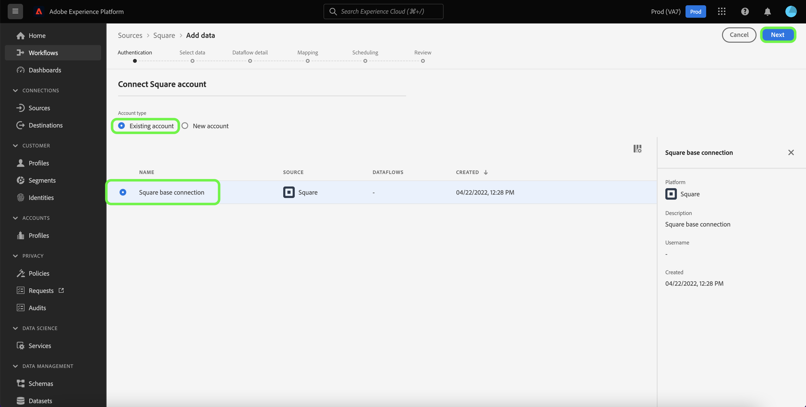

# 在用户界面中创建[!DNL Square]源连接

本教程提供了使用Experience Platform用户界面创建[!DNL Square]源连接器的步骤。

## 快速入门

本教程需要对以下Adobe Experience Platform组件有一定的了解：

* [[!DNL Experience Data Model (XDM)] 系统](../../../../../xdm/home.md)： [!DNL Experience Platform]用于组织客户体验数据的标准化框架。
   * [架构组合的基础知识](../../../../../xdm/schema/composition.md)：了解XDM架构的基本构建块，包括架构组合中的关键原则和最佳实践。
   * [架构编辑器教程](../../../../../xdm/tutorials/create-schema-ui.md)：了解如何使用架构编辑器UI创建自定义架构。
* [[!DNL Real-Time Customer Profile]](../../../../../profile/home.md)：根据来自多个源的汇总数据，提供统一的实时使用者个人资料。

### 收集所需的凭据

要访问您的[!DNL Square]帐户Experience Platform，您必须提供以下值：

| 凭据 | 描述 |
| --- | --- |
| Host | [!DNL Square]实例的URL。 |
| 客户端 ID | 与您的[!DNL Square]帐户关联的客户端ID。 |
| 客户端密码 | 与您的[!DNL Square]帐户关联的客户端密钥。 |
| 访问令牌 | 访问令牌用于通过OAuth 2.0身份验证对您的[!DNL Square]帐户进行身份验证。 可从[!DNL Square]获取访问令牌。 |
| 刷新令牌 | 刷新令牌用于在当前访问令牌过期后生成新的访问令牌。 可从[!DNL Square]获取刷新令牌。 |

有关这些凭据以及如何获取这些凭据的更多信息，请参阅OAuth](https://developer.squareup.com/docs/oauth-api/receive-and-manage-tokens)上的[[!DNL Square] 文档。

收集所需的凭据后，您可以按照以下步骤将您的[!DNL Square]帐户关联到Experience Platform。

## 连接您的[!DNL Square]帐户

在Experience Platform UI中，从左侧导航中选择&#x200B;**[!UICONTROL 源]**&#x200B;以访问[!UICONTROL 源]工作区。 [!UICONTROL Catalog]屏幕显示您可以用来创建帐户的各种源。

您可以从屏幕左侧的目录中选择相应的类别。 或者，您可以使用搜索选项查找您要使用的特定源。

在[!UICONTROL 付款]类别下，选择&#x200B;**[!UICONTROL 方形]**，然后选择&#x200B;**[!UICONTROL 添加数据]**。

出现&#x200B;**[!UICONTROL 连接到方形]**&#x200B;页面。 在此页上，您可以使用新凭据或现有凭据。

### 现有账户

要使用现有帐户，请选择要用于创建新数据流的[!DNL Square]帐户，然后选择&#x200B;**[!UICONTROL 下一步]**&#x200B;以继续。

### 新帐户

如果要创建新帐户，请选择&#x200B;**[!UICONTROL 新帐户]**，然后为[!DNL Square]凭据提供名称、可选描述和相应的值。 完成后，选择&#x200B;**[!UICONTROL 连接到源]**，然后留出一些时间来建立新连接。

## 后续步骤

通过学习本教程，您已验证并创建了[!DNL Square]帐户与Experience Platform之间的源连接。 您现在可以继续下一教程，并[创建数据流以将付款数据导入Experience Platform](../../dataflow/payments.md)。
