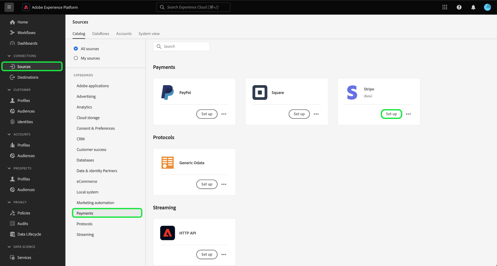
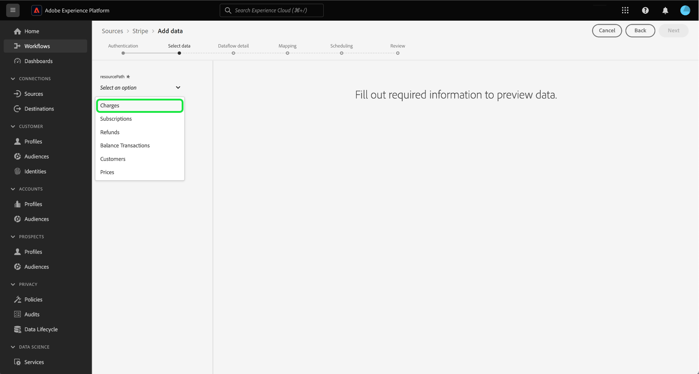
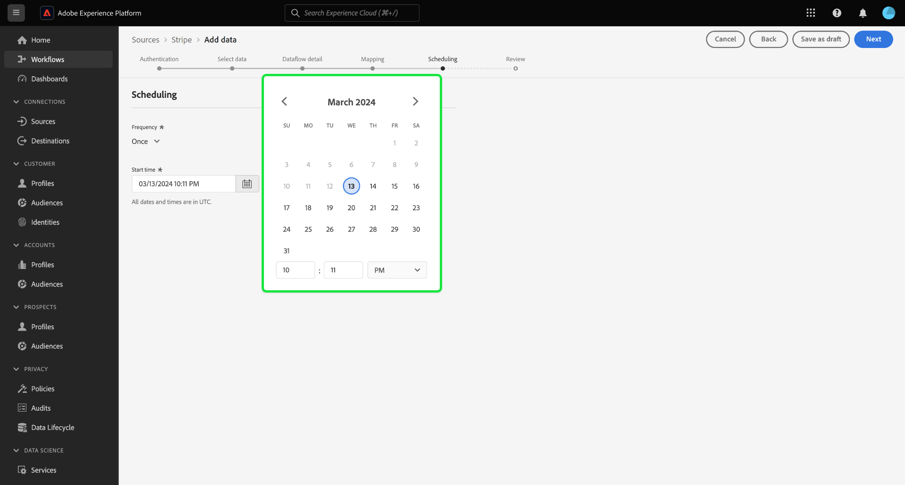

# 使用用户界面将付款数据从您的[!DNL Stripe]帐户摄取到Experience Platform

阅读以下教程，了解如何使用用户界面将付款数据从您的[!DNL Stripe]帐户摄取到Adobe Experience Platform。

## 快速入门

本教程需要对以下Experience Platform组件有一定的了解：

* [[!DNL Experience Data Model (XDM)] 系统](../../../../../xdm/home.md)： [!DNL Experience Platform]用于组织客户体验数据的标准化框架。
   * [架构组合的基础知识](../../../../../xdm/schema/composition.md)：了解XDM架构的基本构建块，包括架构组合中的关键原则和最佳实践。
   * [架构编辑器教程](../../../../../xdm/tutorials/create-schema-ui.md)：了解如何使用架构编辑器UI创建自定义架构。
* [[!DNL Real-Time Customer Profile]](../../../../../profile/home.md)：根据来自多个源的汇总数据，提供统一的实时使用者个人资料。

### 身份验证

有关如何检索身份验证凭据的信息，请阅读[[!DNL Stripe] 概述](../../../../connectors/payments/stripe.md)。

## 连接您的[!DNL Stripe]帐户 {#connect}

在Experience Platform UI中，从左侧导航中选择&#x200B;**[!UICONTROL 源]**&#x200B;以访问[!UICONTROL 源]工作区。 您可以从屏幕左侧的目录中选择相应的类别。 或者，您可以使用搜索选项查找您要使用的特定源。

在&#x200B;*付款*&#x200B;类别下，选择&#x200B;**[!DNL Stripe]**，然后选择&#x200B;**[!UICONTROL 设置]**。

>[!TIP]
>
>当给定的源尚未具有经过身份验证的帐户时，源目录中的源会显示&#x200B;**[!UICONTROL 设置]**&#x200B;选项。 一旦存在经过身份验证的帐户，此选项将更改为&#x200B;**[!UICONTROL 添加数据]**。

此时会显示&#x200B;**[!UICONTROL Connect Stripe帐户]**&#x200B;页面。 在此页上，您可以使用新的或现有的身份证明。

>[!BEGINTABS]

>[!TAB 创建新帐户]

要创建新帐户，请选择&#x200B;**[!UICONTROL 新帐户]**，并提供名称、可选描述和您的凭据。

完成后，选择&#x200B;**[!UICONTROL 连接到源]**，然后留出一些时间来建立新连接。

| 凭据 | 描述 |
| --- | --- |
| 访问令牌 | 您的[!DNL Stripe]访问令牌。 有关如何检索访问令牌的信息，请阅读[[!DNL Stripe] 身份验证指南](../../../../connectors/payments/stripe.md)。 |

>[!TAB 使用现有帐户]

若要使用现有帐户，请选择&#x200B;**[!UICONTROL 现有帐户]**，然后从现有帐户目录中选择要使用的帐户。

选择&#x200B;**[!UICONTROL 下一步]**&#x200B;以继续。

>[!ENDTABS]

## 选择数据 {#select-data}

现在您已经拥有了帐户的访问权限，则必须确定您要摄取的[!DNL Stripe]数据的相应路径。 选择&#x200B;**[!UICONTROL 资源路径]**，然后选择要从中摄取数据的终结点。 可用的[!DNL Stripe]端点包括：

* 费用
* 订阅
* 退款
* 余额交易记录
* 客户
* 价格

选择端点后，界面将更新为预览屏幕，显示您选择的[!DNL Stripe]端点的数据结构。 选择&#x200B;**[!UICONTROL 下一步]**&#x200B;以继续。

## 提供数据集和数据流详细信息 {#provide-dataset-and-dataflow-details}

接下来，您必须提供有关数据集和数据流的信息。

### 数据集详细信息 {#dataset-details}

数据集是用于数据集合的存储和管理结构，通常是表格，其中包含架构（列）和字段（行）。成功引入Experience Platform的数据将作为数据集存储在数据湖中。 在此步骤中，您可以创建新数据集或使用现有数据集。

>[!BEGINTABS]

>[!TAB 使用新数据集]

要使用新数据集，请选择&#x200B;**[!UICONTROL 新数据集]**，然后为您的数据集提供名称和可选描述。 您还必须选择数据集所遵循的体验数据模型(XDM)架构。

| 新数据集详细信息 | 描述 |
| --- | --- |
| 输出数据集名称 | 新数据集的名称。 |
| 描述 | （可选）新数据集的简短说明。 |
| 架构 | 您的组织中存在的架构的下拉列表。 您还可以在源配置过程之前创建自己的架构。 有关详细信息，请参阅[在UI](../../../../../xdm/tutorials/create-schema-ui.md)中创建XDM架构的指南。 |

>[!TAB 使用现有数据集]

如果您已经有一个现有数据集，请选择&#x200B;**[!UICONTROL 现有数据集]**，然后使用&#x200B;**[!UICONTROL 高级搜索]**&#x200B;选项查看组织中所有数据集的窗口，包括其各自的详细信息，例如，是否启用它们以摄取到Real-time Customer Profile。

>[!ENDTABS]

+++选择相关步骤以启用配置文件摄取、错误诊断和部分摄取。

如果您的数据集启用了实时客户个人资料，那么在此步骤中，您可以切换&#x200B;**[!UICONTROL 个人资料数据集]**&#x200B;以启用您的数据以进行个人资料摄取。 您还可以使用此步骤启用&#x200B;**[!UICONTROL 错误诊断]**&#x200B;和&#x200B;**[!UICONTROL 部分摄取]**。

* **[!UICONTROL 错误诊断]**：选择&#x200B;**[!UICONTROL 错误诊断]**&#x200B;以指示源生成错误诊断，以便以后在监视数据集活动和数据流状态时可以引用这些诊断。
* **[!UICONTROL 部分摄取]**：部分批次摄取是摄取包含错误的数据的能力，最多可摄取特定可配置阈值。 此功能允许您成功地将所有准确的数据提取到Experience Platform中，同时将所有不正确的数据与有关其无效原因的信息单独进行批处理。

+++

### 数据流详细信息 {#dataflow-details}

配置数据集后，您必须提供有关数据流的详细信息，包括名称、可选描述和警报配置。

| 数据流配置 | 描述 |
| --- | --- |
| 数据流名称 | 数据流的名称。  默认情况下，这将使用正在导入的文件的名称。 |
| 描述 | （可选）数据流的简短说明。 |
| 警报 | Experience Platform可生成用户可以订阅的基于事件的警报。 这些选项都需要一个正在运行的数据流来触发它们。  有关详细信息，请阅读[警报概述](../../alerts.md) <ul><li>**源数据流运行开始**：选择此警报以在数据流运行开始时接收通知。</li><li>**源数据流运行成功**：选择此警报以在数据流结束且没有任何错误时接收通知。</li><li>**源数据流运行失败**：选择此警报以在数据流运行结束时发生任何错误时接收通知。</li></ul> |

完成后，选择&#x200B;**[!UICONTROL 下一步]**&#x200B;以继续。

## 将字段映射到XDM架构 {#mapping}

出现&#x200B;**[!UICONTROL 映射]**&#x200B;步骤。 使用映射界面将源数据映射到相应的架构字段，然后再将该数据摄取到Experience Platform。 有关如何使用映射界面的详细指南，请阅读[数据准备UI指南](../../../../../data-prep/ui/mapping.md)以了解更多信息。

## 配置摄取计划 {#scheduling}

接下来，使用计划界面为数据流创建摄取计划。

选择频率下拉菜单以配置数据流的摄取频率。

您还可以选择日历图标并使用弹出日历来配置摄取开始时间。

| 计划配置 | 描述 |
| --- | --- |
| 频率 | 配置频率以指示数据流运行的频率。 您可以将频率设置为： <ul><li>**一次**：将频率设置为`once`以创建一次性引入。 创建一次性摄取数据流时，间隔和回填配置不可用。 默认情况下，调度频率设置为一次。</li><li>**分钟**：将频率设置为`minute`，以计划数据流以每分钟摄取数据。</li><li>**小时**：将频率设置为`hour`，以计划数据流每小时摄取数据。</li><li>**天**：将频率设置为`day`，以计划数据流每天摄取数据。</li><li>**周**：将频率设置为`week`，以计划数据流每周摄取数据。</li></ul> |
| 间隔 | 选择频率后，可以配置间隔设置以建立每次引入之间的时间范围。 例如，如果将频率设置为天并将间隔配置为15，则数据流将每15天运行一次。 不能将间隔设置为零。 每个频率的最小接受间隔值如下：<ul><li>**一次**：不适用</li><li>**分钟**： 15</li><li>**小时**： 1</li><li>**天**： 1</li><li>**周**： 1</li></ul> |
| 开始时间 | 预计运行的时间戳，以UTC时区显示。 |
| 回填 | 回填可确定最初摄取的数据。 如果启用了回填，则指定路径中的所有当前文件将在第一次计划摄取期间摄取。 如果禁用回填，则只摄取在第一次引入运行到开始时间之间加载的文件。 将不会摄取在开始时间之前加载的文件。 |

配置数据流的摄取计划后，选择&#x200B;**[!UICONTROL 下一步]**。

## 查看您的数据流

数据流创建过程的最后一步是在执行数据流之前对其进行检查。 使用&#x200B;**[!UICONTROL 查看]**&#x200B;步骤可在新数据流运行之前查看其详细信息。 详细信息按以下类别分组：

* **连接**：显示源类型、所选源文件的相关路径以及该源文件中的列数。
* **分配数据集和映射字段**：显示要将源数据摄取到哪个数据集，包括数据集所遵循的架构。
* **计划**：显示摄取计划的活动时段、频率和间隔。

查看数据流后，选择&#x200B;**[!UICONTROL 完成]**，然后等待一些时间来创建数据流。

## 后续步骤

通过学习本教程，您已成功创建了一个数据流，以将付款数据从[!DNL Stripe]源引入Experience Platform。 有关其他资源，请访问下面列出的文档。

### 监测数据流

创建数据流后，您可以监视通过它摄取的数据，以查看有关摄取率、成功和错误的信息。 有关如何监视数据流的详细信息，请访问有关UI中[监视帐户和数据流的教程](../../../../../dataflows/ui/monitor-sources.md)。

### 更新您的数据流

要更新数据流计划、映射和常规信息的配置，请访问有关[在UI中更新源数据流的教程](../../update-dataflows.md)。

### 删除您的数据流

您可以删除不再必需的数据流或使用&#x200B;**[!UICONTROL 数据流]**&#x200B;工作区中提供的&#x200B;**[!UICONTROL 删除]**&#x200B;功能错误地创建的数据流。 有关如何删除数据流的详细信息，请访问有关[在UI中删除数据流](../../delete.md)的教程。
