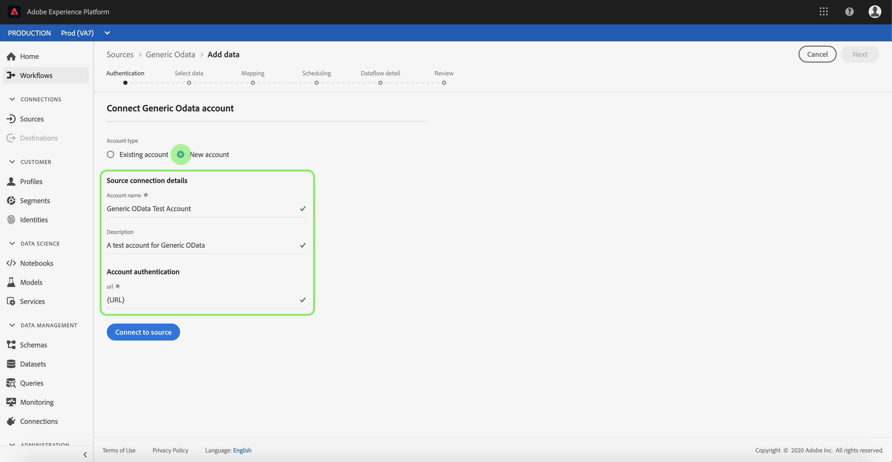

# 在UI中创建通用OData源连接器

> [!NOTE]
> 通用OData连接器为测试版。 功能和文档可能会发生更改。

Adobe Experience Platform中的源连接器提供按计划收集外部源数据的能力。 本教程提供了使用平台用户界面创建通用开放数据协议（以下简称“OData”）源连接器的步骤。

## 入门指南

本教程需要对Adobe Experience Platform的以下组件有充分的了解：

* [体验数据模型(XDM)系统](../../../../../xdm/home.md): Experience Platform组织客户体验数据的标准化框架。
   * [模式合成基础](../../../../../xdm/schema/composition.md): 了解XDM模式的基本构件，包括模式构成的主要原则和最佳做法。
   * [模式编辑器教程](../../../../../xdm/tutorials/create-schema-ui.md): 了解如何使用模式编辑器UI创建自定义模式。
* [实时客户用户档案](../../../../../profile/home.md): 基于来自多个来源的聚集数据提供统一、实时的消费者用户档案。

如果您已经有有效的OData连接，您可以跳过此文档的其余部分，继续学习有关配置协议 [数据集流的教程](../../dataflow/protocols.md)

### 收集所需的凭据

要在平台中访问您的OData帐户，必须提供以下值：

| 凭据 | 描述 |
| ---------- | ----------- |
| `url` | OData服务的根URL。 |

有关快速入门的详细信息，请参 [阅此OData文档](https://www.odata.org/getting-started/basic-tutorial/)。

## 连接您的OData帐户

收集所需凭据后，您可以按照以下步骤创建新的OData帐户以连接到平台。

登录到 <a href="https://platform.adobe.com" target="_blank">Adobe Experience Platform</a> ，然后从左 **侧导航栏** 中 *选择“源* ”以访问“源”工作区。 “ *目录* ”屏幕显示可为其创建入站帐户的各种源。 每个源显示与其关联的现有帐户和数据集流的数量。

您可以从屏幕左侧的目录中选择适当的类别。 或者，您也可以使用搜索选项找到要使用的特定源。

在“协 *议* ”类别下， **选择“通用OData** ”以在屏幕右侧显示一个信息栏。 信息栏提供所选源的简短描述以及与源或视图其文档的选项。 要创建新的入站连接，请选择“ **连接源”**。

将显 *示“连接到通用OData* ”页。 在此页上，您可以使用新凭据或现有凭据。

### 新帐户

如果您使用新凭据，请选择“ **新帐户**”。 在显示的输入表单上，提供连接的名称、可选说明和您的OData凭据。 完成后，选 **择** Connect，然后允许一段时间建立新帐户。

### 现有帐户

要连接现有帐户，请选择要连接的OData帐户，然后选择“下 **一步** ”以继续。

## 后续步骤

通过遵循本教程，您已建立了与OData帐户的连接。 您现在可以继续阅读下一个教程并 [配置数据集流，将协议数据引入平台](../../dataflow/protocols.md)。