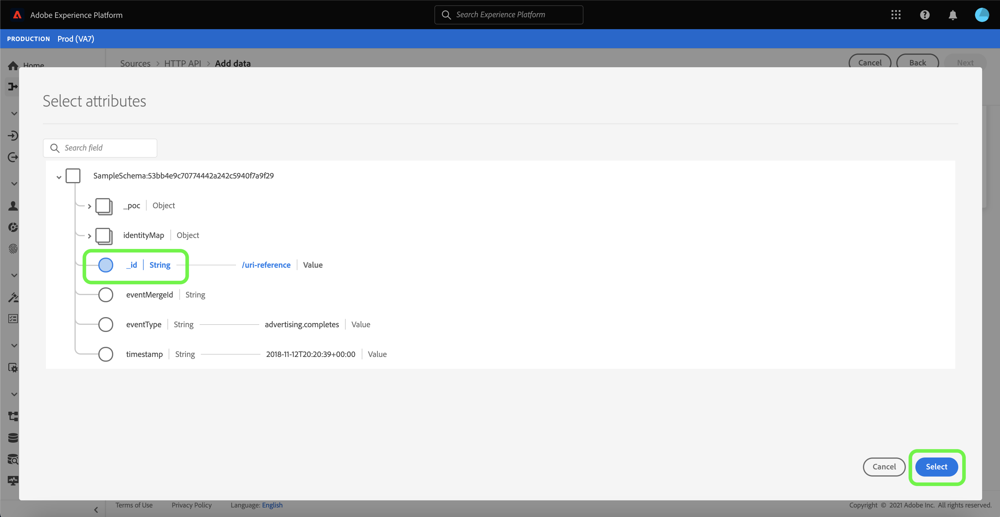
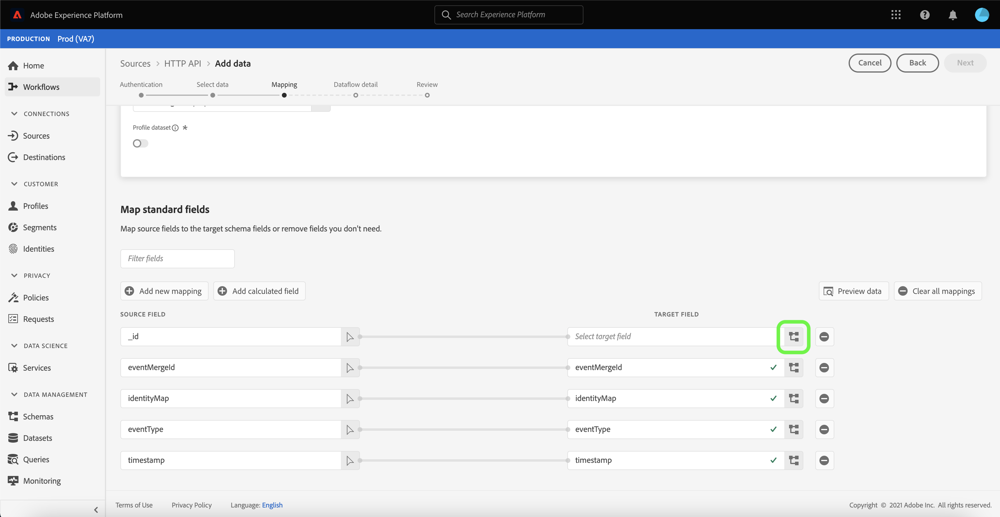
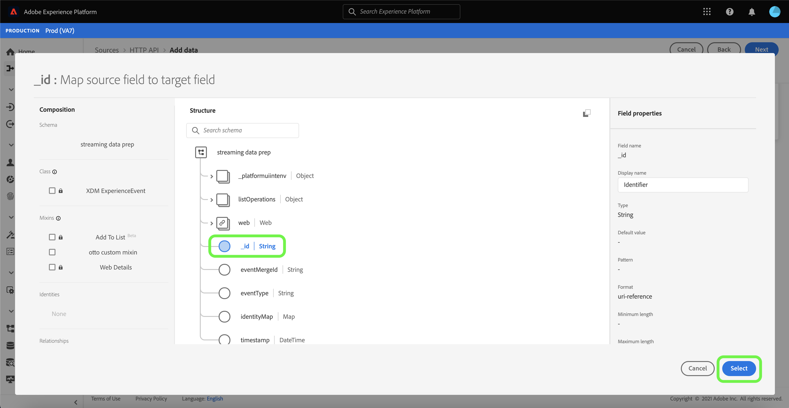

# 使用用户界面创建[!DNL HTTP API]流连接

本教程提供了使用[!UICONTROL 源]工作区创建流源连接的步骤。

## 快速入门

本教程需要对以下Adobe Experience Platform组件有一定的了解：

- [[!DNL Experience Data Model (XDM)] 系统](../../../../../xdm/home.md)： [!DNL Experience Platform]用于组织客户体验数据的标准化框架。
   - [架构组合的基础知识](../../../../../xdm/schema/composition.md)：了解XDM架构的基本构建块，包括架构组合中的关键原则和最佳实践。
   - [架构编辑器教程](../../../../../xdm/tutorials/create-schema-ui.md)：了解如何使用架构编辑器UI创建自定义架构。
- [[!DNL Real-Time Customer Profile]](../../../../../profile/home.md)：根据来自多个源的汇总数据，提供统一的实时使用者个人资料。

## 创建流连接

在Experience Platform UI中，从左侧导航中选择&#x200B;**[!UICONTROL 源]**&#x200B;以访问[!UICONTROL 源]工作区。 [!UICONTROL Catalog]屏幕显示您可以用来创建帐户的各种源。

您可以从屏幕左侧的目录中选择相应的类别。 或者，您可以使用搜索选项查找您要使用的特定源。

在&#x200B;**[!UICONTROL 流]**&#x200B;类别下，选择&#x200B;**[!UICONTROL HTTP API]**，然后选择&#x200B;**[!UICONTROL 添加数据]**。

出现&#x200B;**[!UICONTROL Connect HTTP API帐户]**&#x200B;页面。 在此页上，您可以使用新凭据或现有凭据。

### 现有账户

要使用现有帐户，请选择要用于创建新数据流的HTTP API帐户，然后选择&#x200B;**[!UICONTROL 下一步]**&#x200B;以继续。

### 新帐户

如果要创建新帐户，请选择&#x200B;**[!UICONTROL 新建帐户]**。 在出现的输入表单上，提供帐户名称和可选描述。 您还可以选择提供以下配置属性：

- **[!UICONTROL 身份验证]：**&#x200B;此属性确定流连接是否需要身份验证。 身份验证确保从可信来源收集数据。 如果您处理的是个人身份信息(PII)，则应该启用此属性。 默认情况下，此属性处于关闭状态。
- **[!UICONTROL 与XDM兼容]：**&#x200B;此属性指示此流连接是否将发送与XDM架构兼容的事件。 默认情况下，此属性处于关闭状态。

完成后，选择&#x200B;**[!UICONTROL 连接到源]**，然后选择&#x200B;**[!UICONTROL 下一步]**&#x200B;以继续。

## 选择数据

创建HTTP API连接后，将显示&#x200B;**[!UICONTROL 选择数据]**&#x200B;步骤，为您提供上传和预览数据的界面。

选择&#x200B;**[!UICONTROL 上载文件]**&#x200B;上载您的数据。 或者，您也可以将数据拖放到界面的[!UICONTROL 拖放文件]部分。

上传数据后，您可以使用界面的右侧预览文件层次结构。 选择&#x200B;**[!UICONTROL 下一步]**&#x200B;以继续。

## 将数据字段映射到XDM架构

此时将显示[!UICONTROL 映射]步骤，该步骤提供了一个用于将源数据映射到Experience Platform数据集的界面。

[!DNL HTTP API]源支持摄取JSON文件。 如果将JSON文件标记为XDM投诉，则无需手动配置。 如果没有，则必须显式配置映射。

选择要引入的集客数据的数据集。 您可以使用现有数据集或创建新数据集。

### 创建新数据集

要创建新数据集，请选择&#x200B;**[!UICONTROL 新建数据集]**。 在显示的表单上，提供名称、可选描述以及数据集的目标架构。 如果您选择启用了[!DNL Profile]的架构，则可以选择数据集是否也应该启用[!DNL Profile]。

### 使用现有数据集

要使用现有数据集，请选择&#x200B;**[!UICONTROL 现有数据集]**。 在显示的表单上，选择要使用的数据集。 选择数据集后，您可以选择是否应将该数据集启用[!DNL Profile]。

### 映射标准字段

根据需要，您可以选择直接映射字段，或使用数据准备函数转换源数据以派生计算值或计算值。 有关使用映射器界面和计算字段的全面步骤，请参阅[数据准备UI指南](../../../../../data-prep/ui/mapping.md)。

要添加新源字段，请选择&#x200B;**[!UICONTROL 添加新映射]**。

此时将显示一个新的源字段与目标字段配对。 要添加新源字段，请选择[!UICONTROL 选择源字段]输入栏旁边的箭头图标。

[!UICONTROL 选择属性]面板允许您浏览文件层次结构并选择要映射到目标XDM字段的特定源字段。 选择要映射的源字段后，选择&#x200B;**[!UICONTROL 选择]**&#x200B;以继续。

选择源字段后，您现在可以标识要映射到的相应目标XDM字段。 选择目标字段部分下的架构图标。

出现[!UICONTROL 将源字段映射到目标字段]窗口，为您提供用于浏览目标数据集架构的界面。 选择与源字段匹配的目标字段，然后选择&#x200B;**[!UICONTROL 选择]**&#x200B;以继续。

将源字段全部映射到相应的目标XDM字段后，选择&#x200B;**[!UICONTROL 下一步]**

## 数据流详细信息

此时将显示&#x200B;**[!UICONTROL 数据流详细信息]**&#x200B;步骤。 在此页上，可以通过提供名称和可选描述来提供已创建数据流的详细信息。

为数据流提供详细信息后，选择&#x200B;**[!UICONTROL 下一步]**。

## 审查

此时将显示&#x200B;**[!UICONTROL 审核]**&#x200B;步骤，允许您在创建数据流之前查看其详细信息。 详细信息分为以下类别：

- **[!UICONTROL 连接]**：显示帐户名、源平台和源名。
- **[!UICONTROL 分配数据集并映射字段]**：显示目标数据集和数据集所遵循的架构。

确认详细信息正确后，选择&#x200B;**[!UICONTROL 完成]**。

## 获取流端点URL

创建连接后，将显示源详细信息页面。 此页面显示新创建连接的详细信息，包括以前运行的数据流、ID和流端点URL。

## 后续步骤

通过遵循本教程，您已创建一个流HTTP连接，从而允许您使用流端点访问各种[!DNL Data Ingestion] API。 有关在API中创建流连接的说明，请参阅[创建流连接教程](../../../api/create/streaming/http.md)。

要了解如何将数据流式传输到Experience Platform，请阅读有关[流式传输时间序列数据](../../../../../ingestion/tutorials/streaming-time-series-data.md)的教程或有关[流式传输记录数据](../../../../../ingestion/tutorials/streaming-record-data.md)的教程。
