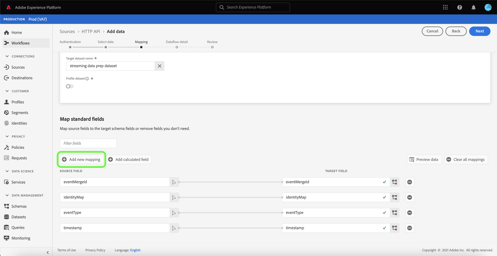

# 创建 [!DNL HTTP API] 使用UI的流连接

本教程提供了使用创建流源连接的步骤 [!UICONTROL 源] 工作区。

## 快速入门

本教程需要对Adobe Experience Platform的以下组件有一定的了解：

- [[!DNL Experience Data Model (XDM)] 系统](../../../../../xdm/home.md):标准化框架， [!DNL Experience Platform] 组织客户体验数据。
   - [架构组合的基础知识](../../../../../xdm/schema/composition.md):了解XDM模式的基本构建块，包括模式组合中的关键原则和最佳实践。
   - [模式编辑器教程](../../../../../xdm/tutorials/create-schema-ui.md):了解如何使用模式编辑器UI创建自定义模式。
- [[!DNL Real-Time Customer Profile]](../../../../../profile/home.md):根据来自多个来源的汇总数据提供统一的实时客户资料。

## 创建流连接

在平台UI中，选择 **[!UICONTROL 源]** 从左侧导航访问 [!UICONTROL 源] 工作区。 的 [!UICONTROL 目录] 屏幕会显示您可以为其创建帐户的各种来源。

您可以从屏幕左侧的目录中选择相应的类别。 或者，您可以使用搜索选项找到要处理的特定源。

在 **[!UICONTROL 流]** 类别，选择 **[!UICONTROL HTTP API]** 然后选择 **[!UICONTROL 添加数据]**.

的 **[!UICONTROL 连接HTTP API帐户]** 页面。 在此页面上，您可以使用新凭据或现有凭据。

### 现有帐户

要使用现有帐户，请选择要通过创建新数据流的HTTP API帐户，然后选择 **[!UICONTROL 下一个]** 以继续。

### 新帐户

如果要创建新帐户，请选择 **[!UICONTROL 新帐户]**. 在显示的输入窗体上，提供帐户名称和可选描述。 您还可以选择提供以下配置属性：

- **[!UICONTROL 身份验证]:** 此属性确定流连接是否需要身份验证。 身份验证可确保从可信来源收集数据。 如果您要处理个人身份信息(PII)，则应该打开此资产。 默认情况下，此属性处于关闭状态。
- **[!UICONTROL 兼容XDM]:** 此属性指示此流连接是否将发送与XDM架构兼容的事件。 默认情况下，此属性处于关闭状态。

完成后，选择 **[!UICONTROL 连接到源]** 然后选择 **[!UICONTROL 下一个]** 以继续。

## 选择数据

创建HTTP API连接后， **[!UICONTROL 选择数据]** 步骤，为您提供用于上传和预览数据的界面。

选择 **[!UICONTROL 上传文件]** 上传数据。 或者，您也可以将数据拖放到 [!UICONTROL 拖放文件] 部分。

上传数据后，您可以使用界面的右侧预览文件层次结构。 选择 **[!UICONTROL 下一个]** 以继续。

## 将数据字段映射到XDM架构

的 [!UICONTROL 映射] 步骤，提供一个界面以将源数据映射到Platform数据集。

Parquet文件必须符合XDM标准，并且不需要您手动配置映射，而CSV文件要求您明确配置映射，但允许您选择要映射的源数据字段。 如果JSON文件标记为XDM投诉，则无需手动配置。 但是，如果它未标记为符合XDM，则需要您明确配置映射。

为要摄取到的入站数据选择数据集。 您可以使用现有数据集，也可以创建新数据集。

### 创建新数据集

要创建新数据集，请选择 **[!UICONTROL 新数据集]**. 在显示的表单中，提供名称、可选描述以及数据集的目标架构。 如果您选择 [!DNL Profile]启用模式时，您可以选择是否还应 [!DNL Profile]-enabled。

### 使用现有数据集

要使用现有数据集，请选择 **[!UICONTROL 现有数据集]**. 在显示的表单中，选择要使用的数据集。 选择数据集后，您可以选择该数据集是否应为 [!DNL Profile]-enabled。

### 映射标准字段

根据您的需要，您可以选择直接映射字段，或使用数据准备函数转换源数据以导出计算值或计算值。 有关使用映射器界面和计算字段的完整步骤，请参阅 [数据准备UI指南](../../../../../data-prep/ui/mapping.md).

要添加新源字段，请选择 **[!UICONTROL 添加新映射]**.

出现新的源字段和目标字段配对。 要添加新的源字段，请选择 [!UICONTROL 选择源字段] 输入栏。

的 [!UICONTROL 选择属性] 面板允许您浏览文件层次结构并选择要映射到目标XDM字段的特定源字段。 选择要映射的源字段后，选择 **[!UICONTROL 选择]** 以继续。

现在，选择源字段后，您可以识别要映射到的相应目标XDM字段。 选择目标字段部分下的架构图标。

的 [!UICONTROL 将源字段映射到目标字段] 窗口，为您提供一个界面来浏览target数据集的架构。 选择与源字段匹配的目标字段，然后选择 **[!UICONTROL 选择]** 以继续。

将所有源字段都映射到相应的目标XDM字段后，请选择 **[!UICONTROL 下一个]**

## 数据流详细信息

的 **[!UICONTROL 数据流详细信息]** 中。 在本页中，您可以通过提供名称和可选描述来提供已创建数据流的详细信息。

在提供数据流的详细信息后，选择 **[!UICONTROL 下一个]**.

## 审阅

的 **[!UICONTROL 审阅]** 步骤，允许您在创建数据流之前查看其详细信息。 详细信息属于以下类别：

- **[!UICONTROL 连接]**:显示帐户名称、源平台和源名称。
- **[!UICONTROL 分配数据集和映射字段]**:显示目标数据集以及数据集所遵循的架构。

确认详细信息正确后，选择 **[!UICONTROL 完成]**.

## 获取流端点URL

创建连接后，将显示源详细信息页面。 本页显示新创建连接的详细信息，包括以前运行的数据流、ID和流端点URL。

## 后续步骤

在本教程之后，您创建了一个流HTTP连接，使您能够使用流端点访问各种 [!DNL Data Ingestion] API。 有关在API中创建流连接的说明，请阅读 [创建流连接教程](../../../api/create/streaming/http.md).

要了解如何将数据流式传输到Platform，请阅读 [流时间序列数据](../../../../../ingestion/tutorials/streaming-time-series-data.md) 或 [流记录数据](../../../../../ingestion/tutorials/streaming-record-data.md).
