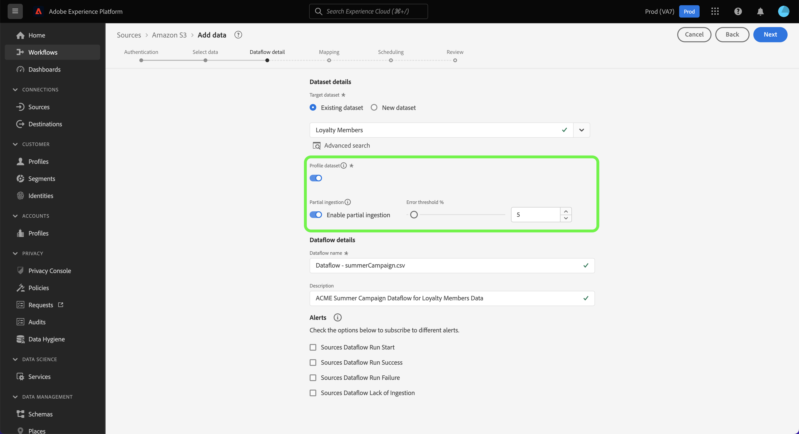

# 配置数据流以从UI中的云存储源摄取批量数据

本教程提供了有关如何配置数据流以将批量数据从云存储源引入到Adobe Experience Platform的步骤。

## 快速入门

>[!NOTE]
>
>要创建数据流以从云存储引入批量数据，您必须已拥有对经过身份验证的云存储源的访问权限。 如果您没有访问权限，请转到[源概述](../../../../home.md#cloud-storage)，获取可为其创建帐户的云存储源的列表。

本教程需要对以下Experience Platform组件有一定的了解：

* [[!DNL Experience Data Model (XDM)] 系统](../../../../../xdm/home.md)： Experience Platform用于组织客户体验数据的标准化框架。
   * [架构组合的基础知识](../../../../../xdm/schema/composition.md)：了解XDM架构的基本构建块，包括架构组合中的关键原则和最佳实践。
   * [架构编辑器教程](../../../../../xdm/tutorials/create-schema-ui.md)：了解如何使用架构编辑器UI创建自定义架构。
* [[!DNL Real-Time Customer Profile]](../../../../../profile/home.md)：根据来自多个源的汇总数据，提供统一的实时使用者个人资料。

### 支持的文件格式

批量数据的云存储源支持以下文件格式进行摄取：

* 分隔符分隔值(DSV)：任何单字符值都可以用作DSV格式的数据文件的分隔符。
* [!DNL JavaScript Object Notation] (JSON)： JSON格式的数据文件必须符合XDM。
* [!DNL Apache Parquet]： Parquet格式的数据文件必须符合XDM。
* 压缩文件： JSON和分隔文件可以压缩为： `bzip2`、`gzip`、`deflate`、`zipDeflate`、`tarGzip`和`tar`。

## 添加数据

创建云存储帐户后，将显示&#x200B;**[!UICONTROL 添加数据]**&#x200B;步骤，该步骤为您提供了一个界面，用于浏览云存储文件层次结构并选择要带到Experience Platform的文件夹或特定文件。

* 界面的左侧是目录浏览器，显示您的云存储文件层次结构。
* 界面的右侧部分允许您预览兼容文件夹或文件中最多100行数据。

选择根文件夹以访问您的文件夹层次结构。 在此处，您可以选择单个文件夹以递归方式摄取文件夹中的所有文件。 摄取整个文件夹时，必须确保该文件夹中的所有文件共享相同的数据格式和架构。

选择文件夹后，正确的界面将更新为所选文件夹中第一个文件的内容和结构的预览。

在此步骤中，您可以在继续之前对数据做出多个配置。 首先，选择&#x200B;**[!UICONTROL 数据格式]**，然后在出现的下拉面板中为文件选择适当的数据格式。

下表显示了所支持文件类型的相应数据格式：

| 文件类型 | 数据格式 |
| --- | --- |
| CSV | [!UICONTROL 已分隔] |
| JSON | [!UICONTROL JSON] |
| Parquet | [!UICONTROL XDM Parquet] |

### 选择列分隔符

配置数据格式后，可在引入分隔文件时设置列分隔符。 选择&#x200B;**[!UICONTROL 分隔符]**&#x200B;选项，然后从下拉菜单中选择一个分隔符。 菜单显示最常用的分隔符选项，包括逗号(`,`)、制表符(`\t`)和管道字符(`|`)。

如果您希望使用自定义分隔符，请选择&#x200B;**[!UICONTROL 自定义]**，然后在弹出输入栏中输入您选择的单个字符分隔符。

### 摄取压缩文件

您还可以通过指定压缩JSON或分隔文件的压缩类型来摄取它们。

在[!UICONTROL 选择数据]步骤中，选择要摄取的压缩文件，然后选择其相应的文件类型以及是否符合XDM。 接下来，选择&#x200B;**[!UICONTROL 压缩类型]**，然后为您的源数据选择适当的压缩文件类型。

要将特定文件带入Experience Platform，请选择一个文件夹，然后选择要摄取的文件。 在此步骤中，还可以使用文件名旁边的预览图标预览给定文件夹中其他文件的文件内容。

完成后，选择&#x200B;**[!UICONTROL 下一步]**。

## 提供数据流详细信息

[!UICONTROL 数据流详细信息]页面允许您选择是要使用现有数据集，还是使用新数据集。 在此过程中，您还可以配置要摄取到配置文件的数据，并启用[!UICONTROL 错误诊断]、[!UICONTROL 部分摄取]和[!UICONTROL 警报]等设置。

### 使用现有数据集

要将数据摄取到现有数据集，请选择&#x200B;**[!UICONTROL 现有数据集]**。 您可以使用[!UICONTROL 高级搜索]选项或通过滚动下拉菜单中的现有数据集列表来检索现有数据集。 选择数据集后，为数据流提供名称和描述。

### 使用新数据集

要摄取到新数据集中，请选择&#x200B;**[!UICONTROL 新数据集]**，然后提供输出数据集名称和可选描述。 接下来，使用[!UICONTROL 高级搜索]选项或通过滚动下拉菜单中的现有架构列表来选择要映射到的架构。 选择架构后，为数据流提供名称和描述。

### 启用配置文件和错误诊断

接下来，选择&#x200B;**[!UICONTROL 配置文件数据集]**&#x200B;切换为配置文件启用您的数据集。 这允许您创建实体的属性和行为的整体视图。 来自所有启用配置文件的数据集的数据将包含在配置文件中，并在保存数据流时应用更改。

[!UICONTROL 错误诊断]允许为数据流中发生的任何错误记录生成详细的错误消息，而[!UICONTROL 部分摄取]允许您摄取包含错误的数据，摄取阈值为您手动定义的某个阈值。 有关详细信息，请参阅[部分批次摄取概述](../../../../../ingestion/batch-ingestion/partial.md)。

### 启用警报

您可以启用警报以接收有关数据流状态的通知。 从列表中选择警报以订阅接收有关数据流状态的通知。 有关警报的详细信息，请参阅[使用UI订阅源警报指南](../../alerts.md)。

完成向数据流提供详细信息后，选择&#x200B;**[!UICONTROL 下一步]**。

## 将数据字段映射到XDM架构

此时将显示[!UICONTROL 映射]步骤，该步骤为您提供了一个接口，用于将源架构中的源字段映射到目标架构中相应的目标XDM字段。

Experience Platform根据您选择的目标架构或数据集，为自动映射的字段提供智能推荐。 您可以手动调整映射规则以适合您的用例。 根据需要，您可以选择直接映射字段，或使用数据准备函数转换源数据以派生计算值或计算值。 有关使用映射器界面和计算字段的全面步骤，请参阅[数据准备UI指南](../../../../../data-prep/ui/mapping.md)。

成功映射源数据后，选择&#x200B;**[!UICONTROL 下一步]**。

## 计划摄取运行

>[!IMPORTANT]
>
>强烈建议在使用[FTP源](../../../../connectors/cloud-storage/ftp.md)时安排数据流的一次性摄取。

此时将显示[!UICONTROL 计划]步骤，允许您配置摄取计划，以使用配置的映射自动摄取选定的源数据。 默认情况下，计划设置为`Once`。 要调整您的摄取频率，请选择&#x200B;**[!UICONTROL 频率]**，然后从下拉菜单中选择一个选项。

>[!TIP]
>
>间隔和回填在一次性摄取期间不可见。

如果将摄取频率设置为`Minute`、`Hour`、`Day`或`Week`，则必须设置一个间隔，以便在每次摄取之间建立一个设置的时间范围。 例如，摄取频率设置为`Day`，间隔设置为`15`意味着您的数据流计划每15天摄取一次数据。

在此步骤中，您还可以启用&#x200B;**回填**&#x200B;并为增量数据摄取定义列。 回填用于摄取历史数据，而您为增量摄取定义的列允许从现有数据中区分新数据。

有关计划配置的详细信息，请参阅下表。

| 计划配置 | 描述 |
| --- | --- |
| 频度 | 配置频率以指示数据流运行的频率。 您可以将频率设置为： <ul><li>**一次**：将频率设置为`once`以创建一次性引入。 创建一次性摄取数据流时，间隔和回填配置不可用。 默认情况下，调度频率设置为一次。</li><li>**分钟**：将频率设置为`minute`，以计划数据流以每分钟摄取数据。</li><li>**小时**：将频率设置为`hour`，以计划数据流每小时摄取数据。</li><li>**天**：将频率设置为`day`，以计划数据流每天摄取数据。</li><li>**周**：将频率设置为`week`，以计划数据流每周摄取数据。</li></ul> |
| 间隔 | 选择频率后，可以配置间隔设置以建立每次引入之间的时间范围。 例如，如果将频率设置为天并将间隔配置为15，则数据流将每15天运行一次。 不能将间隔设置为零。 每个频率的最小接受间隔值如下：<ul><li>**一次**：不适用</li><li>**分钟**： 15</li><li>**小时**： 1</li><li>**天**： 1</li><li>**周**： 1</li></ul> |
| 开始时间 | 预计运行的时间戳，以UTC时区显示。 |
| 回填 | 回填可确定最初摄取的数据。 如果启用了回填，则指定路径中的所有当前文件将在第一次计划摄取期间摄取。 如果禁用回填，则只摄取在第一次引入运行到开始时间之间加载的文件。 将不会摄取在开始时间之前加载的文件。 |

>[!NOTE]
>
>对于批量摄取，每个后续数据流会根据其&#x200B;**上次修改时间**&#x200B;时间戳选择从源中摄取的文件。 这意味着批处理数据流从源中选择新的文件，或者自上次流运行以来修改的文件。 此外，您必须确保在文件上传与计划流量运行之间有足够的时间跨度，因为可能无法提取在计划流量运行时间之前未完全上传到您的云存储帐户的文件以供摄取。

完成摄取计划配置后，选择&#x200B;**[!UICONTROL 下一步]**。

## 查看您的数据流

将显示&#x200B;**[!UICONTROL 审核]**&#x200B;步骤，允许您在创建新数据流之前对其进行审核。 详细信息分为以下类别：

* **[!UICONTROL 连接]**：显示源类型、所选源文件的相关路径以及该源文件中的列数。
* **[!UICONTROL 分配数据集和映射字段]**：显示要将源数据摄取到哪个数据集，包括数据集所遵循的架构。
* **[!UICONTROL 计划]**：显示摄取计划的活动时段、频率和间隔。

查看数据流后，单击&#x200B;**[!UICONTROL 完成]**&#x200B;并留出一些时间来创建数据流。

## 后续步骤

通过学习本教程，您已成功创建了数据流以从外部云存储引入数据，并深入了解了监测数据集。 要了解有关创建数据流的更多信息，您可以通过观看以下视频来补充您的学习。 此外，下游[!DNL Experience Platform]服务（如[!DNL Real-Time Customer Profile]和[!DNL Data Science Workspace]）现在可以使用传入数据。 有关更多详细信息，请参阅以下文档：

* [[!DNL Real-Time Customer Profile] 概述](../../../../../profile/home.md)
* [[!DNL Data Science Workspace] 概述](../../../../../data-science-workspace/home.md)

>[!WARNING]
>
> 以下视频中显示的[!DNL Experience Platform] UI已过期。 有关最新的UI屏幕截图和功能，请参阅上述文档。

>[!VIDEO](https://video.tv.adobe.com/v/32136?quality=12&learn=on&captions=chi_hans)

## 附录

以下部分提供了有关使用源连接器的其他信息。

## 监测数据流

创建数据流后，您可以监视通过它摄取的数据，以查看有关摄取率、成功和错误的信息。 有关如何监视数据流的详细信息，请访问有关UI中[监视帐户和数据流的教程](../../monitor.md)。

## 更新您的数据流

要更新数据流计划、映射和常规信息的配置，请访问有关[在UI中更新源数据流的教程](../../update-dataflows.md)

## 删除您的数据流

您可以删除不再必需的数据流或使用&#x200B;**[!UICONTROL 数据流]**&#x200B;工作区中提供的&#x200B;**[!UICONTROL 删除]**&#x200B;功能错误地创建的数据流。 有关如何删除数据流的详细信息，请访问有关[在UI中删除数据流](../../delete.md)的教程。