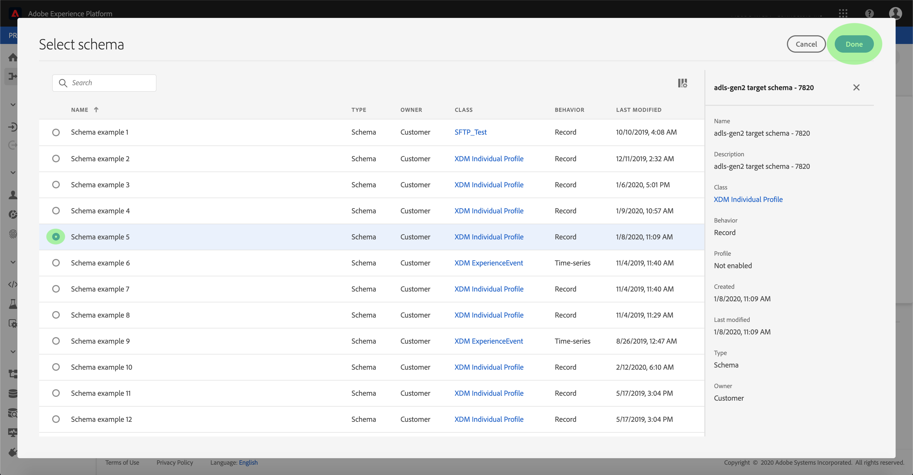

# 在UI中为云存储批处理连接器配置数据流

数据流是从源中检索数据并将其引入平台数据集的计划任务。 本教程提供使用云存储库连接器配置新数据流的步骤。

## 入门指南

本教程需要对Adobe Experience Platform的以下组件有充分的了解：

* [体验数据模型(XDM)系统](../../../../../xdm/home.md): Experience Platform组织客户体验数据的标准化框架。
   * [模式合成基础](../../../../../xdm/schema/composition.md): 了解XDM模式的基本构件，包括模式构成的主要原则和最佳做法。
   * [模式编辑器教程](../../../../../xdm/tutorials/create-schema-ui.md): 了解如何使用模式编辑器UI创建自定义模式。
* [实时客户用户档案](../../../../../profile/home.md): 基于来自多个来源的聚集数据提供统一、实时的消费者用户档案。

此外，本教程要求您已创建云存储连接器。 有关在UI中创建不同云存储连接器的列表教程，请参阅源连接 [器概述](../../../../home.md)。

### 支持的文件格式

Experience Platform支持从外部存储摄取的以下文件格式：

* 分隔符分隔值(DSV): 目前，对DSV格式数据文件的支持仅限于逗号分隔的值。 DSV格式化文件中字段标题的值只能由字母数字字符和下划线组成。 今后将提供对一般DSV文件的支持。
* JavaScript对象表示法(JSON): JSON格式的数据文件必须符合XDM规范。
* Apache Parke: 拼花格式的数据文件必须符合XDM标准。

## 选择数据

创建云存储连接器后，将显 *示选择* 步骤，为您提供一个交互式界面来浏览您的云存储层次结构。

* 界面的左半部分是目录浏览器，显示服务器的文件和目录。
* 界面的右半部分允许您从一个兼容文件预览多达100行数据。

单击列出的文件夹可将文件夹层次结构遍历到更深层文件夹。 选择兼容文件或文件夹后，将显示“选 **择预览格式** ”下拉框，您可以在“”窗口中选择显示数据的格式。

预览窗口填充后，您可以单击“下 **一步** ”以上传选定文件夹中的所有文件。 如果要上传到特定文件，请在单击“下一步”之前从列表中选择该 **文件**。

>[!NOTE] 支持的文件格式包括CSV、JSON和Parke。 JSON和Parke文件必须符合XDM标准。

## 将数据字段映射到XDM模式

将显 *示“映射* ”步骤，提供一个交互界面，将源数据映射到平台数据集。 JSON或Parke格式的源文件必须符合XDM规范，并且不需要手动配置映射。 相反，CSV文件要求您显式配置映射，但允许您选择要映射的源数据字段。

选择要收录到的入站数据的数据集。 您可以使用现有数据集或创建新数据集。

**使用现有数据集**

要将数据引入现有数据集，请选择 **使用现有数据集**，然后单击数据集图标。

此时将 _显示“选择数据集_ ”对话框。 找到您要使用的数据集，选择它，然后单击“继 **续”**。

**使用新数据集**

要将数据引入新数据集，请选 **择创建新数据集** ，并在提供的字段中输入数据集的名称和说明。 然后，单击模式图标。

将出 _现“选择模式_ ”对话框。 选择要应用于新数据集的模式，然后单击 **完成**。

根据您的需要，您可以选择直接映射字段，或使用映射器函数转换源数据以导出计算值或计算值。 有关数据映射和映射器功能的详细信息，请参阅将CSV数据 [映射到XDM模式字段的教程](../../../../../ingestion/tutorials/map-a-csv-file.md)。

映射源数据后，单击“下 **一步**”。

## 计划摄取运行

此时 *将显示* “计划”步骤，允许您配置摄取计划，以使用配置的映射自动摄取所选源数据。 下表概述了用于计划的不同可配置字段：

| 字段 | 描述 |
| --- | --- |
| 频率 | 可选频率包括分钟、小时、天和周。 |
| 间隔 | 一个整数，它为所选频率设置间隔。 |
| 开始时间 | UTC时间戳，将对其进行第一次摄取。 |
| 回填 | 一个布尔值，它确定最初摄取的数据。 如果 *启用* “回填”，则指定路径中的所有当前文件将在第一次预定接收期间被摄取。 如果 *禁用* “回填”，则只会摄取在首次摄取和开始时间之间加 *载的文件* 。 在开始时间之 *前加载的文* 件将不会被摄取。 |

数据流设计为按计划自动摄取数据。 如果您希望通过此工作流只收录一次，可以将 **Frequency** （频率）配置为“Day”，并为Interval（间隔）应用一个非常大的 **数字**，如10000或类似。

为计划提供值，然后单击“下 **一步**”。

## 命名数据流

随 *后将出现* “命名流”步骤，允许您命名新数据流并给出简要描述。

提供数据流的值，然后单击“下 **一步**”。

### 查看数据流

此时 *会出现* “审阅”步骤，允许您在创建新数据流之前对其进行查看。 详细信息按以下类别分组：

* *源详细信息*: 显示源类型、所选源文件的相关路径以及该源文件中的列数。
* *目标详细信息*: 显示接收源数据的数据集，包括数据集附带的模式。
* *计划详细信息*: 显示摄取计划的活动周期、频率和间隔。

查看数据流后，单击 **完成** ，并允许一段时间创建数据流。

## 监视数据流

创建云存储数据流后，您可以监视通过它摄取的数据。 有关监视数据集的详细信息，请参阅有关监视流数据 [流的教程](../../../../../ingestion/quality/monitor-data-flows.md)。

## 后续步骤

通过遵循本教程，您已成功创建了从外部云存储导入数据的数据流，并获得了有关监视数据集的洞察。 现在，下游平台服务(如实时客户用户档案和数据科学工作区)可以使用传入数据。 有关更多详细信息，请参阅以下文档:

* [实时客户用户档案概述](../../../../../profile/home.md)
* [数据科学工作区概述](../../../../../data-science-workspace/home.md)

## 附录

以下部分提供了有关使用源连接器的其他信息。

### 禁用数据流

创建数据流时，它会立即变为活动状态，并根据给定的计划接收数据。 您可以按照以下说明随时禁用活动数据流。

在“源 *”工作* 区中，单击“ **浏览** ”选项卡。 然后，单击与要禁用的活动数据流关联的帐户的名称。

将显 *示“源活动* ”页面。 从列表中选择活动数据流以在屏 *幕* 右侧打开其“属性”列，该列包含“已启用 **** ”切换按钮。 单击切换以禁用数据流。 在禁用数据流后，可以使用相同的切换重新启用数据流。

### 为用户档案填充激活入站数据

来自源连接器的入站数据可用于丰富和填充实时客户用户档案数据。 有关填充实际客户用户档案数据的更多信息，请参阅关于用户档案填充 [的教程](../../profile.md)。
