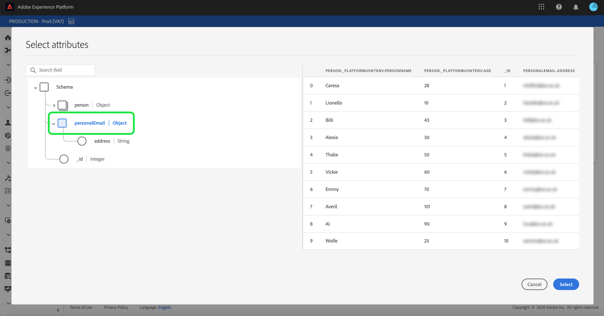

# 在UI中为云存储批处理连接配置数据流

数据流是从源中检索数据并将其引入[!DNL Platform]数据集的计划任务。 本教程提供使用云存储帐户配置新数据流的步骤。

## 入门指南

本教程需要对Adobe Experience Platform的以下组件进行有效的理解：

* [[!DNL Experience Data Model (XDM)] 系统](../../../../../xdm/home.md):组织客户体验数 [!DNL Experience Platform] 据的标准化框架。
   * [模式合成基础](../../../../../xdm/schema/composition.md):了解XDM模式的基本构件，包括模式构成的主要原则和最佳做法。
   * [模式编辑器教程](../../../../../xdm/tutorials/create-schema-ui.md):了解如何使用模式编辑器UI创建自定义模式。
* [[!DNL Real-time Customer Profile]](../../../../../profile/home.md):基于来自多个来源的聚集数据提供统一、实时的消费者用户档案。

此外，本教程要求您具有已建立的云存储帐户。 在[源连接器概述](../../../../home.md)中可以找到在UI中创建不同云存储帐户的列表教程。

### 支持的文件格式

[!DNL Experience Platform] 支持从外部存储摄取的以下文件格式：

* 分隔符分隔值(DSV):目前，对DSV格式数据文件的支持仅限于逗号分隔的值。 DSV格式化文件中字段标题的值只能由字母数字字符和下划线组成。 今后将提供对一般DSV文件的支持。
* [!DNL JavaScript Object Notation] (JSON):JSON格式的数据文件必须符合XDM规范。
* [!DNL Apache Parquet]:拼花格式的数据文件必须符合XDM标准。

## 选择数据

创建云存储帐户后，将显示&#x200B;**[!UICONTROL 选择数据]**&#x200B;步骤，为您提供一个界面来浏览云存储文件层次结构。

* 界面的左半部分是目录浏览器，显示服务器的文件和目录。
* 界面的右半部分允许您从一个兼容文件预览多达100行数据。

通过选择列出的文件夹，您可以将文件夹层次结构遍历到更深层的文件夹。 选择兼容文件或文件夹后，将显示&#x200B;**[!UICONTROL 选择数据格式]**&#x200B;下拉框，在该下拉框中，您可以选择一种格式在预览窗口中显示数据。

为要收录的文件选择适当的预览格式，并在几秒钟内填充该数据窗口。

可在摄取分隔文件时设置自定义分隔符。 选择&#x200B;**[!UICONTROL 分隔符]**&#x200B;选项，然后从下拉菜单中选择分隔符。 菜单显示最常用的分隔符选项，包括逗号(`,`)、制表符(`\t`)和管道(`|`)。 或者，您也可以选择&#x200B;**[!UICONTROL Custom]**&#x200B;并在弹出输入栏中输入您选择的自定义分隔符。

选择数据格式并设置分隔符后，选择&#x200B;**[!UICONTROL 下一步]**。

### 收录Parke或JSON文件

云存储帐户还支持JSON和Parke文件。 拼花文件必须符合XDM标准，而JSON文件不必符合XDM标准。 要收录JSON或Parke文件，请从目录浏览器中选择适当的文件格式，并从正确的界面应用兼容的数据格式。

如果数据格式为JSON，则将显示预览，显示有关文件中数据的信息。 在预览屏幕上，可以使用符合&#x200B;**[!UICONTROL XDM的]**&#x200B;下拉菜单选择JSON是否符合XDM。

选择&#x200B;**[!UICONTROL 下一步]**&#x200B;以继续。

>[!IMPORTANT]
>
>与分隔文件和JSON文件类型不同，拼花格式文件不可用于预览。

## 将数据字段映射到XDM模式

出现&#x200B;**[!UICONTROL 映射]**&#x200B;步骤，提供交互式界面以将源数据映射到[!DNL Platform]数据集。 采用Parke格式的源文件必须符合XDM要求，并且不需要手动配置映射，而CSV文件要求您显式配置映射，但允许您选择要映射的源数据字段。 JSON文件（如果标记为XDM投诉）不需要手动配置。 但是，如果未标记为符合XDM规范，则需要您显式配置映射。

选择要收录到的入站数据的数据集。 您可以使用现有数据集或创建新数据集。

**使用现有数据集**

要将数据引入现有数据集，请选择&#x200B;**[!UICONTROL 现有数据集]**，然后选择数据集图标。

出现&#x200B;**[!UICONTROL 选择数据集]**&#x200B;对话框。 找到您要使用的数据集，选择它，然后单击&#x200B;**[!UICONTROL 继续]**。

**使用新数据集**

要将数据引入新数据集，请选择&#x200B;**[!UICONTROL New dataset]**，并在提供的字段中输入数据集的名称和说明。 要添加模式，可以在&#x200B;**[!UICONTROL 选择模式]**&#x200B;对话框中输入现有的模式名称。 或者，您也可以选择&#x200B;**[!UICONTROL 模式高级搜索]**&#x200B;以搜索相应的模式。

在此步骤中，您可以为[!DNL Real-time Customer Profile]启用数据集，并创建实体属性和行为的整体视图。 来自所有已启用数据集的数据将包含在[!DNL Profile]中，并在保存数据流时应用更改。

切换&#x200B;**[!UICONTROL 用户档案数据集]**&#x200B;按钮，为[!DNL Profile]启用目标数据集。

出现&#x200B;**[!UICONTROL 选择模式]**&#x200B;对话框。 选择要应用于新数据集的模式，然后选择&#x200B;**[!UICONTROL 完成]**。

根据您的需要，您可以选择直接映射字段，或使用映射器函数转换源数据以导出计算值或计算值。 有关模式映射和映射器功能的详细信息，请参阅有关[将CSV数据映射到XDM字段](../../../../../ingestion/tutorials/map-a-csv-file.md)的教程。

对于JSON文件，除了直接将字段映射到其他字段外，您还可以将对象直接映射到其他对象和数组到其他数组。您还可以使用云存储源连接器预览和映射JSON文件中的数组等复杂数据类型。

请注意，您无法跨不同类型进行映射。 例如，无法将对象映射到数组，或将字段映射到对象。

>[!TIP]
>
>[!DNL Platform] 根据您选择的目标模式或数据集，为自动映射字段提供智能建议。您可以手动调整映射规则以适合您的用例。

选择&#x200B;**[!UICONTROL 预览数据]**&#x200B;可查看所选数据集中最多100行样本数据的映射结果。

在该预览中，标识列作为第一字段进行优先级排序，因为它是验证映射结果时必需的关键信息。

映射源数据后，选择&#x200B;**[!UICONTROL 关闭]**。

## 计划摄取运行

出现&#x200B;**[!UICONTROL 计划]**&#x200B;步骤，允许您配置摄取计划，以使用配置的映射自动摄取所选源数据。 下表概述了用于计划的不同可配置字段：

| 字段 | 描述 |
| --- | --- |
| 频度 | 可选频率包括`Once`、`Minute`、`Hour`、`Day`和`Week`。 |
| 间隔 | 一个整数，它为所选频率设置间隔。 |
| 开始时间 | UTC时间戳，指示何时设置第一次摄取。 |
| 回填 | 一个布尔值，它确定最初摄取的数据。 如果启用了&#x200B;**[!UICONTROL 回填]**，则指定路径中的所有当前文件将在第一次预定接收期间被摄取。 如果&#x200B;**[!UICONTROL 回填]**&#x200B;被禁用，则只会摄取在第一次摄取运行和开始时间之间加载的文件。 不会摄取在开始时间之前加载的文件。 |

数据流设计为按计划自动摄取数据。 开始。 然后，设置时间间隔以指定两个流运行之间的周期。 间隔的值应为非零整数，并应设置为大于或等于15。

要设置摄取的开始时间，请调整开始时间框中显示的日期和时间。 或者，也可以选择日历图标以编辑开始时间值。 开始时间必须大于或等于以UTC表示的当前时间。

为计划提供值，然后选择&#x200B;**[!UICONTROL Next]**。

### 设置一次性摄取数据流

要设置一次性摄取，请选择频率下拉箭头，然后选择&#x200B;**[!UICONTROL 一次]**。 只要开始时间在将来保持不变，您就可以继续编辑数据流集以进行一次频率摄取。 一旦开始时间过去，就不能再编辑一次频率值。 **[!UICONTROL 设]** 置一 **** 次性摄取数据流时，Interval和Backfill不可见。

>[!IMPORTANT]
>
>强烈建议在使用[FTP连接器](../../../../connectors/cloud-storage/ftp.md)时计划数据流以进行一次性摄取。

向计划提供适当的值后，选择&#x200B;**[!UICONTROL 下一步]**。

## 提供数据流详细信息

出现&#x200B;**[!UICONTROL 数据流详细信息]**&#x200B;步骤，允许您命名新数据流并提供有关新数据流的简要说明。

在此过程中，还可以启用&#x200B;**[!UICONTROL 部分摄取]**&#x200B;和&#x200B;**[!UICONTROL 错误诊断]**。 启用&#x200B;**[!UICONTROL 部分摄取]**&#x200B;可以摄取包含错误的数据，最高可设置特定阈值。 启用&#x200B;**[!UICONTROL 错误诊断]**&#x200B;将提供有关单独分批的任何错误数据的详细信息。 有关详细信息，请参阅[部分批摄取概述](../../../../../ingestion/batch-ingestion/partial.md)。

为数据流提供值并选择&#x200B;**[!UICONTROL Next]**。

## 查看数据流

出现&#x200B;**[!UICONTROL Review]**&#x200B;步骤，允许您在创建新数据流之前对其进行查看。 详细信息按以下类别分组：

* **[!UICONTROL 连接]**:显示源类型、所选源文件的相关路径以及该源文件中的列数。
* **[!UICONTROL 分配数据集和地图字段]**:显示接收源数据的数据集，包括数据集附带的模式。
* **[!UICONTROL 计划]**:显示摄取计划的活动周期、频率和间隔。

查看数据流后，单击&#x200B;**[!UICONTROL 完成]**&#x200B;并允许一段时间创建数据流。

## 监视数据流

创建数据流后，您可以监视通过它摄取的数据，以查看有关摄取率、成功和错误的信息。 有关如何监视数据流的详细信息，请参阅有关UI](../../monitor.md)中[监视帐户和数据流的教程。

## 删除数据流

您可以删除不再需要的或使用&#x200B;**[!UICONTROL Dataflows]**&#x200B;工作区中可用的&#x200B;**[!UICONTROL Delete]**&#x200B;函数创建错误的数据流。 有关如何删除数据流的详细信息，请参阅有关在UI](../../delete.md)中删除数据流的教程。[

## 后续步骤

通过遵循本教程，您已成功创建了从外部云存储导入数据的数据流，并获得了有关监视数据集的洞察。 要进一步了解如何创建数据流，您可以通过观看以下视频来补充您的学习。 此外，下游[!DNL Platform]服务（如[!DNL Real-time Customer Profile]和[!DNL Data Science Workspace]）现可使用传入数据。 有关更多详细信息，请参阅以下文档:

* [[!DNL Real-time Customer Profile] 概述](../../../../../profile/home.md)
* [[!DNL Data Science Workspace] 概述](../../../../../data-science-workspace/home.md)

>[!WARNING]
>
> 以下视频中显示的[!DNL Platform] UI已过期。 有关最新的UI屏幕截图和功能，请参阅上面的文档。

>[!VIDEO](https://video.tv.adobe.com/v/29695?quality=12&learn=on)

## 附录

以下部分提供了有关使用源连接器的其他信息。

### 禁用数据流

创建数据流时，它会立即变为活动状态，并根据给定的计划接收数据。 您可以按照以下说明随时禁用活动数据流。

在&#x200B;**[!UICONTROL 源]**&#x200B;工作区中，单击&#x200B;**[!UICONTROL 浏览]**&#x200B;选项卡。 然后，单击与要禁用的活动数据流关联的帐户的名称。

将显示&#x200B;**[!UICONTROL 源活动]**&#x200B;页。 从列表中选择活动数据流以在屏幕右侧打开其&#x200B;**[!UICONTROL 属性]**&#x200B;列，该列包含一个&#x200B;**[!UICONTROL 已启用]**&#x200B;切换按钮。 单击切换以禁用数据流。 在禁用数据流后，可以使用相同的切换重新启用数据流。

### 为[!DNL Profile]人口激活入站数据

源连接器的入站数据可用于丰富和填充[!DNL Real-time Customer Profile]数据。 有关填充[!DNL Real-time Customer Profile]数据的详细信息，请参阅关于[用户档案填充](../../profile.md)的教程。
