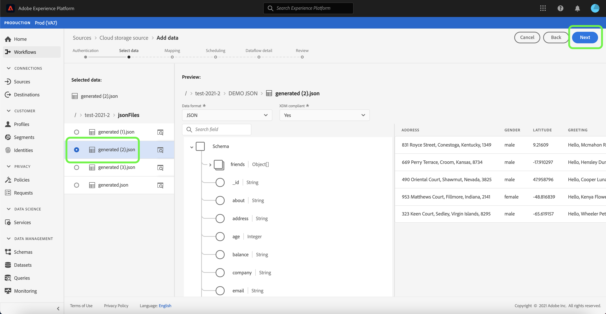
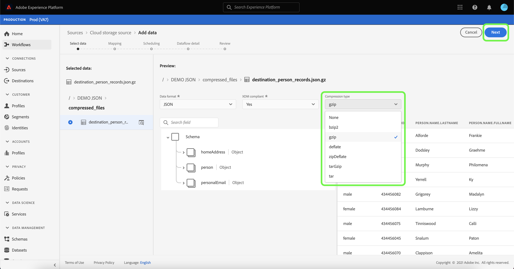

# 在UI中为云存储批量连接配置数据流

数据流是一项计划任务，用于从源中检索数据并将其摄取到[!DNL Platform]数据集。 本教程提供了使用云存储帐户配置新数据流的步骤。

## 快速入门

本教程需要对Adobe Experience Platform的以下组件有一定的了解：

* [[!DNL Experience Data Model (XDM)] 系统](../../../../../xdm/home.md):用于组织客户体验数 [!DNL Experience Platform] 据的标准化框架。
   * [架构组合的基础知识](../../../../../xdm/schema/composition.md):了解XDM模式的基本构建块，包括模式组合中的关键原则和最佳实践。
   * [模式编辑器教程](../../../../../xdm/tutorials/create-schema-ui.md):了解如何使用模式编辑器UI创建自定义模式。
* [[!DNL Real-time Customer Profile]](../../../../../profile/home.md):根据来自多个来源的汇总数据提供统一的实时客户资料。

此外，本教程还要求您已建立云存储帐户。 有关在UI中创建不同云存储帐户的教程列表，请参阅[源连接器概述](../../../../home.md)。

### 支持的文件格式

[!DNL Experience Platform] 支持从外部存储摄取以下文件格式：

* 分隔符分隔值(DSV):任何单字符值都可用作DSV格式数据文件的分隔符。
* [!DNL JavaScript Object Notation] (JSON):JSON格式的数据文件必须符合XDM。
* [!DNL Apache Parquet]:Parquet格式的数据文件必须符合XDM。
* 压缩文件：JSON和分隔文件可压缩为：`bzip2`、`gzip`、`deflate`、`zipDeflate`、`tarGzip`和`tar`。

## 选择数据

创建云存储帐户后，将显示&#x200B;**[!UICONTROL 选择数据]**&#x200B;步骤，为您提供一个界面来浏览云存储文件层次结构。

* 界面的左侧是目录浏览器，用于显示云存储文件和目录。
* 界面的右侧部分允许您从兼容的文件中预览多达100行数据。

通过选择列出的文件夹，您可以将文件夹层次结构遍历到更深的文件夹中。 您可以选择单个文件夹，以递归方式摄取文件夹中的所有文件。 摄取整个文件夹时，必须确保文件夹中的所有文件共享相同的架构。

选择兼容的文件或文件夹后，从[!UICONTROL 选择数据格式]下拉菜单中选择相应的数据格式。

下表显示了支持的文件类型的相应数据格式：

| 文件类型 | 数据格式 |
| --- | --- |
| CSV | [!UICONTROL 分隔] |
| JSON | [!UICONTROL JSON] |
| 镶木 | [!UICONTROL XDM Parquet] |

选择&#x200B;**[!UICONTROL JSON]** ，然后等待几秒钟以填充预览界面。

>[!NOTE]
>
>与分隔文件和JSON文件类型不同，Parquet格式的文件不可用于预览。

预览界面允许您检查文件的内容和结构。 默认情况下，预览界面会显示所选文件夹中的第一个文件。

要预览其他文件，请选择要检查的文件名称旁边的预览图标。

检查文件夹中文件的内容和结构后，选择&#x200B;**[!UICONTROL Next]**&#x200B;以递归方式摄取文件夹中的所有文件。

如果您希望选择特定文件，请选择要摄取的文件，然后选择&#x200B;**[!UICONTROL Next]**。

### 为分隔文件设置自定义分隔符

在摄取分隔文件时，可以设置自定义分隔符。 选择&#x200B;**[!UICONTROL 分隔符]**&#x200B;选项，然后从下拉菜单中选择分隔符。 菜单显示最常用的分隔符选项，包括逗号(`,`)、制表符(`\t`)和管道字符(`|`)。 如果您希望使用自定义分隔符，请选择&#x200B;**[!UICONTROL Custom]**，然后在弹出输入栏中输入您选择的单字符分隔符。

选择数据格式并设置分隔符后，请选择&#x200B;**[!UICONTROL Next]**。

### 摄取压缩文件

您可以通过指定压缩类型来摄取压缩的JSON或分隔文件。

在[!UICONTROL 选择数据]步骤中，选择要摄取的压缩文件，然后选择其相应的文件类型以及它是否符合XDM。 接下来，选择&#x200B;**[!UICONTROL 压缩类型]**，然后为源数据选择适当的压缩文件类型。

在标识了压缩文件类型后，选择&#x200B;**[!UICONTROL Next]**&#x200B;以继续。

## 将数据字段映射到XDM架构

此时将显示&#x200B;**[!UICONTROL 映射]**&#x200B;步骤，提供一个交互式界面，用于将源数据映射到[!DNL Platform]数据集。 Parquet格式的源文件必须符合XDM，并且不需要您手动配置映射，而CSV文件要求您明确配置映射，但允许您选择要映射的源数据字段。 如果JSON文件标记为XDM投诉，则不需要手动配置。 但是，如果它未标记为符合XDM，则需要您明确配置映射。

为要摄取到的入站数据选择数据集。 您可以使用现有数据集，也可以创建新数据集。

**使用现有数据集**

要将数据摄取到现有数据集，请选择&#x200B;**[!UICONTROL 现有数据集]**，然后选择数据集图标。

出现&#x200B;**[!UICONTROL 选择数据集]**&#x200B;对话框。 找到您要使用的数据集，将其选中，然后单击&#x200B;**[!UICONTROL 继续]**。

**使用新数据集**

要将数据摄取到新数据集，请选择&#x200B;**[!UICONTROL New dataset]** ，然后在提供的字段中输入数据集的名称和说明。 要添加架构，您可以在&#x200B;**[!UICONTROL 选择架构]**&#x200B;对话框中输入现有架构名称。 或者，您也可以选择&#x200B;**[!UICONTROL 架构高级搜索]**&#x200B;以搜索相应的架构。

在此步骤中，您可以为[!DNL Real-time Customer Profile]启用数据集，并创建实体属性和行为的整体视图。 所有已启用数据集的数据都将包含在[!DNL Profile]中，并在保存数据流时应用更改。

切换&#x200B;**[!UICONTROL 配置文件数据集]**&#x200B;按钮，为[!DNL Profile]启用目标数据集。

出现&#x200B;**[!UICONTROL 选择架构]**&#x200B;对话框。 选择要应用于新数据集的架构，然后选择&#x200B;**[!UICONTROL Done]**。

根据您的需要，您可以选择直接映射字段，或使用数据准备函数转换源数据以导出计算值或计算值。 有关映射器函数和计算字段的详细信息，请参阅[数据准备函数指南](../../../../../data-prep/functions.md)或[计算字段指南](../../../../../data-prep/calculated-fields.md)。

对于JSON文件，除了直接将字段映射到其他字段之外，您还可以将对象直接映射到其他对象和数组到其他数组。您还可以使用云存储源连接器预览和映射JSON文件中的数组等复杂数据类型。

请注意，您无法跨不同类型映射。 例如，不能将对象映射到数组，或将字段映射到对象。

>[!TIP]
>
>[!DNL Platform] 根据您选择的目标架构或数据集，为自动映射的字段提供智能推荐。您可以手动调整映射规则以适合您的用例。

选择&#x200B;**[!UICONTROL 预览数据]**&#x200B;可查看选定数据集中最多100行示例数据的映射结果。

在预览期间，标识列将作为第一个字段按优先级排列，因为它是验证映射结果时必需的关键信息。

映射源数据后，选择&#x200B;**[!UICONTROL 关闭]**。

## 计划摄取运行

此时将显示&#x200B;**[!UICONTROL 计划]**&#x200B;步骤，允许您配置摄取计划以使用配置的映射自动摄取所选源数据。 下表概述了计划的不同可配置字段：

| 字段 | 描述 |
| --- | --- |
| 频度 | 可选频率包括`Once`、`Minute`、`Hour`、`Day`和`Week`。 |
| 间隔 | 一个整数，用于设置所选频率的间隔。 |
| 开始时间 | UTC时间戳，指示何时设置进行第一次摄取。 |
| 回填 | 一个布尔值，用于确定最初摄取的数据。 如果启用了&#x200B;**[!UICONTROL 回填]**，则指定路径中的所有当前文件都将在首次计划摄取期间被摄取。 如果禁用了&#x200B;**[!UICONTROL Backfill]**，则只会摄取在首次摄取运行到开始时间之间加载的文件。 不会摄取在开始时间之前加载的文件。 |

数据流旨在按计划自动摄取数据。 首先选择摄取频率。 接下来，设置间隔以指定两个流运行之间的周期。 间隔的值应为非零整数，并应设置为大于或等于15。

要设置摄取的开始时间，请调整开始时间框中显示的日期和时间。 或者，您也可以选择日历图标以编辑开始时间值。 开始时间必须大于或等于当前时间（以UTC为单位）。

为计划提供值并选择&#x200B;**[!UICONTROL Next]**。

### 设置一次性摄取数据流

要设置一次性摄取，请选择频度下拉箭头，然后选择&#x200B;**[!UICONTROL Once]**。 只要开始时间在将来保留，您就可以继续为一次性频率摄取对数据流集进行编辑。 开始时间过后，将无法再编辑一次性频率值。 **** 设置一 **** 次性摄取数据流时，无法看到间隔和回填。

>[!IMPORTANT]
>
>强烈建议在使用[FTP连接器](../../../../connectors/cloud-storage/ftp.md)时，安排一次性引入数据流。

向计划提供适当值后，请选择&#x200B;**[!UICONTROL Next]**。

## 提供数据流详细信息

出现&#x200B;**[!UICONTROL 数据流详细信息]**&#x200B;步骤，允许您命名并简要描述新数据流。

在此过程中，您还可以启用&#x200B;**[!UICONTROL 部分摄取]**&#x200B;和&#x200B;**[!UICONTROL 错误诊断]**。 启用&#x200B;**[!UICONTROL 部分摄取]**&#x200B;提供了摄取包含错误的数据的功能，最高可以设置某个阈值。 启用&#x200B;**[!UICONTROL 错误诊断]**&#x200B;将提供有关单独批处理的任何错误数据的详细信息。 有关更多信息，请参阅[部分批量摄取概述](../../../../../ingestion/batch-ingestion/partial.md)。

为数据流提供值，然后选择&#x200B;**[!UICONTROL Next]**。

## 查看数据流

此时会出现&#x200B;**[!UICONTROL Review]**&#x200B;步骤，允许您在创建新数据流之前查看新数据流。 详细信息按以下类别分组：

* **[!UICONTROL 连接]**:显示源类型、所选源文件的相关路径以及该源文件中的列数。
* **[!UICONTROL 分配数据集和映射字段]**:显示源数据被摄取到的数据集，包括该数据集附加的架构。
* **[!UICONTROL 计划]**:显示摄取计划的活动期、频率和间隔。

审核数据流后，单击&#x200B;**[!UICONTROL 完成]**，并为创建数据流留出一些时间。

## 监控数据流

创建数据流后，您可以监控通过其摄取的数据，以查看有关摄取率、成功和错误的信息。 有关如何监控数据流的更多信息，请参阅关于[在UI](../../monitor.md)中监控帐户和数据流的教程。

## 删除数据流

您可以删除不再需要或使用&#x200B;**[!UICONTROL 数据流]**&#x200B;工作区中提供的&#x200B;**[!UICONTROL Delete]**&#x200B;函数错误地创建的数据流。 有关如何删除数据流的更多信息，请参阅有关[在UI](../../delete.md)中删除数据流的教程。

## 后续步骤

通过阅读本教程，您成功创建了一个数据流以从外部云存储中导入数据，并获得了有关监控数据集的洞察信息。 要了解有关创建数据流的更多信息，您可以通过观看以下视频来补充您的学习。 此外，现在下游[!DNL Platform]服务（如[!DNL Real-time Customer Profile]和[!DNL Data Science Workspace]）可以使用传入数据。 有关更多详细信息，请参阅以下文档：

* [[!DNL Real-time Customer Profile] 概述](../../../../../profile/home.md)
* [[!DNL Data Science Workspace] 概述](../../../../../data-science-workspace/home.md)

>[!WARNING]
>
> 以下视频中显示的[!DNL Platform] UI已过期。 有关最新的UI屏幕截图和功能，请参阅上述文档。

>[!VIDEO](https://video.tv.adobe.com/v/29695?quality=12&learn=on)

## 附录

以下部分提供了有关使用源连接器的其他信息。

### 禁用数据流

创建数据流后，该数据流会立即变为活动状态，并根据给定的计划摄取数据。 您可以随时按照以下说明禁用活动数据流。

在&#x200B;**[!UICONTROL Sources]**&#x200B;工作区中，单击&#x200B;**[!UICONTROL Browse]**&#x200B;选项卡。 接下来，单击与要禁用的活动数据流关联的帐户名称。

此时会显示&#x200B;**[!UICONTROL 源活动]**&#x200B;页面。 从列表中选择活动数据流，以在屏幕右侧打开其&#x200B;**[!UICONTROL 属性]**&#x200B;列，该列包含&#x200B;**[!UICONTROL Enabled]**&#x200B;切换按钮。 单击切换以禁用数据流。 在禁用数据流后，可以使用相同的切换开关重新启用数据流。

### 激活[!DNL Profile]群体的入站数据

源连接器的入站数据可用于扩充和填充[!DNL Real-time Customer Profile]数据。 有关填充[!DNL Real-time Customer Profile]数据的更多信息，请参阅[配置文件群体](../../profile.md)教程。
