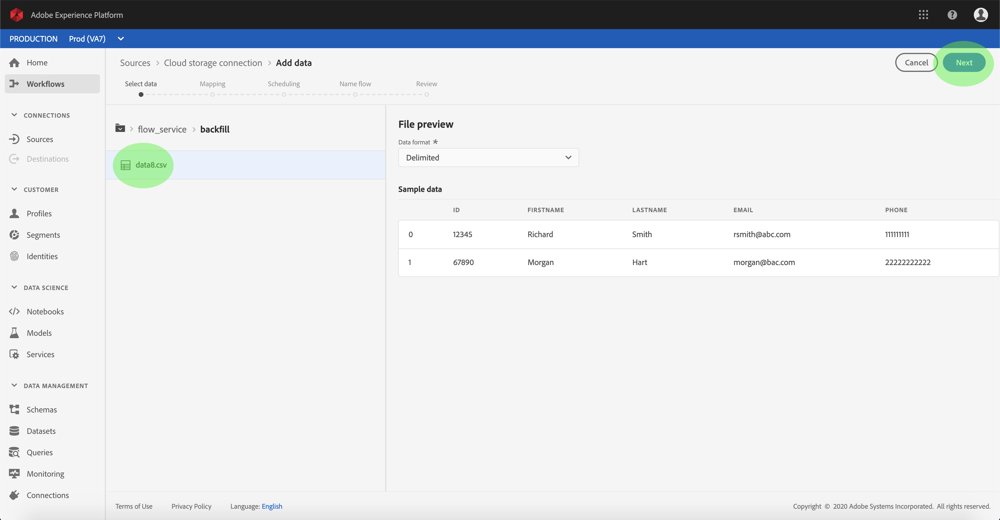
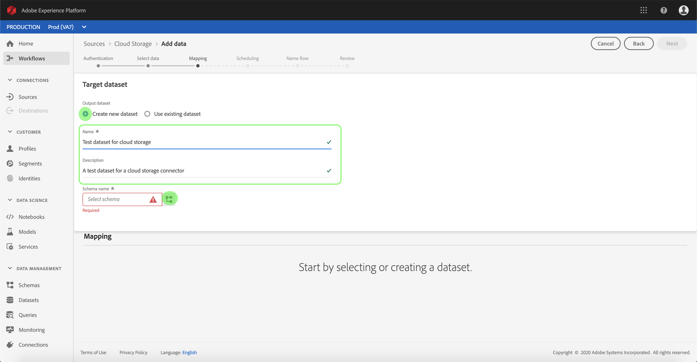

# 在UI中为云存储连接器配置数据流

数据流是从源中检索数据并将其摄取到平台数据集的计划任务。 本教程提供了使用云存储基连接器配置新数据流的步骤。

## 入门指南

本教程需要对Adobe Experience Platform的以下组件有充分的了解：

* [体验数据模型(XDM)系统](../../../../xdm/home.md):Experience Platform组织客户体验数据的标准化框架。
   * [模式合成的基础知识](../../../../xdm/schema/composition.md):了解XDM模式的基本构件，包括模式构成的主要原则和最佳做法。
   * [模式编辑器教程](../../../../xdm/tutorials/create-schema-ui.md):了解如何使用模式编辑器UI创建自定义模式。
* [实时客户用户档案](../../../../profile/home.md):根据来自多个来源的汇总数据提供统一、实时的消费者用户档案。

此外，本教程要求您已经创建了云存储连接器。 有关在UI中创建不同云存储连接器的列表教程，请参阅源连接 [器概述](../../../home.md)。

### 支持的文件格式

Experience Platform支持以下从外部存储摄取的文件格式：

* 分隔符分隔值(DSV):目前，对DSV格式数据文件的支持仅限于逗号分隔的值。 DSV格式文件中字段标题的值只能由字母数字字符和下划线组成。 将来将提供对一般DSV文件的支持。
* JavaScript对象表示法(JSON):JSON格式的数据文件必须符合XDM规范。
* Apache Parce:拼花格式的数据文件必须符合XDM规范。

## 选择数据

创建云存储连接器后，将显示 *选择数据步骤* ，为您提供一个交互式界面来浏览您的云存储层次结构。

* 界面的左半部分是目录浏览器，显示服务器的文件和目录。
* 界面的右半部分允许您从一个兼容文件中预览多达100行数据。

单击列出的文件夹可将文件夹层次结构遍历到更深入的文件夹中。 选择兼容文件或文件夹后，将显示“选择数据格式 **** ”下拉框，在该下拉框中，您可以选择一种格式以在“预览”窗口中显示数据。

填充预览窗口后，您可以单击“下 **一步** ”上传选定文件夹内的所有文件。 如果要上传到特定文件，请在单击“下一步”之前从列表中选择该 **文件**。

>[!NOTE] 支持的文件格式包括CSV、JSON和Parke。 JSON和Parce文件必须符合XDM规范。

## 将数据字段映射到XDM模式

将显 *示“映射* ”步骤，提供一个交互界面，以将源数据映射到平台数据集。 以JSON或Parce格式化的源文件必须符合XDM规范，并且不需要手动配置映射。 相反，CSV文件要求您显式配置映射，但允许您选择要映射的源数据字段。

为要摄取的入站数据选择数据集。 您可以使用现有数据集或创建新数据集。

**使用现有数据集**

要将数据摄取到现有数据集中，请选择“ **使用现有数据集**”，然后单击数据集图标。

将显 _示“选择数据集_ ”对话框。 查找您要使用的数据集，选择它，然后单击继 **续**。

**使用新数据集**

要将数据收录到新数据集中，请选择 **创建新数据集** ，然后在提供的字段中输入数据集的名称和说明。 然后，单击模式图标。

将显 _示“选择模式_ ”对话框。 选择要应用于新数据集的模式，然后单击完 **成**。

根据您的需要，您可以选择直接映射字段，或使用映射器函数转换源数据以导出计算或计算的值。 有关数据映射和映射器功能的详细信息，请参阅将CSV数据映 [射到XDM模式字段的教程](../../../../ingestion/tutorials/map-a-csv-file.md)。

映射源数据后，单击“下 **一步”**。

## 计划摄取运行

此时 *会显示计划* ，允许您配置摄取计划，以使用配置的映射自动摄取选定的源数据。 下表概述了用于计划的不同可配置字段：

| 字段 | 描述 |
| --- | --- |
| 频率 | 可选频率包括分钟、小时、天和周。 |
| 间隔 | 一个整数，它设置所选频率的间隔。 |
| 开始时间 | UTC时间戳，将发生第一个摄取。 |
| 回填 | 一个布尔值，它确定最初摄取的数据。 如果 *启用回填* ，则指定路径中的所有当前文件将在第一次预定摄取期间被摄取。 如果 *禁用了* “回填” *，则只会摄取在第一次摄取和开始时间之间加载的* 文件。 在开始时间之前加 *载的文件* ，将不会被摄取。 |

数据流设计为按计划自动摄取数据。 如果您希望通过此工作流只收录一次，可以通过将 **Frequency** （频率）配置为“Day”，并为 **** Interval（间隔）应用一个非常大的数字（如10000或类似数字）来执行此操作。

为计划提供值，然后单击“下 **一步”**。

## 命名数据流

将显 *示“命名流* ”步骤，允许您命名新数据流并提供有关新数据流的简要说明。

为数据流提供值，然后单击“下 **一步”**。

### 查看数据流

将显 *示“审阅* ”步骤，允许您在创建新数据流之前查看该数据流。 详细信息按以下类别分组：

* *源详细信息*:显示源类型、所选源文件的相关路径以及该源文件中的列数。
* *目标详细信息*:显示将源数据摄取到哪个数据集中，包括数据集所附加的模式。
* *计划详细信息*:显示摄取计划的活动周期、频率和间隔。

查看数据流后，单击“完 **成** ”，然后为创建数据流留出一些时间。

## 监控数据流

创建云存储数据流后，您可以监视通过它摄取的数据。 请按照以下步骤访问数据流的数据集监视器。

在“源” *工作区* ，单击“浏 **览** ”选项卡以列表基本连接。 在显示的列表中，单击要监视的数据流的名称，找到包含该数据流的连接。

出现 *“源活动* ”屏幕。 在此处，单击要监视其活动的数据集的名称。

将显 *示“数据集活动* ”屏幕。 此页以图形形式显示消费消息的速率。

图表下方是一列表已摄取到数据集中的批次，显示其状态（成功或失败）和已摄取的记录数。 如果将批量摄取到启用用户档案的数据集中，则会显示摄取的用户档案和身份数。

您可以通过单击列出的批的ID来视图更多有关其的详细信息。

有关监视数据集和摄取的详细信息，请参阅有关监视流数据 [流的教程](../../../../ingestion/quality/monitor-data-flows.md)。

## 后续步骤

通过本教程，您成功创建了一个数据流以从外部云存储导入数据，并获得了有关监视数据集的洞察。 现在，下游平台服务(如实时客户用户档案和数据科学工作区)可以使用传入的数据。 有关更多详细信息，请参阅以下文档:

* [实时客户用户档案概述](../../../../profile/home.md)
* [数据科学工作区概述](../../../../data-science-workspace/home.md)

## 附录

以下部分提供了有关使用源连接器的其他信息。

### 禁用数据流

创建数据流后，它会立即变为活动状态，并根据给定的计划摄取数据。 您可以按照以下说明随时禁用活动数据流。

在“源” *工作区* ，单击“浏 **览** ”选项卡。 然后，单击与要禁用的活动数据流关联的基本连接的名称。

将显 *示“源活动* ”页。 从列表中选择活动数据流以在屏幕右侧打开其“ *Properties* ”列，该列包含“已启用 **** ”切换按钮。 单击切换以禁用数据流。 在禁用数据流后，可以使用相同的切换功能重新启用数据流。

### 为用户档案群激活入站数据

来自源连接器的入站数据可用于丰富和填充实时客户用户档案数据。 有关填充真实客户用户档案数据的更多信息，请参阅关于用户档案人口 [的教程](../profile.md)。
