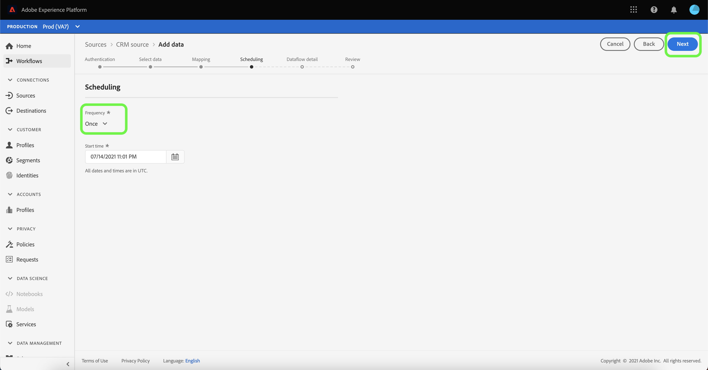

# 在UI中为CRM连接配置数据流

数据流是一项计划任务，用于从源中检索数据并将其摄取到平台数据集。 本教程提供了使用CRM帐户配置新数据流的步骤。

## 快速入门

本教程需要对Adobe Experience Platform的以下组件有一定的了解：

* [[!DNL Experience Data Model (XDM)] 系统](../../../../xdm/home.md):用于组织客户体验数 [!DNL Experience Platform] 据的标准化框架。
   * [架构组合的基础知识](../../../../xdm/schema/composition.md):了解XDM模式的基本构建块，包括模式组合中的关键原则和最佳实践。
   * [模式编辑器教程](../../../../xdm/tutorials/create-schema-ui.md):了解如何使用模式编辑器UI创建自定义模式。
* [[!DNL Real-time Customer Profile]](../../../../profile/home.md):根据来自多个来源的汇总数据提供统一的实时客户资料。

此外，本教程还要求您已创建CRM帐户。 有关在UI中创建不同CRM连接器的教程列表，请参阅[源连接器概述](../../../home.md)。

## 选择数据

创建CRM帐户后，将显示[!UICONTROL 选择数据]步骤，为您提供一个界面以浏览文件层次结构。

* 界面的左半部分是目录浏览器，用于显示CRM的文件和目录。
* 界面的右半部分允许您从兼容的文件中预览多达100行数据。

您可以使用页面顶部的&#x200B;**[!UICONTROL Search]**&#x200B;选项快速识别要使用的源数据。

>[!NOTE]
>
>搜索源数据选项适用于所有基于表格的源连接器，不包括Analytics、分类、事件中心和Kinesis连接器。

找到源数据后，选择目录，然后选择&#x200B;**[!UICONTROL Next]**。

## 将数据字段映射到XDM架构

将显示&#x200B;**[!UICONTROL 映射]**&#x200B;步骤，提供一个接口，用于将源数据映射到Platform数据集。

为要摄取到的入站数据选择数据集。 您可以使用现有数据集或创建新数据集。

### 使用现有数据集

要将数据摄取到现有数据集，请选择&#x200B;**[!UICONTROL 现有数据集]**，然后选择输入栏旁边的数据图标。

出现&#x200B;**[!UICONTROL 选择数据集]**&#x200B;对话框。 找到要使用的数据集，将其选中，然后单击&#x200B;**[!UICONTROL 继续]**。

### 使用新数据集

要将数据摄取到新数据集，请选择&#x200B;**[!UICONTROL New dataset]** ，然后在提供的字段中输入数据集的名称和说明。

通过在&#x200B;**[!UICONTROL 选择架构]**&#x200B;搜索栏中输入架构名称，可以附加架构字段。 您还可以选择下拉图标以查看现有架构的列表。 或者，您也可以选择&#x200B;**[!UICONTROL 高级搜索]**&#x200B;以访问现有架构的屏幕，包括其各自的详细信息。

在此步骤中，您可以为[!DNL Real-time Customer Profile]启用数据集，并创建实体属性和行为的整体视图。 所有已启用数据集的数据都将包含在[!DNL Profile]中，并在保存数据流时应用更改。

切换&#x200B;**[!UICONTROL 配置文件数据集]**&#x200B;按钮，为[!DNL Profile]启用目标数据集。

出现&#x200B;**[!UICONTROL 选择架构]**&#x200B;对话框。 选择要应用于新数据集的架构，然后单击&#x200B;**[!UICONTROL Done]**。

根据您的需要，您可以选择直接映射字段，或使用数据准备函数转换源数据以导出计算值或计算值。 有关映射器函数和计算字段的详细信息，请参阅[数据准备函数指南](../../../../data-prep/functions.md)或[计算字段指南](../../../../data-prep/calculated-fields.md)。

<!--
>[!TIP]
>
>If you are using the [!DNL Salesforce] source as part of B2B CDP, refer to the [[!DNL Salesforce] field mapping tables](../../../connectors/adobe-applications/mapping/salesforce.md) for a guide on the appropriate mapping sets between [!DNL Salesforce] source fields and XDM target fields.
-->

Platform根据您选择的目标架构或数据集，为自动映射的字段提供智能推荐。 您可以手动调整映射规则以适合您的用例。

选择&#x200B;**[!UICONTROL 预览数据]**&#x200B;可查看选定数据集中最多100行示例数据的映射结果。

在预览期间，标识列将作为第一个字段按优先级排列，因为它是验证映射结果时必需的关键信息。

映射源数据后，选择&#x200B;**[!UICONTROL 关闭]**。

接下来，从[!UICONTROL Mapping]屏幕中，选择&#x200B;**[!UICONTROL Next]**&#x200B;以继续。

## 计划摄取运行

此时将显示&#x200B;**[!UICONTROL 计划]**&#x200B;步骤，允许您配置摄取计划以使用配置的映射自动摄取所选源数据。 下表概述了计划的不同可配置字段：

| 字段 | 描述 |
| --- | --- |
| 频度 | 可选频率包括`Once`、`Minute`、`Hour`、`Day`和`Week`。 |
| 间隔 | 一个整数，用于设置所选频率的间隔。 |
| 开始时间 | UTC时间戳，指示何时设置进行第一次摄取。 |
| 回填 | 一个布尔值，用于确定最初摄取的数据。 如果启用了&#x200B;**[!UICONTROL 回填]**，则指定路径中的所有当前文件都将在首次计划摄取期间被摄取。 如果禁用了&#x200B;**[!UICONTROL Backfill]**，则只会摄取在首次摄取运行到&#x200B;**[!UICONTROL 开始时间]**&#x200B;之间加载的文件。 在&#x200B;**[!UICONTROL 开始时间]**&#x200B;之前加载的文件将不会被摄取。 |
| 增量列 | 一个选项，其中包含一组类型、日期或时间的筛选源架构字段。 此字段用于区分新数据和现有数据。 将根据选定列的时间戳摄取增量数据。 |

数据流旨在按计划自动摄取数据。 首先选择摄取频率。 接下来，设置间隔以指定两个流运行之间的周期。 间隔的值应为非零整数，并应设置为大于或等于15。

要设置摄取的开始时间，请调整开始时间框中显示的日期和时间。 或者，您也可以选择日历图标以编辑开始时间值。 开始时间必须大于或等于当前UTC时间。

选择&#x200B;**[!UICONTROL 按]**&#x200B;加载增量数据以分配增量列。 此字段区分新数据和现有数据。

### 设置一次性摄取数据流

要设置一次性摄取，请选择频度下拉箭头，然后选择&#x200B;**[!UICONTROL Once]**。

>[!TIP]
>
>**** 一次性 **** 摄取期间，无法看到间隔回填。

向计划提供适当值后，请选择&#x200B;**[!UICONTROL Next]**。

## 提供数据流详细信息

出现&#x200B;**[!UICONTROL 数据流详细信息]**&#x200B;步骤，允许您命名并简要描述新数据流。

在此过程中，您还可以启用&#x200B;**[!UICONTROL 部分摄取]**&#x200B;和&#x200B;**[!UICONTROL 错误诊断]**。 启用&#x200B;**[!UICONTROL 部分摄取]**&#x200B;提供了摄取包含错误且达到特定阈值的数据的功能。 启用&#x200B;**[!UICONTROL 部分摄取]**&#x200B;后，拖动&#x200B;**[!UICONTROL 错误阈值%]**&#x200B;拨号以调整批次的错误阈值。 或者，您也可以通过选择输入框手动调整阈值。 有关更多信息，请参阅[部分批量摄取概述](../../../../ingestion/batch-ingestion/partial.md)。

为数据流提供值，然后选择&#x200B;**[!UICONTROL Next]**。

## 查看数据流

此时会出现&#x200B;*Review*&#x200B;步骤，允许您在创建新数据流之前查看新数据流。 详细信息按以下类别分组：

* **[!UICONTROL 连接]**:显示源帐户名称、源平台、所选源文件的相关路径以及该源文件中的列数。
* **[!UICONTROL 分配数据集和映射字段]**:显示源数据被摄取到的目标数据集，包括该数据集所遵守的架构。
* **[!UICONTROL 计划]**:显示数据流的开始时间和频率率。

审核数据流后，单击&#x200B;**[!UICONTROL 完成]**，并为创建数据流留出一些时间。

## 监控数据流

创建数据流后，您可以监控通过其摄取的数据，以查看有关摄取率、成功和错误的信息。 有关如何监控数据流的更多信息，请参阅关于[在UI](../monitor.md)中监控帐户和数据流的教程。

## 删除数据流

您可以删除不再需要或使用&#x200B;**[!UICONTROL 数据流]**&#x200B;工作区中提供的&#x200B;**[!UICONTROL Delete]**&#x200B;函数错误地创建的数据流。 有关如何删除数据流的更多信息，请参阅有关[在UI](../delete.md)中删除数据流的教程。

## 后续步骤

通过阅读本教程，您成功创建了一个数据流，以从CRM中导入数据，并获得了有关监控数据集的洞察信息。 要了解有关创建数据流的更多信息，您可以通过观看以下视频来补充您的学习。 此外，现在下游Platform服务（如[!DNL Real-time Customer Profile]和[!DNL Data Science Workspace]）可以使用传入数据。 有关更多详细信息，请参阅以下文档：

* [实时客户资料概述](../../../../profile/home.md)
* [数据科学工作区概述](../../../../data-science-workspace/home.md)

>[!WARNING]
>
> 以下视频中显示的平台UI已过期。 有关最新的UI屏幕截图和功能，请参阅上述文档。
>
>[!VIDEO](https://video.tv.adobe.com/v/29711?quality=12&learn=on)
