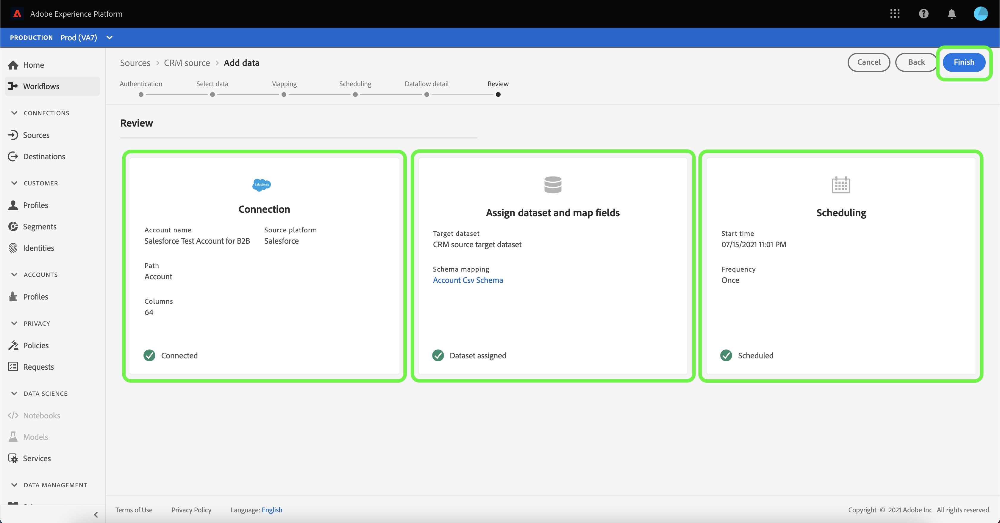
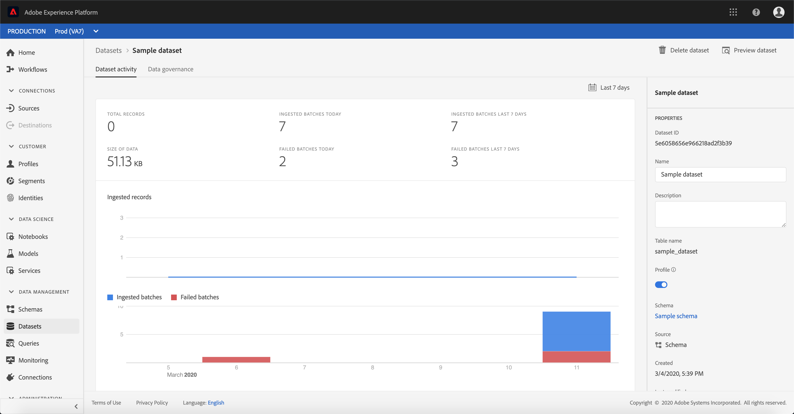

# 在UI中为CRM连接器配置数据流

数据流是从源中检索数据并将其摄取到平台数据集的计划任务。 本教程提供了使用CRM基本连接器配置新数据流的步骤。

## 入门指南

本教程需要对Adobe Experience Platform的以下组件有充分的了解：

* [体验数据模型(XDM)系统](../../../../xdm/home.md):Experience Platform组织客户体验数据的标准化框架。
   * [模式合成的基础知识](../../../../xdm/schema/composition.md):了解XDM模式的基本构件，包括模式构成的主要原则和最佳做法。
   * [模式编辑器教程](../../../../xdm/tutorials/create-schema-ui.md):了解如何使用模式编辑器UI创建自定义模式。
* [实时客户用户档案](../../../../profile/home.md):根据来自多个来源的汇总数据提供统一、实时的消费者用户档案。

此外，本教程要求您已经创建了CRM连接器。 有关在UI中创建不同CRM连接器的一列表教程，请参阅源连接 [器概述](../../../home.md)。

## 选择数据

创建CRM连接器后，将显示“ *选择数据* ”步骤，为您提供一个交互式界面来浏览文件层次结构。

* 界面的左半部分是目录浏览器，显示服务器的文件和目录。
* 界面的右半部分允许您从一个兼容文件中预览多达100行数据。

选择要使用的目录，然后单击“下 **一步”**。

## 将数据字段映射到XDM模式

将显 *示“映射* ”步骤，提供一个交互界面，以将源数据映射到平台数据集。

为要摄取的入站数据选择数据集。 您可以使用现有数据集或创建新数据集。

### 使用现有数据集

要将数据摄取到现有数据集中，请选择“ **使用现有数据集**”，然后单击数据集图标。

将显 _示“选择数据集_ ”对话框。 查找您要使用的数据集，选择它，然后单击继 **续**。

### 使用新数据集

要将数据收录到新数据集中，请选择 **创建新数据集** ，然后在提供的字段中输入数据集的名称和说明。 然后，单击模式图标。

将显 _示“选择模式_ ”对话框。 选择要应用于新数据集的模式，然后单击完 **成**。

根据您的需要，您可以选择直接映射字段，或使用映射器函数转换源数据以导出计算或计算的值。 有关数据映射和映射器功能的详细信息，请参阅将CSV数据映 [射到XDM模式字段的教程](../../../../ingestion/tutorials/map-a-csv-file.md)。

映射源数据后，单击“下 **一步”**。

## 计划摄取运行

此时 *会显示计划* ，允许您配置摄取计划，以使用配置的映射自动摄取选定的源数据。 下表概述了用于计划的不同可配置字段：

| 字段 | 描述 |
| --- | --- |
| 频率 | 可选频率包括分钟、小时、天和周。 |
| 间隔 | 一个整数，它设置所选频率的间隔。 |
| 开始时间 | UTC时间戳，将发生第一个摄取。 |
| 回填 | 一个布尔值，它确定最初摄取的数据。 如果 *启用回填* ，则指定路径中的所有当前文件将在第一次预定摄取期间被摄取。 如果 *禁用了* “回填” *，则只会摄取在第一次摄取和开始时间之间加载的* 文件。 在开始时间之前加 *载的文件* ，将不会被摄取。 |

数据流设计为按计划自动摄取数据。 如果您希望通过此工作流只收录一次，可以通过将 **Frequency** （频率）配置为“Day”，并为 **** Interval（间隔）应用一个非常大的数字（如10000或类似数字）来执行此操作。

为计划提供值，然后单击“下 **一步”**。

## 命名数据流

将出 *现“名称流* ”步骤，您必须在其中为数据流提供名称和可选说明。 完成后，单击&#x200B;**下一步**。

## 查看数据流

将显 *示“审阅* ”步骤，允许您在创建新数据流之前查看该数据流。 详细信息按以下类别分组：

* *连接详细信息*:显示源类型、所选源文件的相关路径以及该源文件中的列数。
* *映射详细信息*:显示将源数据摄取到哪个数据集中，包括数据集所附加的模式。
* *计划详细信息*:显示摄取计划的活动周期、频率和间隔。

查看数据流后，单击“完 **成** ”，然后为创建数据流留出一些时间。

## 监控数据流

创建数据流后，您可以监视通过它摄取的数据。 请按照以下步骤访问数据流的数据集监视器。

在“ _源_ ”工作区中，选择要在 *CRM类别下视图的CRM* 源。 选择 *Connect源* ，启动身份验证界面。 要视图现有数据流，请选择 *现有帐户* ，然后选择要访问的帐户。

出现 *“源活动* ”屏幕。 在此处，单击要监视其活动的数据集的名称。

将显 *示“数据集活动* ”屏幕。 此页以图形形式显示消费消息的速率。

有关监视数据集和摄取的详细信息，请参阅有关监视流数据 [流的教程](../../../../ingestion/quality/monitor-data-flows.md)。

## 后续步骤

通过本教程，您成功创建了一个数据流，以从CRM导入数据并获得有关监视数据集的洞察。 现在，下游平台服务(如实时客户用户档案和数据科学工作区)可以使用传入的数据。 有关更多详细信息，请参阅以下文档:

* [实时客户用户档案概述](../../../../profile/home.md)
* [数据科学工作区概述](../../../../data-science-workspace/home.md)

## 附录

以下部分提供了有关使用源连接器的其他信息。

### 禁用数据流

创建数据流后，它会立即变为活动状态，并根据给定的计划摄取数据。 您可以按照以下说明随时禁用活动数据流。

在身份验证 *屏幕中* ，选择与要禁用的数据流关联的基本连接的名称。

将显 _示“源活动_ ”页。 从列表中选择活动数据流以在屏幕右侧打开其“ *Properties* ”列，该列包含“已启用 **** ”切换按钮。 单击切换以禁用数据流。 在禁用数据流后，可以使用相同的切换功能重新启用数据流。

### 为用户档案群激活入站数据

来自源连接器的入站数据可用于丰富和填充实时客户用户档案数据。 有关填充真实客户用户档案数据的更多信息，请参阅关于用户档案人口 [的教程](../profile.md)。