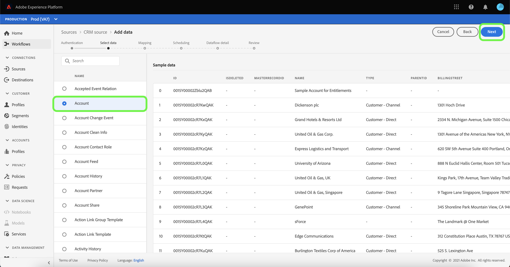

# 在UI中为CRM连接器配置数据流

数据流是从源中检索数据并将其引入数据集的计划任务 [!DNL Platform] 符。 本教程提供了使用CRM连接器配置新数据流的步骤。

## 入门指南

本教程需要对Adobe Experience Platform的以下组件有一定的了解：

* [体验数据模型(XDM)系统](../../../../xdm/home.md): 组织客户体验数 [!DNL Experience Platform] 据的标准化框架。
   * [模式合成基础](../../../../xdm/schema/composition.md): 了解XDM模式的基本构件，包括模式构成的主要原则和最佳做法。
   * [模式编辑器教程](../../../../xdm/tutorials/create-schema-ui.md): 了解如何使用模式编辑器UI创建自定义模式。
* [实时客户用户档案](../../../../profile/home.md): 基于来自多个来源的聚集数据提供统一、实时的消费者用户档案。

此外，本教程要求您已创建CRM连接器。 有关在UI中创建不同CRM连接器的列表教程，请参阅源连接 [器概述](../../../home.md)。

## 选择数据

创建CRM连接器后，将显 *示选择* 数据步骤，为您提供一个交互界面来浏览文件层次结构。

* 界面的左半部分是目录浏览器，显示服务器的文件和目录。
* 界面的右半部分允许您从一个兼容文件预览多达100行数据。

选择要使用的目录，然后单击“下 **[!UICONTROL 一步]**”。

## 将数据字段映射到XDM模式

将显 *示* “映射”步骤，提供一个交互界面来将源数据映射到数 [!DNL Platform] 据集。

选择要收录到的入站数据的数据集。 您可以使用现有数据集或创建新数据集。

### 使用现有数据集

要将数据引入现有数据集，请选择 **[!UICONTROL 使用现有数据集]**，然后单击数据集图标。

此时将 _显示“选择数据集_ ”对话框。 找到您要使用的数据集，选择它，然后单击“继 **[!UICONTROL 续”]**。

### 使用新数据集

要将数据引入新数据集，请选 **[!UICONTROL 择创建新数据集]** ，并在提供的字段中输入数据集的名称和说明。 然后，单击模式图标。

将出 _现“选择模式_ ”对话框。 选择要应用于新数据集的模式，然后单击 **[!UICONTROL 完成]**。

根据您的需要，您可以选择直接映射字段，或使用映射器函数转换源数据以导出计算值或计算值。 有关数据映射和映射器功能的详细信息，请参阅将CSV数据 [映射到XDM模式字段的教程](../../../../ingestion/tutorials/map-a-csv-file.md)。

映射源数据后，单击“下 **[!UICONTROL 一步]**”。

## 计划摄取运行

此时 *[!UICONTROL 将显示]* “计划”步骤，允许您配置摄取计划，以使用配置的映射自动摄取所选源数据。 下表概述了用于计划的不同可配置字段：

| 字段 | 描述 |
| --- | --- |
| 频率 | 可选频率包括一次、分钟、小时、天和周。 |
| 间隔 | 一个整数，它为所选频率设置间隔。 |
| 开始时间 | UTC时间戳，指示何时设置第一次摄取 |
| 回填 | 一个布尔值，它确定最初摄取的数据。 如果 *启用* “回填”，则指定路径中的所有当前文件将在第一次预定接收期间被摄取。 如果 *禁用* “回填”，则只会摄取在首次摄取和开始时间之间加 *载的文件* 。 在开始时间之 *前加载的文* 件将不会被摄取。 |
| 增量列 | 具有筛选的源模式字段集类型、日期或时间的选项。 此字段用于区分新数据和现有数据。 增量数据将根据所选列的时间戳被摄取。 |

数据流设计为按计划自动摄取数据。 开始。 然后，设置时间间隔以指定两个流运行之间的周期。 间隔的值应为非零整数，并应设置为大于或等于15。

要设置摄取的开始时间，请调整开始时间框中显示的日期和时间。 或者，也可以选择日历图标以编辑开始时间值。 开始时间必须大于或等于当前UTC时间。

选择 **[!UICONTROL 加载增量数据]** ，以分配增量列。 此字段区分新数据和现有数据。

### 设置一次性摄取数据流

要设置一次性摄取，请选择频率下拉箭头，然后选择“ **[!UICONTROL 一次]**”。

>[!TIP] **[!UICONTROL 在一]** 次性摄取 **** 期间，间隔和回填不可见。

向计划提供适当的值后，选择“下 **[!UICONTROL 一步]**”。

## 命名数据流

将 *出现* “名称流”步骤，您必须在其中为数据流提供名称和可选描述。 完成后，单击&#x200B;**[!UICONTROL 下一步]**。

## 查看数据流

此时 *会出现* “审阅”步骤，允许您在创建新数据流之前对其进行查看。 详细信息按以下类别分组：

* *[!UICONTROL 连接详细信息]*: 显示源类型、所选源文件的相关路径以及该源文件中的列数。
* *[!UICONTROL 映射详细信息]*: 显示接收源数据的数据集，包括数据集附带的模式。
* *[!UICONTROL 计划详细信息]*: 显示摄取计划的活动周期、频率和间隔。

查看数据流后，单击 **[!UICONTROL 完成]** ，并允许一段时间创建数据流。

## 监视和删除数据流

创建数据流后，您可以监视通过它摄取的数据。 有关如何监视和删除数据流的详细信息，请参阅有关监视和删除 [数据流的教程](../monitor.md)。

## 后续步骤

通过遵循本教程，您成功创建了一个数据流，以从CRM导入数据并获得了有关监视数据集的洞察。 要进一步了解如何创建数据流，您可以通过观看以下视频来补充您的学习。 此外，传入数据现在可供下游服务 [!DNL Platform] （如和） [!DNL Real-time Customer Profile] 使用 [!DNL Data Science Workspace]。 有关更多详细信息，请参阅以下文档:

* [实时客户用户档案概述](../../../../profile/home.md)
* [数据科学工作区概述](../../../../data-science-workspace/home.md)

>[!WARNING]
>
> 以 [!DNL Platform] 下视频中显示的UI已过期。 有关最新的UI屏幕截图和功能，请参阅上面的文档。

>[!VIDEO](https://video.tv.adobe.com/v/29711?quality=12&learn=on)

## 附录

以下部分提供了有关使用源连接器的其他信息。

### 禁用数据流

创建数据流时，它会立即变为活动状态，并根据给定的计划接收数据。 您可以按照以下说明随时禁用活动数据流。

在身 *[!UICONTROL 份验证]* 屏幕中，选择与要禁用的数据流关联的基本连接的名称。

将显 _示“源活动_ ”页面。 从列表中选择活动数据流以在屏 *[!UICONTROL 幕]* 右侧打开其“属性”列，该列包含“已启用 **** ”切换按钮。 单击切换以禁用数据流。 在禁用数据流后，可以使用相同的切换重新启用数据流。

### 激活入站数据以进行 [!DNL Profile] 填充

来自源连接器的入站数据可用于丰富和填充数 [!DNL Real-time Customer Profile] 据。 有关填充数据的更 [!DNL Real-time Customer Profile] 多信息，请参阅用户档案填 [充教程](../profile.md)。