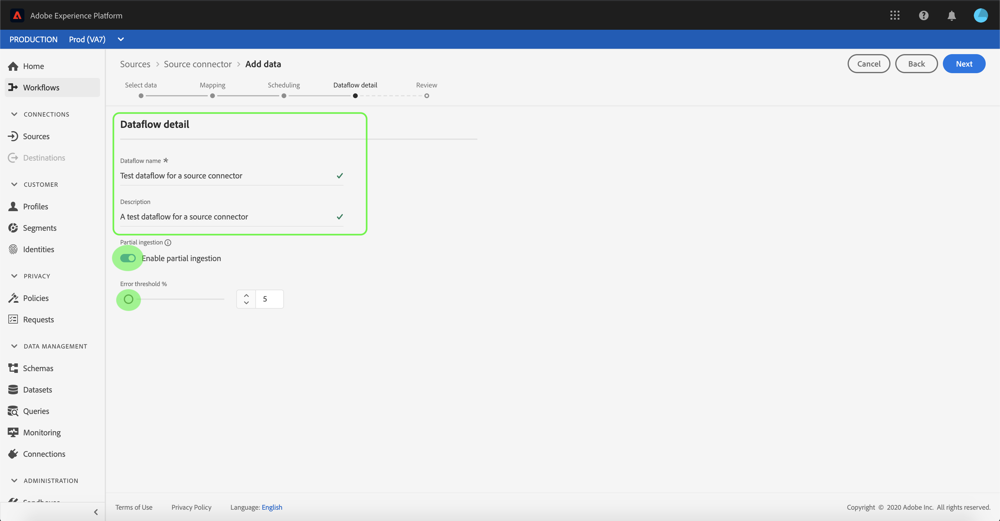

# 在UI中为客户成功连接配置数据流

数据流是一种从源中检索数据并将其摄取到 [!DNL Platform] 数据集。 本教程提供了使用客户成功帐户配置新数据流的步骤。

## 快速入门

本教程需要对Adobe Experience Platform的以下组件有一定的了解：

- [[!DNL Experience Data Model (XDM)] 系统](../../../../xdm/home.md):标准化框架， [!DNL Experience Platform] 组织客户体验数据。
   - [架构组合的基础知识](../../../../xdm/schema/composition.md):了解XDM模式的基本构建块，包括模式组合中的关键原则和最佳实践。
   - [模式编辑器教程](../../../../xdm/tutorials/create-schema-ui.md):了解如何使用模式编辑器UI创建自定义模式。
- [[!DNL Real-time Customer Profile]](../../../../profile/home.md):根据来自多个来源的汇总数据提供统一的实时客户资料。

此外，本教程还要求您已创建客户成功帐户。 有关在UI中创建不同客户成功连接器的教程列表，请参阅 [源连接器概述](../../../home.md).

## 选择数据

创建客户成功连接器后， **[!UICONTROL 选择数据]** 中，提供了一个交互式界面来浏览文件层次结构。

- 界面的左半部分是目录浏览器，用于显示服务器的文件和目录。
- 界面的右半部分允许您从兼容的文件中预览多达100行数据。

您可以使用 **[!UICONTROL 搜索]** 选项来快速识别您要使用的源数据。

>[!NOTE]
>
>搜索源数据选项适用于所有基于表格的源连接器，不包括Analytics、分类、事件中心和Kinesis连接器。

找到源数据后，选择目录，然后单击 **[!UICONTROL 下一个]**.

## 将数据字段映射到XDM架构

的 **[!UICONTROL 映射]** 提供交互界面以将源数据映射到 [!DNL Platform] 数据集。

为要摄取到的入站数据选择数据集。 您可以使用现有数据集或创建新数据集。

### 使用现有数据集

要将数据摄取到现有数据集，请选择 **[!UICONTROL 使用现有数据集]**，然后单击数据集图标。

的 **[!UICONTROL 选择数据集]** 对话框。 找到您要使用的数据集，将其选中，然后单击 **[!UICONTROL 继续]**.

### 使用新数据集

要将数据引入新数据集，请选择 **[!UICONTROL 创建新数据集]** 并在提供的字段中输入数据集的名称和描述。

您可以通过在 **[!UICONTROL 选择架构]** 搜索栏。 您还可以选择下拉图标以查看现有架构的列表。 或者，您也可以选择 **[!UICONTROL 高级搜索]** 访问现有架构的屏幕，包括其各自的详细信息。

在此步骤中，您可以为 [!DNL Real-time Customer Profile] 并创建实体属性和行为的整体视图。 所有已启用数据集的数据都将包含在 [!DNL Profile] 和更改将在您保存数据流时应用。

切换 **[!UICONTROL 配置文件数据集]** 按钮为 [!DNL Profile].

的 **[!UICONTROL 选择架构]** 对话框。 选择要应用于新数据集的架构，然后单击 **[!UICONTROL 完成]**.

根据您的需要，您可以选择直接映射字段，或使用数据准备函数转换源数据以导出计算值或计算值。 有关使用映射器界面和计算字段的完整步骤，请参阅 [数据准备UI指南](../../../../data-prep/ui/mapping.md).

>[!TIP]
>
>Platform根据您选择的目标架构或数据集，为自动映射的字段提供智能推荐。 您可以手动调整映射规则以适合您的用例。

选择 **[!UICONTROL 预览数据]** 查看从选定数据集映射最多100行示例数据的结果。

在预览期间，标识列将作为第一个字段按优先级排列，因为它是验证映射结果时必需的关键信息。

映射源数据后，选择 **[!UICONTROL 关闭]**.

## 计划摄取运行

的 **[!UICONTROL 计划]** 步骤，允许您配置摄取计划以使用配置的映射自动摄取选定的源数据。 下表概述了计划的不同可配置字段：

| 字段 | 描述 |
| --- | --- |
| 频度 | 可选频率包括 `Once`, `Minute`, `Hour`, `Day`和 `Week`. |
| 间隔 | 一个整数，用于设置所选频率的间隔。 |
| 开始时间 | UTC时间戳，指示何时设置进行第一次摄取。 |
| 回填 | 一个布尔值，用于确定最初摄取的数据。 如果 **[!UICONTROL 回填]** 启用后，指定路径中的所有当前文件都将在首次计划摄取期间被摄取。 如果 **[!UICONTROL 回填]** 禁用，则只会摄取在首次摄取运行到开始时间之间加载的文件。 不会摄取在开始时间之前加载的文件。 |
| 增量列 | 一个选项，其中包含一组类型、日期或时间的筛选源架构字段。 此字段用于区分新数据和现有数据。 将根据选定列的时间戳摄取增量数据。 |

数据流旨在按计划自动摄取数据。 首先选择摄取频率。 接下来，设置间隔以指定两个流运行之间的周期。 间隔的值应为非零整数，并应设置为大于或等于15。

要设置摄取的开始时间，请调整开始时间框中显示的日期和时间。 或者，您也可以选择日历图标以编辑开始时间值。 开始时间必须大于或等于当前UTC时间。

选择 **[!UICONTROL 加载增量数据的方式]** 来分配增量列。 此字段区分新数据和现有数据。

### 设置一次性摄取数据流

要设置一次性摄取，请选择频度下拉箭头，然后选择 **[!UICONTROL 一次]**.

>[!TIP]
>
>**[!UICONTROL 间隔]** 和 **[!UICONTROL 回填]** 在一次性摄取期间不可见。

向计划提供适当值后，请选择 **[!UICONTROL 下一个]**.

## 提供数据流详细信息

的 **[!UICONTROL 数据流详细信息]** 步骤，允许您命名并简要描述新数据流。

在此过程中，您还可以启用 **[!UICONTROL 部分摄取]** 和 **[!UICONTROL 错误诊断]**. 启用 **[!UICONTROL 部分摄取]** 能够摄取包含错误且最高达特定阈值的数据。 一次 **[!UICONTROL 部分摄取]** ，请将 **[!UICONTROL 错误阈值%]** 拨号以调整批次的错误阈值。 或者，您也可以通过选择输入框手动调整阈值。 有关更多信息，请参阅 [部分批量摄取概述](../../../../ingestion/batch-ingestion/partial.md).

为数据流提供值并选择 **[!UICONTROL 下一个]**.

## 查看数据流

的 **[!UICONTROL 审阅]** 步骤，允许您在创建新数据流之前查看新数据流。 详细信息按以下类别分组：

- **[!UICONTROL 连接详细信息]**:显示源类型、所选源文件的相关路径以及该源文件中的列数。
- **[!UICONTROL 映射详细信息]**:显示源数据被摄取到的数据集，包括该数据集附加的架构。
- **[!UICONTROL 计划详细信息]**:显示摄取计划的活动期、频率和间隔。

审核数据流后，单击 **[!UICONTROL 完成]** 并为创建数据流留出一些时间。

## 监控数据流

创建数据流后，您可以监控通过其摄取的数据，以查看有关摄取率、成功和错误的信息。 有关如何监控数据流的更多信息，请参阅 [监控UI中的帐户和数据流](../monitor.md).

## 删除数据流

您可以删除不再需要或使用错误创建的数据流 **[!UICONTROL 删除]** 函数 **[!UICONTROL 数据流]** 工作区。 有关如何删除数据流的更多信息，请参阅 [删除UI中的数据流](../delete.md).

## 后续步骤

通过阅读本教程，您成功创建了一个数据流，以从客户成功来源导入数据，并深入了解了监控数据集。 现在，下游可以使用传入数据 [!DNL Platform] 诸如 [!DNL Real-time Customer Profile] 和 [!DNL Data Science Workspace]. 有关更多详细信息，请参阅以下文档：

- [实时客户资料概述](../../../../profile/home.md)
- [数据科学工作区概述](../../../../data-science-workspace/home.md)

## 附录

以下部分提供了有关使用源连接器的其他信息。

### 禁用数据流

创建数据流后，该数据流会立即变为活动状态，并根据给定的计划摄取数据。 您可以随时按照以下说明禁用活动数据流。

在 **[!UICONTROL 身份验证]** 屏幕中，选择与要禁用的数据流关联的帐户名称。

的 **[!UICONTROL 源活动]** 页面。 从列表中选择活动数据流以打开其 **[!UICONTROL 属性]** 列，其中包含 **[!UICONTROL 已启用]** 切换按钮。 单击切换以禁用数据流。 在禁用数据流后，可以使用相同的切换开关重新启用数据流。

### 激活的入站数据 [!DNL Profile] 人口

来自源连接器的入站数据可用于丰富和填充您的 [!DNL Real-time Customer Profile] 数据。 有关填充 [!DNL Real-time Customer Profile] 数据，请参阅 [用户档案人口](../profile.md).
