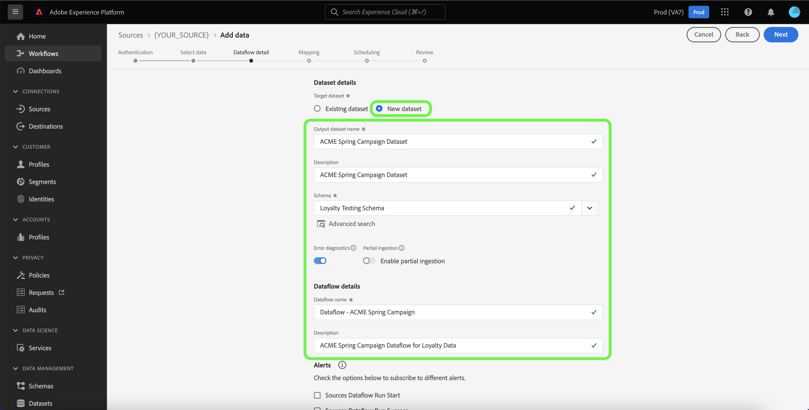

# 在UI中使用数据库源创建数据流

数据流是一种计划任务，用于检索源中的数据并将其摄取到Adobe Experience Platform中的数据集。 本教程提供了有关如何使用Platform UI为数据库源创建数据流的步骤。

>[!NOTE]
>
>要创建数据流，您必须已拥有具有数据库源的经过身份验证的帐户。 有关在UI中创建不同数据库源帐户的教程列表，请参阅 [源概述](../../../home.md#database).

## 快速入门

本教程需要深入了解Platform的以下组件：

* [源](../../../home.md)：Platform允许从各种源摄取数据，同时让您能够使用来构建、标记和增强传入数据 [!DNL Platform] 服务。
* [[!DNL Experience Data Model (XDM)] 系统](../../../../xdm/home.md)：Experience Platform用于组织客户体验数据的标准化框架。
   * [模式组合基础](../../../../xdm/schema/composition.md)：了解XDM架构的基本构建基块，包括架构构成中的关键原则和最佳实践。
   * [架构编辑器教程](../../../../xdm/tutorials/create-schema-ui.md)：了解如何使用架构编辑器UI创建自定义架构。
* [[!DNL Real-Time Customer Profile]](../../../../profile/home.md)：根据来自多个来源的汇总数据提供统一的实时使用者个人资料。
* [[!DNL Data Prep]](../../../../data-prep/home.md)：允许数据工程师映射、转换和验证与Experience Data Model (XDM)之间的数据。

## 添加数据

创建数据库源帐户后， **[!UICONTROL 添加数据]** 此时将显示步骤，为您提供浏览数据库源帐户表层次结构的界面。

* 界面的左半部分是一个浏览器，显示帐户中包含的数据表列表。 该界面还包括一个搜索选项，可让您快速识别要使用的源数据。
* 界面的右半部分是一个预览面板，允许您预览最多100行数据。

>[!NOTE]
>
>搜索源数据选项适用于除Adobe Analytics之外的所有基于表的源。 [!DNL Amazon Kinesis]、和 [!DNL Azure Event Hubs].

找到源数据后，选择表，然后选择 **[!UICONTROL 下一个]**.

## 提供数据流详细信息

此 [!UICONTROL 数据流详细信息] 页面允许您选择是要使用现有数据集，还是新数据集。 在此过程中，您还可以配置设置 [!UICONTROL 配置文件数据集]， [!UICONTROL 错误诊断]， [!UICONTROL 部分摄取]、和 [!UICONTROL 警报].

### 使用现有数据集

要将数据摄取到现有数据集，请选择 **[!UICONTROL 现有数据集]**. 您可以使用检索现有数据集 [!UICONTROL 高级搜索] 选项中进行选择，或者通过滚动下拉菜单中的现有数据集列表来进行选择。 选择数据集后，为数据流提供名称和描述。

### 使用新数据集

要摄取到新数据集中，请选择 **[!UICONTROL 新建数据集]** 然后提供输出数据集名称和可选描述。 接下来，使用选择要映射到的架构 [!UICONTROL 高级搜索] 选项中进行选择，或者通过滚动下拉菜单中的现有架构列表来进行选择。 选择架构后，为数据流提供名称和描述。

### 启用 [!DNL Profile] 和错误诊断

接下来，选择 **[!UICONTROL 配置文件数据集]** 切换以启用您的数据集 [!DNL Profile]. 这允许您创建实体的属性和行为的整体视图。 来自所有客户的数据 [!DNL Profile] — 启用的数据集将包含在 [!DNL Profile] 在保存数据流时，将应用更改。

[!UICONTROL 错误诊断] 为数据流中发生的任何错误记录启用详细的错误消息生成，而 [!UICONTROL 部分摄取] 允许您摄取包含错误的数据，摄取到手动定义的特定阈值为止。 请参阅 [部分批量摄取概述](../../../../ingestion/batch-ingestion/partial.md) 了解更多信息。

### 启用警报

您可以启用警报以接收有关数据流状态的通知。 从列表中选择警报以订阅接收有关数据流状态的通知。 有关警报的更多信息，请参阅以下指南中的 [使用UI订阅源警报](../alerts.md).

完成向数据流提供详细信息后，选择 **[!UICONTROL 下一个]**.

## 将数据字段映射到XDM架构

此 [!UICONTROL 映射] 步骤随即显示，为您提供了一个界面，用于将源架构中的源字段映射到目标架构中相应的目标XDM字段。

Platform根据您选择的目标架构或数据集，为自动映射的字段提供智能推荐。 您可以手动调整映射规则以适合您的用例。 根据需要，您可以选择直接映射字段，或使用数据准备函数转换源数据以派生计算值或计算值。 有关使用映射器界面和计算字段的综合步骤，请参阅 [数据准备UI指南](../../../../data-prep/ui/mapping.md).

成功映射源数据后，选择 **[!UICONTROL 下一个]**.

## 计划摄取运行

此 [!UICONTROL 计划] 此时将显示步骤，允许您配置摄取计划，以使用配置的映射自动摄取选定的源数据。 默认情况下，计划设置为 `Once`. 要调整摄取频率，请选择 **[!UICONTROL 频率]** ，然后从下拉菜单中选择一个选项。

>[!TIP]
>
>间隔和回填在一次性摄取期间不可见。

如果将摄取频率设置为 `Minute`， `Hour`， `Day`，或 `Week`，则必须设置一个间隔，以便在每次引入之间建立一个设置的时间范围。 例如，摄取频率设置为 `Day` 并且间隔设置为 `15` 这意味着您的数据流计划每15天摄取一次数据。

在此步骤中，您还可以启用 **回填** 和定义用于增量摄取数据的列。 回填用于摄取历史数据，而您为增量摄取定义的列允许将新数据与现有数据区分开。

有关计划配置的详细信息，请参阅下表。

| 字段 | 描述 |
| --- | --- |
| 频度 | 摄取的频率。 可选择频率包括 `Once`， `Minute`， `Hour`， `Day`、和 `Week`. |
| 间隔 | 一个整数，它设置所选频率的间隔。 间隔值应为非零整数，应设置为大于或等于15。 |
| 开始时间 | UTC时间戳，指示首次引入的时间设置。 开始时间必须大于或等于当前UTC时间。 |
| 回填 | 一个布尔值，用于确定最初摄取的数据。 如果启用了回填，则指定路径中的所有当前文件将在第一次计划摄取期间摄取。 如果禁用了回填，则只摄取在第一次引入运行到开始时间之间加载的文件。 在开始时间之前加载的文件不会被摄取。 |
| 加载增量数据依据 | 一个选项，其中包含一组类型为、日期或时间的源架构字段。 此字段用于区分新数据和现有数据。 将根据所选列的时间戳摄取增量数据。 |

## 查看您的数据流

此 **[!UICONTROL 审核]** 步骤，允许您在创建新数据流之前对其进行查看。 详细信息分为以下类别：

* **[!UICONTROL 连接]**：显示源类型、所选源文件的相关路径以及该源文件中的列数。
* **[!UICONTROL 分配数据集和映射字段]**：显示要将源数据摄取到哪个数据集，包括该数据集所遵循的架构。
* **[!UICONTROL 计划]**：显示摄取调度的活动时段、频率和间隔。

查看数据流后，选择 **[!UICONTROL 完成]** 并留出一些时间来创建数据流。

## 监测数据流

创建数据流后，您可以监视通过它摄取的数据，以查看有关摄取率、成功和错误的信息。 有关如何监视数据流的更多信息，请参阅关于的教程 [在UI中监控帐户和数据流](../monitor.md).

## 删除数据流

您可以删除不再必需或之前使用错误创建的数据流 **[!UICONTROL 删除]** 函数位于 **[!UICONTROL 数据流]** 工作区。 有关如何删除数据流的更多信息，请参阅关于的教程 [在UI中删除数据流](../delete.md).

## 后续步骤

通过阅读本教程，您已成功创建了一个数据流，将数据从数据库源引入平台。 传入数据现在可供下游使用 [!DNL Platform] 服务，例如 [!DNL Real-Time Customer Profile] 和 [!DNL Data Science Workspace]. 有关更多详细信息，请参阅以下文档：

* [[!DNL Real-Time Customer Profile] 概述](../../../../profile/home.md)
* [[!DNL Data Science Workspace] 概述](../../../../data-science-workspace/home.md)
