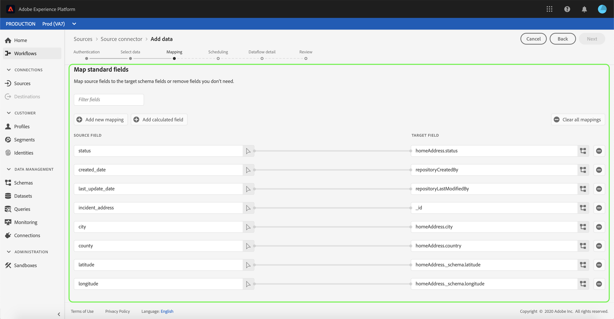
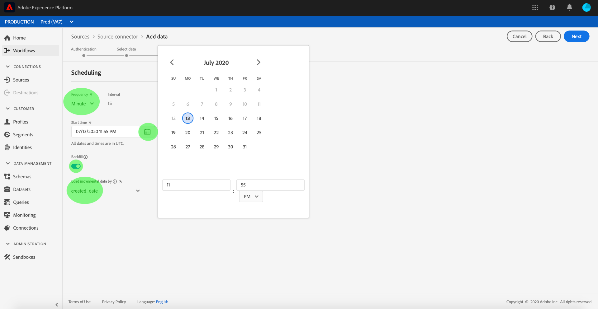
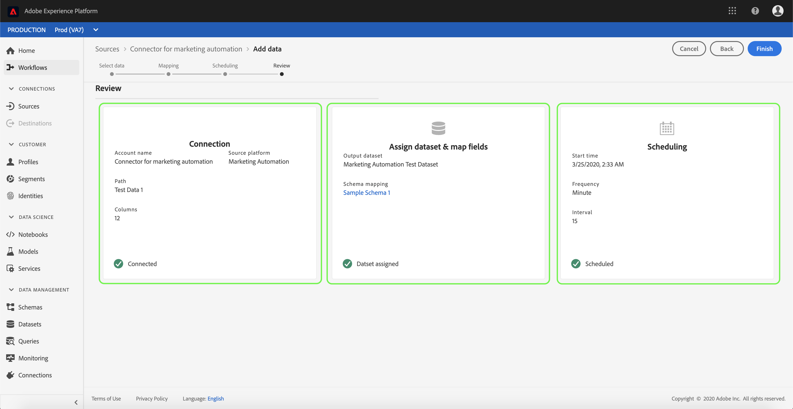
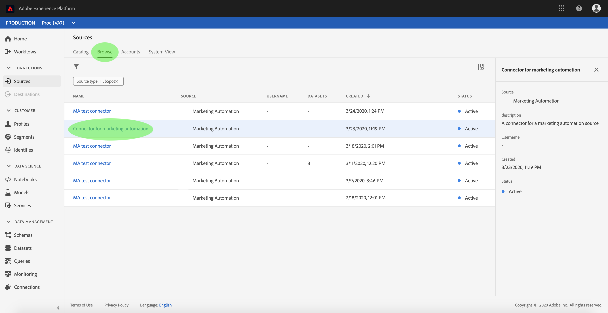

# 在UI中为营销自动化连接器配置数据流

数据流是从源中检索数据并将其引入数据集的计划任务 [!DNL Platform] 符。 本教程提供使用营销自动化帐户配置新数据流的步骤。

## 入门指南

本教程需要对Adobe Experience Platform的以下组件进行有效的理解：

- [[!DNL Experience Data Model] (XDM)系统](../../../../xdm/home.md):组织客户体验数 [!DNL Experience Platform] 据的标准化框架。
   - [模式合成基础](../../../../xdm/schema/composition.md):了解XDM模式的基本构件，包括模式构成的主要原则和最佳做法。
   - [模式编辑器教程](../../../../xdm/tutorials/create-schema-ui.md):了解如何使用模式编辑器UI创建自定义模式。
- [[!DNL实时客户用户档案]](../../../../profile/home.md):基于来自多个来源的聚集数据提供统一、实时的消费者用户档案。

此外，本教程要求您已经创建了营销自动化帐户。 有关在UI中创建不同营销自动化连接器的一列表教程，请参阅源 [连接器概述](../../../home.md)。

## 选择数据

创建营销自动化帐户后，将显 *示选择数据* 步骤，为您提供一个交互界面来探索文件层次结构。

- 界面的左半部分是目录浏览器，显示服务器的文件和目录。
- 界面的右半部分允许您从一个兼容文件预览多达100行数据。

您可以使用页 **[!UICONTROL 面顶部]** 的“搜索”选项快速识别您要使用的源数据。

>[!NOTE]
>
>搜索源数据选项适用于所有基于表格的源连接器，不包括分析、分类、事件中心和Kinesis连接器。

找到源数据后，选择目录，然后单击“下 **[!UICONTROL 一步]**”。

## 将数据字段映射到XDM模式

将显 **[!UICONTROL 示]** “映射”步骤，提供一个交互界面来将源数据映射到数 [!DNL Platform] 据集。

选择要收录到的入站数据的数据集。 您可以使用现有数据集或创建新数据集。

### 使用现有数据集

要将数据引入现有数据集，请选择 **[!UICONTROL 使用现有数据集]**，然后单击数据集图标。

此时将 **[!UICONTROL 显示“选择数据集]** ”对话框。 找到您要使用的数据集，选择它，然后单击“继 **[!UICONTROL 续”]**。

### 使用新数据集

要将数据引入新数据集，请选 **[!UICONTROL 择创建新数据集]** ，并在提供的字段中输入数据集的名称和说明。

您可以在“选择模式”搜索栏中输入模式名 **[!UICONTROL 称来附加模式]** 字段。 您还可以选择下拉图标以查看现有列表的模式。 或者，您也可以选择“ **[!UICONTROL 高级搜索]** ”来访问现有模式的屏幕，包括其各自的详细信息。

将出 **[!UICONTROL 现“选择模式]** ”对话框。 选择要应用于新数据集的模式，然后单击 **[!UICONTROL 完成]**。

根据您的需要，您可以选择直接映射字段，或使用映射器函数转换源数据以导出计算值或计算值。 有关数据映射和映射器功能的详细信息，请参阅将CSV数据 [映射到XDM模式字段的教程](../../../../ingestion/tutorials/map-a-csv-file.md)。

映射源数据后，单击“下 **[!UICONTROL 一步]**”。

## 计划摄取运行

此时 **[!UICONTROL 将显示]** “计划”步骤，允许您配置摄取计划，以使用配置的映射自动摄取所选源数据。 下表概述了用于计划的不同可配置字段：

| 字段 | 描述 |
| --- | --- |
| 频度 | 可选频率 `Once`包括 `Minute`、 `Hour`、 `Day`和 `Week`。 |
| 间隔 | 一个整数，它为所选频率设置间隔。 |
| 开始时间 | UTC时间戳，指示何时设置第一次摄取。 |
| 回填 | 一个布尔值，它确定最初摄取的数据。 如果 **[!UICONTROL 启用]** “回填”，则指定路径中的所有当前文件将在第一次预定接收期间被摄取。 如果 **[!UICONTROL 禁用]** “回填”，则只会摄取在首次摄取和开始时间之间加 **[!UICONTROL 载的文件]** 。 在开始时间之 **[!UICONTROL 前加载的文]** 件将不会被摄取。 |
| 增量列 | 具有筛选的源模式字段集类型、日期或时间的选项。 此字段用于区分新数据和现有数据。 增量数据将根据所选列的时间戳被摄取。 |

数据流设计为按计划自动摄取数据。 开始。 然后，设置时间间隔以指定两个流运行之间的周期。 间隔的值应为非零整数，并应设置为大于或等于15。

要设置摄取的开始时间，请调整开始时间框中显示的日期和时间。 或者，也可以选择日历图标以编辑开始时间值。 开始时间必须大于或等于当前UTC时间。

选择 **[!UICONTROL 加载增量数据]** ，以分配增量列。 此字段区分新数据和现有数据。

### 设置一次性摄取数据流

要设置一次性摄取，请选择频率下拉箭头，然后选择“ **[!UICONTROL 一次]**”。

>[!TIP]
>
>**[!UICONTROL 在一]** 次 **[!UICONTROL 性摄取期]** 间，间隔和回填不可见。

向计划提供适当的值后，选择“下 **[!UICONTROL 一步]**”。

## 提供数据流详细信息

此时 **[!UICONTROL 会显示]** “数据流详细信息”步骤，允许您命名新数据流并简要描述新数据流。

在此过程中，您还可以启用“部 **[!UICONTROL 分摄取]** ”和“ **[!UICONTROL 错误诊断”]**。 启用 **[!UICONTROL 部分摄取]** ，可以摄取包含错误且达到特定阈值的数据。 启 **[!UICONTROL 用部分摄取]** ，请拖动错误 **[!UICONTROL 阈值%dial以调整批]** 错误阈值。 或者，也可以通过选择输入框手动调整阈值。 有关详细信息，请参 [阅部分批摄取概述](../../../../ingestion/batch-ingestion/partial.md)。

为数据流提供值，然后选择 **[!UICONTROL 下一步]**。

## 查看数据流

此时 **[!UICONTROL 会出现]** “审阅”步骤，允许您在创建新数据流之前对其进行查看。 详细信息按以下类别分组：

- **[!UICONTROL 连接]**:显示源类型、所选源文件的相关路径以及该源文件中的列数。
- **[!UICONTROL 分配数据集和地图字段]**:显示接收源数据的数据集，包括数据集附带的模式。
- **[!UICONTROL 计划]**:显示摄取计划的活动周期、频率和间隔。

查看数据流后，单击 **[!UICONTROL 完成]** ，并允许一段时间创建数据流。

## 监视数据流

创建数据流后，您可以监视通过它摄取的数据，以查看有关摄取率、成功和错误的信息。 有关如何监视数据流的详细信息，请参阅UI中 [关于监视帐户和数据流的教程](../monitor.md)。

## 删除数据流

您可以删除不再需要的或使用Dataflows工作区中提供的Delete **** （删除）功能创建的 **[!UICONTROL 数据流]** 。 有关如何删除数据流的详细信息，请参阅有关在UI [中删除数据流的教程](../delete.md)。

## 后续步骤

通过遵循本教程，您成功创建了一个数据流以从营销自动化系统导入数据并获得了有关监视数据集的洞察。 现在，下游服务（如和）可 [!DNL Platform] 以使用传入 [!DNL Real-time Customer Profile] 数据 [!DNL Data Science Workspace]。 有关更多详细信息，请参阅以下文档:

- [[!DNL Real-time Customer Profile] 概述](../../../../profile/home.md)
- [[!DNL Data Science Workspace] 概述](../../../../data-science-workspace/home.md)

## 附录

以下部分提供了有关使用源连接器的其他信息。

### 禁用数据流

创建数据流时，它会立即变为活动状态，并根据给定的计划接收数据。 您可以按照以下说明随时禁用活动数据流。

在身 **[!UICONTROL 份验证]** 屏幕中，选择与要禁用的数据流关联的连接的名称。

将显 **[!UICONTROL 示“源活动]** ”页面。 从列表中选择活动数据流以在屏 **[!UICONTROL 幕]** 右侧打开其“属性”列，该列包含“已启用 **** ”切换按钮。 单击切换以禁用数据流。 在禁用数据流后，可以使用相同的切换重新启用数据流。

### 激活入站数据以进行 [!DNL Profile] 填充

来自源连接器的入站数据可用于丰富和填充数 [!DNL Real-time Customer Profile] 据。 有关填充数据的更 [!DNL Real-time Customer Profile] 多信息，请参阅用户档案填 [充教程](../profile.md)。
