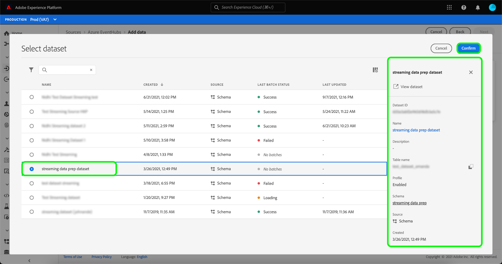

# 在UI中为云存储源创建流数据流

数据流是一项计划任务，用于从源中检索数据并将其摄取到Adobe Experience Platform数据集。 本教程提供了在UI中为云存储源创建流数据流的步骤。

在尝试使用本教程之前，您必须先在云存储帐户与平台之间建立一个经过身份验证的有效连接。 如果您还没有经过身份验证的连接，请参阅以下教程之一，以了解有关验证流云存储帐户的信息：

- [[!DNL Amazon Kinesis]](../../../ui/create/cloud-storage/kinesis.md)
- [[!DNL Azure Event Hubs]](../../../ui/create/cloud-storage/eventhub.md)
- [[!DNL Google PubSub]](../../../ui/create/cloud-storage/google-pubsub.md)

## 快速入门

本教程需要对Adobe Experience Platform的以下组件有一定的了解：

- [数据流](../../../../../dataflows/home.md):数据流是跨平台移动数据的数据作业的表示形式。 数据流是跨不同的服务(从源到 [!DNL Identity Service]，更改为 [!DNL Profile]和 [!DNL Destinations].
- [数据准备](../../../../../data-prep/home.md):数据准备允许数据工程师映射、转换和验证来自体验数据模型(XDM)的数据。 数据准备在数据摄取流程（包括CSV摄取工作流）中显示为“映射”步骤。
- [[!DNL Experience Data Model (XDM)] 系统](../../../../../xdm/home.md):标准化框架， [!DNL Experience Platform] 组织客户体验数据。
   - [架构组合的基础知识](../../../../../xdm/schema/composition.md):了解XDM模式的基本构建块，包括模式组合中的关键原则和最佳实践。
   - [模式编辑器教程](../../../../../xdm/tutorials/create-schema-ui.md):了解如何使用模式编辑器UI创建自定义模式。
- [[!DNL Real-Time Customer Profile]](../../../../../profile/home.md):根据来自多个来源的汇总数据提供统一的实时客户资料。

## 添加数据

创建对流云存储帐户进行身份验证后， **[!UICONTROL 选择数据]** 步骤，为您提供一个界面以选择要引入平台的数据流。

- 界面的左侧是一个浏览器，用于查看您帐户中的可用数据流；
- 界面的右侧部分允许您从JSON文件预览多达100行数据。

选择要使用的数据流，然后选择 **[!UICONTROL 选择文件]** 上传示例架构。

>[!TIP]
>
>如果您的数据符合XDM标准，则可以跳过上传示例架构，然后选择 **[!UICONTROL 下一个]** 以继续。

上传架构后，预览界面会进行更新，以显示您上传的架构的预览。 预览界面允许您检查文件的内容和结构。 您还可以使用 [!UICONTROL 搜索字段] 用于从架构中访问特定项目的实用程序。

完成后，选择 **[!UICONTROL 下一个]**.

## 映射

的 **[!UICONTROL 映射]** 步骤，提供一个界面以将源数据映射到Platform数据集。

为要摄取到的入站数据选择数据集。 您可以使用现有数据集，也可以创建新数据集。

### 新数据集

要将数据引入新数据集，请选择 **[!UICONTROL 新数据集]** 并在提供的字段中输入数据集的名称和描述。 要添加架构，您可以在 **[!UICONTROL 选择架构]** 对话框。 或者，您也可以选择 **[!UICONTROL 架构高级搜索]** 以搜索适当的架构。

的 [!UICONTROL 选择架构] 窗口，为您提供可供选择的架构列表。 从列表中选择架构以更新右边栏，以显示特定于您选择的架构的详细信息，包括是否为 [!DNL Profile].

确定并选择要使用的架构后，选择 **[!UICONTROL 完成]**.

的 [!UICONTROL Target数据集] 页面会更新您选定的架构，该架构会显示为数据集的一部分。 在此步骤中，您可以为 [!DNL Profile] 并创建实体属性和行为的整体视图。 所有已启用数据集的数据都将包含在 [!DNL Profile] 和更改将在您保存数据流时应用。

切换 **[!UICONTROL 配置文件数据集]** 按钮为 [!DNL Profile].

### 现有数据集

要将数据摄取到现有数据集，请选择 **[!UICONTROL 现有数据集]**，然后选择数据集图标。

的 **[!UICONTROL 选择数据集]** 对话框，为您提供可供选择的可用数据集列表。 从列表中选择一个数据集以更新右边栏，以显示特定于您选择的数据集的详细信息，包括是否可以为 [!DNL Profile].

识别并选择要使用的数据集后，请选择 **[!UICONTROL 完成]**.

选择数据集后，选择 [!DNL Profile] 切换为启用数据集 [!DNL Profile].

### 映射标准字段

建立数据集和架构后， **[!UICONTROL 映射标准字段]** 界面，允许您为数据手动配置映射字段。

>[!TIP]
>
>Platform根据您选择的目标架构或数据集，为自动映射的字段提供智能推荐。 您可以手动调整映射规则以适合您的用例。

根据您的需要，您可以选择直接映射字段，或使用数据准备函数转换源数据以导出计算值或计算值。 有关使用映射器界面和计算字段的完整步骤，请参阅 [数据准备UI指南](../../../../../data-prep/ui/mapping.md).

映射源数据后，选择 **[!UICONTROL 下一个]**.

## 数据流详细信息

的 **[!UICONTROL 数据流详细信息]** 步骤，允许您命名并简要描述新数据流。

为数据流提供值并选择 **[!UICONTROL 下一个]**.

### 审阅

的 **[!UICONTROL 审阅]** 步骤，允许您在创建新数据流之前查看新数据流。 详细信息按以下类别分组：

- **[!UICONTROL 连接]**:显示您的帐户名称、源类型以及特定于您所使用的流云存储源的其他信息。
- **[!UICONTROL 分配数据集和映射字段]**:显示用于数据流的目标数据集和架构。

审核数据流后，选择 **[!UICONTROL 完成]** 并为创建数据流留出一些时间。

## 监控和删除数据流

创建流云存储数据流后，您可以监控通过它摄取的数据。 有关监视和删除流数据流的更多信息，请参阅 [监控流数据流](../../monitor-streaming.md).

## 后续步骤

在本教程中，您已成功创建了数据流以从云存储源流化数据。 传入数据现在可由下游Platform服务使用，例如 [!DNL Real-Time Customer Profile] 和 [!DNL Data Science Workspace]. 有关更多详细信息，请参阅以下文档：

- [[!DNL Real-Time Customer Profile] 概述](../../../../../profile/home.md)
- [[!DNL Data Science Workspace] 概述](../../../../../data-science-workspace/home.md)