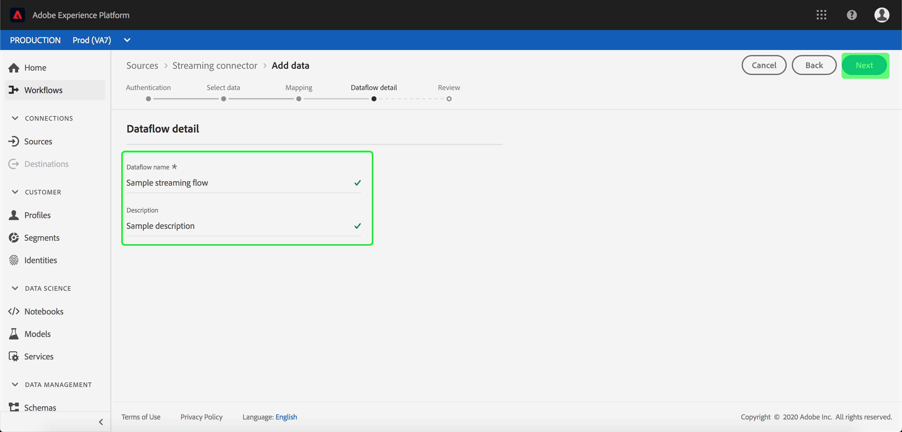

# 在UI中为云存储流连接配置数据流

数据流是从源中检索数据并将其引入[!DNL Platform]数据集的计划任务。 本教程提供使用云存储库连接器配置新数据流的步骤。

## 入门指南

本教程需要对Adobe Experience Platform的以下组件进行有效的理解：

- [[!DNL Experience Data Model (XDM)] 系统](../../../../../xdm/home.md):组织客户体验数 [!DNL Experience Platform] 据的标准化框架。
   - [模式合成基础](../../../../../xdm/schema/composition.md):了解XDM模式的基本构件，包括模式构成的主要原则和最佳做法。
   - [模式编辑器教程](../../../../../xdm/tutorials/create-schema-ui.md):了解如何使用模式编辑器UI创建自定义模式。
- [[!DNL Real-time Customer Profile]](../../../../../profile/home.md):基于来自多个来源的聚集数据提供统一、实时的消费者用户档案。

此外，本教程要求您已创建云存储连接器。 在[源连接器概述](../../../../home.md)中可找到有关在UI中创建不同云存储连接器的列表教程。

## 选择数据

创建云存储连接器后，将显示&#x200B;*选择数据*&#x200B;步骤，为您提供一个接口，供您选择要从哪个流传输数据。

## 将数据字段映射到XDM模式

出现&#x200B;**[!UICONTROL 映射]**&#x200B;步骤，提供交互式界面以将源数据映射到[!DNL Platform]数据集。

选择要收录到的入站数据的数据集。 您可以使用现有数据集或创建新数据集。

**使用现有数据集**

要将数据引入现有数据集，请选择&#x200B;**[!UICONTROL 使用现有数据集]**，然后单击数据集图标。

出现&#x200B;**[!UICONTROL 选择数据集]**&#x200B;对话框。 找到您要使用的数据集，选择它，然后单击&#x200B;**[!UICONTROL 继续]**。

**使用新数据集**

要将数据引入新数据集，请选择&#x200B;**[!UICONTROL 创建新数据集]**，并在提供的字段中输入数据集的名称和说明。 然后，在下拉列表中选择要使用的模式。

## 命名数据流

出现&#x200B;**[!UICONTROL 数据流详细信息]**&#x200B;步骤，允许您命名新数据流并提供有关新数据流的简要说明。

提供数据流的值，然后单击&#x200B;**[!UICONTROL Next]**。

### 查看数据流

出现&#x200B;**[!UICONTROL Review]**&#x200B;步骤，允许您在创建新数据流之前对其进行查看。 详细信息按以下类别分组：

- **[!UICONTROL 源详细信息]**:显示源类型和有关源的其他相关详细信息。
- **[!UICONTROL 目标详细信息]**:显示接收源数据的数据集，包括数据集附带的模式。

查看数据流后，单击&#x200B;**[!UICONTROL 完成]**&#x200B;并允许一段时间创建数据流。

## 监视和删除数据流

创建云存储数据流后，您可以监视通过它摄取的数据。 有关监视和删除数据流的详细信息，请参阅[监视数据流](../../../../../ingestion/quality/monitor-data-ingestion.md)的教程。

## 后续步骤

通过遵循本教程，您已成功创建了从外部云存储导入数据的数据流，并获得了有关监视数据集的洞察。 现在，下游[!DNL Platform]服务（如[!DNL Real-time Customer Profile]和[!DNL Data Science Workspace]）可以使用传入数据。 有关更多详细信息，请参阅以下文档:

- [[!DNL Real-time Customer Profile] 概述](../../../../../profile/home.md)
- [[!DNL Data Science Workspace] 概述](../../../../../data-science-workspace/home.md)

## 附录

以下部分提供了有关使用源连接器的其他信息。

### 禁用数据流

创建数据流时，它会立即变为活动状态，并根据给定的计划接收数据。 您可以按照以下说明随时禁用活动数据流。

在&#x200B;**[!UICONTROL 源]**&#x200B;工作区中，单击&#x200B;**[!UICONTROL 浏览]**&#x200B;选项卡。 然后，单击与要禁用的活动数据流关联的连接的名称。

将显示&#x200B;**[!UICONTROL 源活动]**&#x200B;页。 从列表中选择活动数据流以在屏幕右侧打开其&#x200B;**[!UICONTROL 属性]**&#x200B;列，该列包含一个&#x200B;**[!UICONTROL 已启用]**&#x200B;切换按钮。 单击切换以禁用数据流。 在禁用数据流后，可以使用相同的切换重新启用数据流。

### 为[!DNL Profile]人口激活入站数据

源连接器的入站数据可用于丰富和填充[!DNL Real-time Customer Profile]数据。 有关填充[!DNL Real-time Customer Profile]数据的详细信息，请参阅关于[用户档案填充](../../profile.md)的教程。
