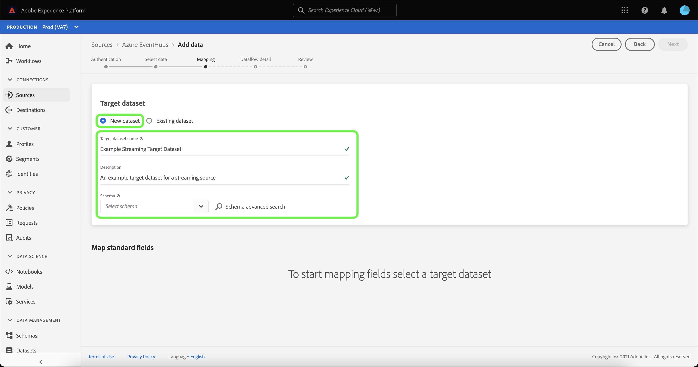
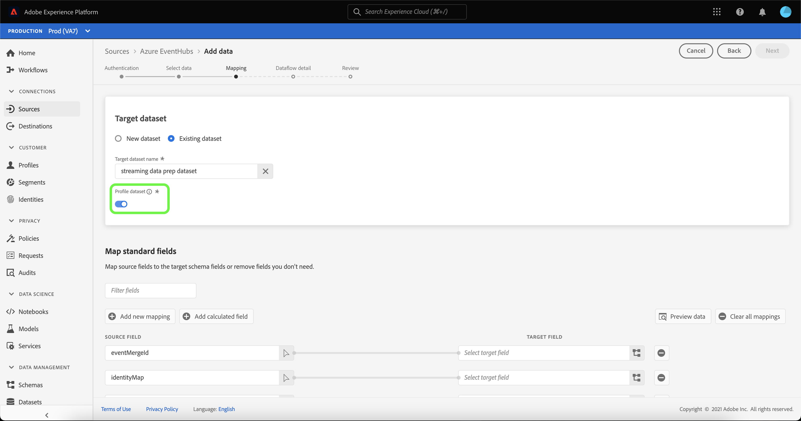

# 在UI中为云存储源创建流数据流

数据流是一种计划任务，用于在源中检索数据并将其摄取到Adobe Experience Platform数据集。 本教程提供了在UI中为云存储源创建流数据流的步骤。

在尝试本教程之前，必须首先在云存储帐户和Experience Platform之间建立有效且经过身份验证的连接。 如果您还没有经过身份验证的连接，请参阅以下教程之一，以了解有关对您的流媒体云存储帐户进行身份验证的信息：

- [[!DNL Amazon Kinesis]](../../../ui/create/cloud-storage/kinesis.md)
- [[!DNL Azure Event Hubs]](../../../ui/create/cloud-storage/eventhub.md)
- [[!DNL Google PubSub]](../../../ui/create/cloud-storage/google-pubsub.md)

## 快速入门

本教程需要对以下Adobe Experience Platform组件有一定的了解：

- [数据流](../../../../../dataflows/home.md)：数据流是跨Experience Platform移动数据的数据作业的表示形式。 数据流在不同服务之间配置，从源到[!DNL Identity Service]，到[!DNL Profile]，再到[!DNL Destinations]。
- [数据准备](../../../../../data-prep/home.md)：数据准备允许数据工程师映射、转换和验证与体验数据模型(XDM)之间的数据。 数据准备在数据提取流程（包括CSV提取工作流）中显示为“映射”步骤。
- [[!DNL Experience Data Model (XDM)] 系统](../../../../../xdm/home.md)： [!DNL Experience Platform]用于组织客户体验数据的标准化框架。
   - [架构组合的基础知识](../../../../../xdm/schema/composition.md)：了解XDM架构的基本构建块，包括架构组合中的关键原则和最佳实践。
   - [架构编辑器教程](../../../../../xdm/tutorials/create-schema-ui.md)：了解如何使用架构编辑器UI创建自定义架构。
- [[!DNL Real-Time Customer Profile]](../../../../../profile/home.md)：根据来自多个源的汇总数据，提供统一的实时使用者个人资料。

## 添加数据

>[!NOTE]
>
>对于给定的事件中心，您只能为每个使用者组创建一个源数据流。

创建对流式云存储帐户进行身份验证后，将显示&#x200B;**[!UICONTROL 选择数据]**&#x200B;步骤，该步骤为您提供了一个界面来选择要将哪些数据流引入到Experience Platform。

- 界面的左侧是一个浏览器，允许您查看帐户内的可用数据流；
- 界面的右侧部分允许您预览JSON文件中最多100行数据。

选择要使用的数据流，然后选择&#x200B;**[!UICONTROL 选择文件]**&#x200B;以上传示例架构。

>[!TIP]
>
>如果您的数据符合XDM，则可以跳过上载示例架构，并选择&#x200B;**[!UICONTROL 下一步]**&#x200B;以继续。

上传架构后，预览界面会更新，以显示您上传的架构预览。 预览界面允许您检查文件的内容和结构。 您还可以使用[!UICONTROL 搜索字段]实用工具访问架构中的特定项目。

完成后，选择&#x200B;**[!UICONTROL 下一步]**。

## 映射

此时将显示&#x200B;**[!UICONTROL 映射]**&#x200B;步骤，该步骤提供了一个用于将源数据映射到Experience Platform数据集的界面。

选择要引入的集客数据的数据集。 您可以使用现有数据集或创建新数据集。

### 新数据集

要将数据摄取到新数据集中，请选择&#x200B;**[!UICONTROL 新数据集]**，然后在提供的字段中输入数据集的名称和描述。 要添加架构，您可以在&#x200B;**[!UICONTROL 选择架构]**&#x200B;对话框中输入现有架构名称。 或者，您可以选择&#x200B;**[!UICONTROL 架构高级搜索]**&#x200B;以搜索适当的架构。

此时将显示[!UICONTROL 选择架构]窗口，其中提供了可供选择的可用架构列表。 从列表中选择架构以更新右边栏以显示特定于所选架构的详细信息，包括有关是否为[!DNL Profile]启用架构的信息。

在识别并选择要使用的架构后，选择&#x200B;**[!UICONTROL 完成]**。

[!UICONTROL Target数据集]页面更新时，您的选定架构将显示为该数据集的一部分。 在此步骤中，您可以为[!DNL Profile]启用数据集，并创建实体的属性和行为的整体视图。 来自所有启用数据集的数据将包含在[!DNL Profile]中，并且更改将在您保存数据流时应用。

切换&#x200B;**[!UICONTROL 配置文件数据集]**&#x200B;按钮以启用[!DNL Profile]的目标数据集。

### 现有数据集

要将数据摄取到现有数据集，请选择&#x200B;**[!UICONTROL 现有数据集]**，然后选择数据集图标。

此时将显示&#x200B;**[!UICONTROL 选择数据集]**&#x200B;对话框，其中提供了可供选择的可用数据集列表。 从列表中选择一个数据集以更新右边栏以显示特定于您选择的数据集的详细信息，包括关于是否可为[!DNL Profile]启用该数据集的信息。

在识别并选择要使用的数据集后，选择&#x200B;**[!UICONTROL 完成]**。

选择数据集后，选择[!DNL Profile]切换开关以为[!DNL Profile]启用数据集。

### 映射标准字段

建立数据集和架构后，将显示&#x200B;**[!UICONTROL 映射标准字段]**&#x200B;界面，允许您手动配置数据的映射字段。

>[!TIP]
>
>Experience Platform根据您选择的目标架构或数据集，为自动映射的字段提供智能推荐。 您可以手动调整映射规则以适合您的用例。

根据需要，您可以选择直接映射字段，或使用数据准备函数转换源数据以派生计算值或计算值。 有关使用映射器界面和计算字段的全面步骤，请参阅[数据准备UI指南](../../../../../data-prep/ui/mapping.md)。

映射源数据后，选择&#x200B;**[!UICONTROL 下一步]**。

## 数据流详细信息

此时将显示&#x200B;**[!UICONTROL 数据流详细信息]**&#x200B;步骤，允许您命名新数据流并提供简短说明。

为数据流提供值并选择&#x200B;**[!UICONTROL 下一步]**。

### 审查

将显示&#x200B;**[!UICONTROL 审核]**&#x200B;步骤，允许您在创建新数据流之前对其进行审核。 详细信息分为以下类别：

- **[!UICONTROL 连接]**：显示您的帐户名称、源类型以及您正在使用的流云存储源的其他特定信息。
- **[!UICONTROL 分配数据集和映射字段]**：显示用于数据流的目标数据集和架构。

查看数据流后，选择&#x200B;**[!UICONTROL 完成]**，然后等待一些时间来创建数据流。

## 监视和删除数据流

创建流媒体云存储数据流后，您可以监视通过该数据流摄取的数据。 有关监视和删除流数据流的详细信息，请参阅有关[监视流数据流](../../monitor-streaming.md)的教程。

## 后续步骤

通过遵循本教程，您已成功创建了数据流以从云存储源流式传输数据。 传入数据现在可供下游Experience Platform服务（如[!DNL Real-Time Customer Profile]和[!DNL Data Science Workspace]）使用。 有关更多详细信息，请参阅以下文档：

- [[!DNL Real-Time Customer Profile] 概述](../../../../../profile/home.md)
- [[!DNL Data Science Workspace] 概述](../../../../../data-science-workspace/home.md)