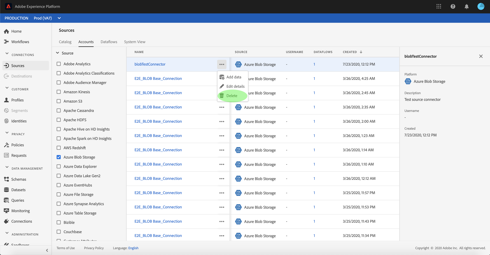

# 删除源连接帐户

Adobe Experience Platform中的Source连接器提供了按计划摄取外部来源数据的功能。 本教程提供了从&#x200B;**[!UICONTROL 源]**&#x200B;工作区中删除帐户的步骤。

## 快速入门

本教程需要对以下Adobe Experience Platform组件有一定的了解：

- [[!DNL Experience Data Model (XDM)] 系统](../../../xdm/home.md)： [!DNL Experience Platform]用于组织客户体验数据的标准化框架。
   - [架构组合的基础知识](../../../xdm/schema/composition.md)：了解XDM架构的基本构建块，包括架构组合中的关键原则和最佳实践。
   - [架构编辑器教程](../../../xdm/tutorials/create-schema-ui.md)：了解如何使用架构编辑器UI创建自定义架构。
- [[!DNL Real-Time Customer Profile]](../../../profile/home.md)：根据来自多个源的汇总数据，提供统一的实时使用者个人资料。

## 使用用户界面删除帐户

>[!TIP]
>
>在删除源帐户之前，必须首先删除与源帐户关联的任何现有数据流。 要删除现有数据流，请参阅有关在UI[&#128279;](./delete.md)中删除源数据流的教程。

登录到[Adobe Experience Platform](https://platform.adobe.com)，然后从左侧导航栏中选择&#x200B;**[!UICONTROL 源]**&#x200B;以访问&#x200B;**[!UICONTROL 源]**&#x200B;工作区。 **[!UICONTROL Catalog]**&#x200B;屏幕显示各种源，您可以使用这些源创建帐户和数据流。 每个源显示与其关联的现有帐户和数据流的数量。

选择&#x200B;**[!UICONTROL 帐户]**&#x200B;以访问&#x200B;**[!UICONTROL 帐户]**&#x200B;页。

此时将显示现有帐户的列表。 在此页上，列出了现有帐户（如源、用户名、关联的数据流和创建日期）的可排序信息。 选择左上方的&#x200B;**漏斗图标**&#x200B;进行排序。

排序面板显示在屏幕的左侧，其中包含可用源的列表。 您可以使用排序功能选择多个源。

选择要访问的源，并在主界面的帐户列表中找到要删除的帐户。 在此示例中，选定的源是&#x200B;**[!DNL Azure Blob Storage]**，帐户名称为&#x200B;**[!UICONTROL blobTestConnector]**。 从排序面板中选择多个源时，您最近创建的帐户会最先出现，因为列表是按创建日期排序的。

选择要删除的帐户。

屏幕右侧将显示&#x200B;**[!UICONTROL 属性]**&#x200B;面板，其中包含有关所选帐户的信息。

选择要删除的帐户名称旁边的省略号(`...`)。 此时将出现一个弹出面板，其中提供了&#x200B;**[!UICONTROL 添加数据]**、**[!UICONTROL 编辑详细信息]**&#x200B;和&#x200B;**[!UICONTROL 删除]**&#x200B;的选项。 选择&#x200B;**[!UICONTROL 删除]**&#x200B;以删除该帐户。

出现最终确认对话框，选择&#x200B;**[!UICONTROL 删除]**&#x200B;以完成该过程。

## 后续步骤

通过完成本教程，您已成功使用&#x200B;**[!UICONTROL 源]**&#x200B;工作区删除现有帐户。

有关如何使用[!DNL Flow Service] API以编程方式执行这些操作的步骤，请参阅有关使用流服务API [删除连接的教程](../../tutorials/api/delete.md)
