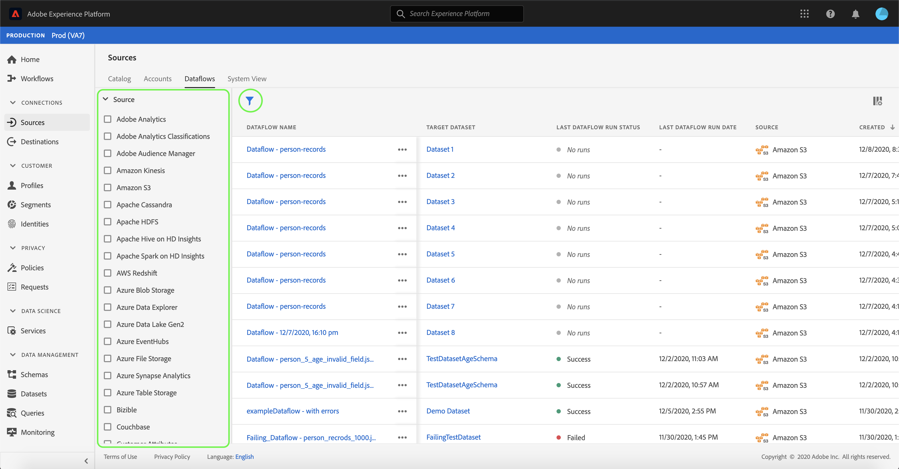

# 删除UI中的数据流

[!UICONTROL 源]工作区允许您删除包含错误或已过时的现有批处理数据流和流式数据流。

本教程提供了使用[!UICONTROL 源]工作区删除数据流的步骤。

## 快速入门

本教程需要对以下Adobe Experience Platform组件有一定的了解：

- [源](../../home.md)： [!DNL Experience Platform]允许从各种源摄取数据，同时允许您使用[!DNL Experience Platform]服务来构建、标记和增强传入数据。
- [沙盒](../../../sandboxes/home.md)： [!DNL Experience Platform]提供将单个[!DNL Experience Platform]实例划分为单独虚拟环境的虚拟沙盒，以帮助开发和改进数字体验应用程序。

## 删除数据流

在[Experience Platform UI](https://platform.adobe.com)中，从左侧导航中选择&#x200B;**[!UICONTROL 源]**&#x200B;以访问[!UICONTROL 源]工作区，然后从顶部标题中选择&#x200B;**[!UICONTROL 数据流]**。

此时会显示&#x200B;**[!UICONTROL 数据流]**&#x200B;页面。 在此页面上是一个可查看的数据流列表，包括有关其目标数据集、源、帐户名称和创建日期的信息。

选择左上角的过滤器图标（）以启动排序面板。

排序面板提供所有源的列表。 您可以从列表中选择多个源，以访问与您选择的特定源关联的数据流的过滤选择。

选择要使用的源以查看其现有数据流的列表。 确定要删除的数据流后，选择数据流名称旁边的省略号(`...`)。

此时会显示一个下拉菜单，为您提供编辑数据流计划、禁用数据流或完全删除数据流的选项。

选择&#x200B;**[!UICONTROL 删除]**&#x200B;以删除数据流。

将出现最终确认对话框。 选择&#x200B;**[!UICONTROL 删除]**&#x200B;以完成该过程。

片刻后，屏幕底部会显示一个确认框，用于确认是否成功删除。

## 后续步骤

通过完成本教程，您已成功使用[!UICONTROL 源]工作区删除现有数据流。

请参阅有关[使用流服务API删除数据流](../../tutorials/api/delete-dataflows.md)的教程，以了解有关如何使用API调用以编程方式执行这些操作的步骤。
