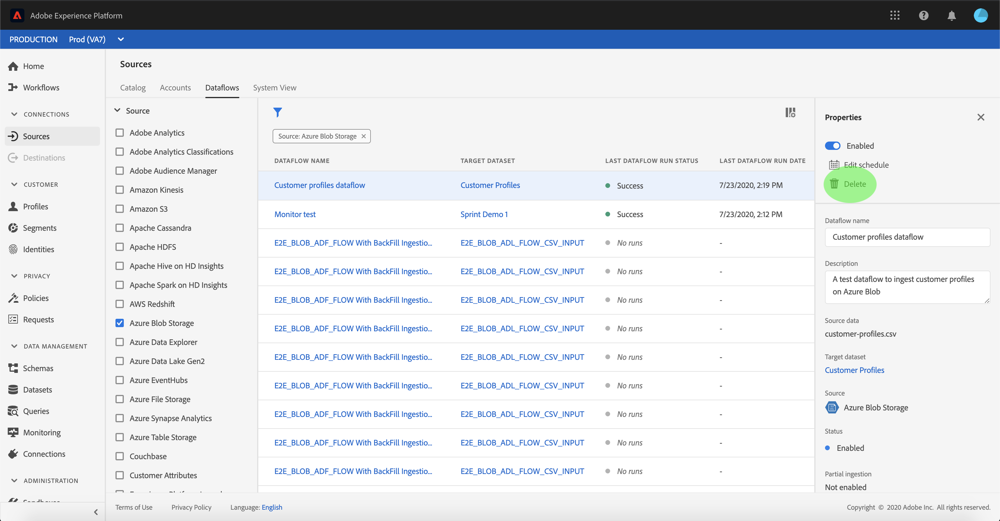

# 删除数据流

Adobe Experience Platform的源连接器提供按计划接收外部源数据的能力。 本教程提供了从“源”工作区删除数据 *[!UICONTROL 流的]* 步骤。

## 入门指南

本教程需要对Adobe Experience Platform的以下组件进行有效的理解：

- [体验数据模型(XDM)系统](../../../xdm/home.md):组织客户体验数 [!DNL Experience Platform] 据的标准化框架。
   - [模式合成基础](../../../xdm/schema/composition.md):了解XDM模式的基本构件，包括模式构成的主要原则和最佳做法。
   - [模式编辑器教程](../../../xdm/tutorials/create-schema-ui.md):了解如何使用模式编辑器UI创建自定义模式。
- [实时客户用户档案](../../../profile/home.md):基于来自多个来源的聚集数据提供统一、实时的消费者用户档案。

## 使用UI删除数据流

登录到 [Adobe Experience Platform](https://platform.adobe.com) ，然后从左 **[!UICONTROL 侧导航栏]** 中选择 *[!UICONTROL “源”以访问]* “源”工作区。 “ *[!UICONTROL 目录]* ”屏幕显示各种源，您可以为其创建帐户和数据流。 每个源显示与它们关联的现有帐户和数据流的数量。

选择 **[!UICONTROL 数据流]** ，以访问“ *[!UICONTROL 数据流]* ”页。

出现一列表现有数据流。 此页上是现有数据流的可排序信息列表，如源、用户名、运行状态和上次运行日期。 选择左 **上方** 的漏斗图标进行排序。

排序面板显示在屏幕的左侧，其中包含可用源的列表。
您可以使用排序功能选择多个源。

选择要访问的源，并从主接口的列表数据流中找到要删除的数据流。 在示例中，所选的源是Azure **Blob存储** ，数据流名称是 **Customer用户档案数据流**。 从排序面板中选择多个源时，最近创建的列表流会首先显示，因为数据是按创建日期排序的。

选择要删除的数据流。

“ *[!UICONTROL 属性]* ”面板显示在屏幕的右侧，其中包含有关选定数据流的信息以及“编辑” *[!UICONTROL 计划的选项]*。

要删除数据流，请选择 **[!UICONTROL 删除]**。

出现最终确认对话框，选 **[!UICONTROL 择]** “删除”以完成该过程。

片刻后，屏幕底部将显示一个绿色确认框，确认成功删除。

## 后续步骤

通过本教程，您成功访问了Sources工作区中的现有帐户和数 *[!UICONTROL 据流]* 。 现在，下游服务（如和）可 [!DNL Platform] 以使用传入 [!DNL Real-time Customer Profile] 数据 [!DNL Data Science Workspace]。 有关更多详细信息，请参阅以下文档:

- [实时客户用户档案概述](../../../profile/home.md)
- [数据科学工作区概述](../../../data-science-workspace/home.md)