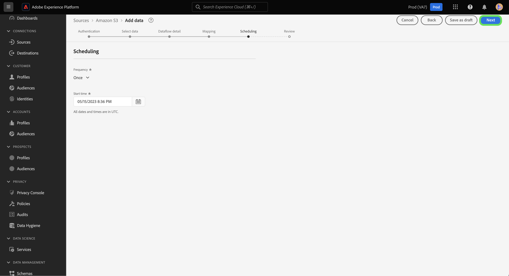

# UI中的草稿数据流

通过将数据流设置为草稿状态，保存未完成的数据摄取工作流进度。 您可以稍后继续并完成草稿的数据流。

本文档提供了在Adobe Experience Platform UI中使用源工作区时如何保存数据流的步骤。

## 快速入门

本文档要求您对Adobe Experience Platform的以下组件有一定的了解：

* [源](../../home.md)：Experience Platform允许从各种源摄取数据，同时让您能够使用Platform服务来构建、标记和增强传入数据。

## 将数据流另存为草稿

选择将要引入Platform的数据后，您可以随时暂停数据流创建进度。

例如，如果要在数据流详细信息步骤中保存进度，请选择 **[!UICONTROL 另存为草稿]**.

保存草稿后，您将被转到帐户的页面，您可以在其中查看现有数据流的列表，包括草稿。

>[!TIP]
>
>起草的数据流将不会启用，其状态将设置为 `draft`.

要继续草稿，请选择省略号(`...`)，然后选择 **[!UICONTROL 更新数据流]**.

>[!NOTE]
>
>如果您的草稿包含计划信息，则下拉窗口也会为您提供选项 **[!UICONTROL 编辑计划]**.

### 从源目录访问草稿

您还可以通过数据流目录访问草稿数据流。 选择 **[!UICONTROL 数据流]** 以访问数据流目录。 从这里，从组织内现有数据流列表中查找草稿，选择省略号(`...`)，然后选择 **[!UICONTROL 更新数据流]**.

## 发布草稿数据流

您将返回到 [!UICONTROL 添加数据] 源工作流的步骤，在此步骤中，您可以重新确认数据的格式并继续处理数据流。

确认数据的格式、分隔符和压缩类型后，选择 **[!UICONTROL 下一个]** 以继续。

接下来，确认数据流详细信息。 使用数据流详细信息界面更新围绕数据流名称、描述、部分摄取、错误诊断设置和警报首选项的配置。

完成配置后，选择 **[!UICONTROL 下一个]** 以继续。

此 [!UICONTROL 映射] 步骤。 在此步骤中，您可以重新配置数据流的映射配置。 有关用于映射的数据准备功能的全面指南，请访问 [数据准备UI指南](../../../data-prep/ui/mapping.md).

完成映射重新配置后，选择 **[!UICONTROL 下一个]** 以继续。

使用 [!UICONTROL 计划] 为数据流建立摄取计划的步骤。 您可以将摄取频率设置为 `once`， `minute`， `hour`， `day`，或 `week`. 完成后，选择 **[!UICONTROL 下一个]** 以继续。

最后，查看数据流的详细信息，然后选择 **[!UICONTROL 完成]** 以发布草稿。

保存并发布草稿后，数据流将启用，您将无法再将其重置为草稿。

## 后续步骤

通过学习本教程，您已了解如何保存进度并将数据流设置为草稿。 欲知信息源的更多信息，请访问 [源概述](../../home.md).