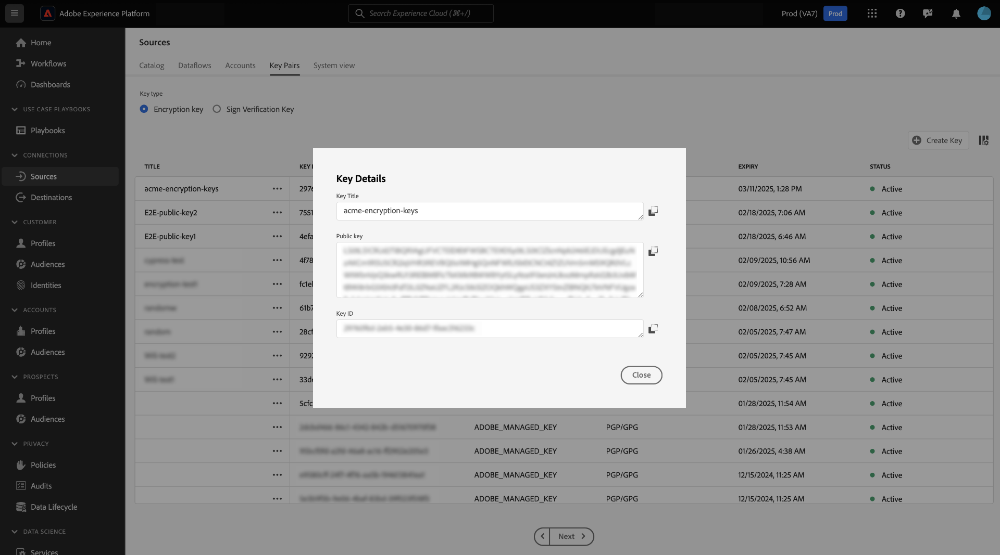

# 在源UI中摄取加密数据

您可以使用云存储批处理源将加密的数据文件和文件夹摄取到Adobe Experience Platform。 通过加密的数据摄取，您可以利用非对称加密机制将批量数据安全地传输到Experience Platform。 支持的非对称加密机制为PGP和GPG。

阅读本指南，了解如何使用UI通过云存储批处理源摄取加密数据。

## 快速入门

在继续本教程之前，请阅读以下文档以更好地了解以下Experience Platform功能和概念。

* [源](../../home.md)：使用Experience Platform中的源从Adobe应用程序或第三方数据源中摄取数据。
* [数据流](../../../dataflows/home.md)：数据流是跨Experience Platform移动数据的数据作业的表示形式。 您可以使用源工作区创建数据流，以将数据从给定源摄取到Experience Platform。
* [沙盒](../../../sandboxes/home.md)：使用Experience Platform中的沙盒在Experience Platform实例之间创建虚拟分区，并创建专用于开发或生产的环境。

### 高级大纲

* 在Experience Platform UI中使用sources工作区创建加密密钥对。
   * 或者，您也可以创建自己的签名验证密钥对，为加密数据提供额外的安全层。
* 使用加密密钥对中的公钥加密数据。
* 将加密数据放入云存储中。 在此步骤中，还必须确保在云存储中拥有数据的示例文件，该文件可用作参考，以将源数据映射到体验数据模型(XDM)架构。
* 在Experience Platform UI中使用云存储批处理源，在源工作区中开始数据摄取过程。
* 在源连接创建过程中，提供与用于加密数据的公共密钥对应的密钥ID。
   * 如果您还使用签名验证密钥对机制，则还必须提供与加密数据对应的签名验证密钥ID。
* 继续数据流创建步骤。

## 创建加密密钥对 {#create-an-encryption-key-pair}

>[!CONTEXTUALHELP]
>id="platform_sources_encrypted_encryptionKeyId"
>title="加密密钥 ID"
>abstract="提供与用于加密您的源数据的加密密钥相对应的加密密钥 ID。"

>[!BEGINSHADEBOX]

**什么是加密密钥对？**

加密密钥对是一种由公钥和私钥组成的非对称加密机制。 使用公钥加密数据，然后使用私钥解密所述数据。

您可以通过Experience Platform UI创建加密密钥对。 生成后，您将收到公钥和相应的密钥ID。 使用公共密钥加密数据，然后在您正在摄取加密的数据时使用密钥ID确认您的身份。 私钥会自动发送到Experience Platform，并存储在安全的保险库中，并且仅在数据准备好进行解密后才会使用。

>[!ENDSHADEBOX]

在Experience Platform UI中，导航到源工作区，然后从顶部标题中选择[!UICONTROL Key Pairs]。

此时您会进入一个页面，该页面显示组织中现有加密密钥对的列表。 本页提供有关给定密钥的标题、ID、类型、加密算法、到期和状态的信息。 要创建新的密钥对，请选择&#x200B;**[!UICONTROL Create Key]**。

接下来，选择要创建的键类型。 要创建加密密钥，请选择&#x200B;**[!UICONTROL Encryption Key]**，然后选择&#x200B;**[!UICONTROL Continue]**。

提供加密密钥的标题和密码。 密码是加密密钥的附加保护层。 创建后，Experience Platform会将该密码短语存储在与公钥不同的安全保管库中。 您必须提供非空字符串作为密码短语。 完成后，选择&#x200B;**[!UICONTROL Create]**。

如果成功，将显示一个新窗口，显示新的加密密钥，包括其标题、公钥和密钥ID。 使用公钥值加密数据。 在数据流创建过程中摄取加密数据时，您将在后面的步骤中使用密钥ID来证明您的身份。

要查看现有加密密钥的信息，请选择密钥标题旁边的省略号(`...`)。 选择&#x200B;**[!UICONTROL Key details]**&#x200B;以查看公钥和密钥ID。 或者，如果您要删除加密密钥，请选择&#x200B;**[!UICONTROL Delete]**。

### 创建签名验证密钥 {#create-a-sign-verification-key}

>[!CONTEXTUALHELP]
>id="platform_sources_encrypted_signVerificationKeyId"
>title="签名验证密钥 ID"
>abstract="提供与您的签名加密源数据相对应的签名验证密钥 ID。"

>[!BEGINSHADEBOX]

**什么是签名验证密钥？**

签名验证密钥是另一种涉及私钥和公钥的加密机制。 在这种情况下，您可以创建签名验证密钥对，并使用私钥进行签名并为数据提供额外的加密层。 然后，您将向Experience Platform共享相应的公钥。 在摄取期间，Experience Platform将使用公钥验证与您的私钥关联的签名。

>[!ENDSHADEBOX]

若要创建签名验证密钥，请从密钥类型选择窗口中选择&#x200B;**[!UICONTROL Sign Verification Key]**，然后选择&#x200B;**[!UICONTROL Continue]**。

接下来，提供标题和[!DNL Base64]编码的PGP密钥作为您的公共密钥，然后选择&#x200B;**[!UICONTROL Create]**。

如果成功，将显示一个新窗口，显示您的新签名验证密钥，包括其标题和密钥ID。

## 提取加密数据 {#ingest-encrypted-data}

>[!CONTEXTUALHELP]
>id="platform_sources_encrypted_isFileEncrypted"
>title="文件是否加密？"
>abstract="如果您正在提取已加密的文件，请选择此切换选项。"

>[!CONTEXTUALHELP]
>id="platform_sources_encrypted_sampleFile"
>title="选择示例文件"
>abstract="为了创建映射，您必须在提取加密数据时提取示例文件。"

您可以使用以下云存储批处理源摄取加密数据：

* [[!DNL Amazon S3]](../ui/create/cloud-storage/s3.md)
* [[!DNL Azure Blob]](../ui/create/cloud-storage/blob.md)
* [[!DNL Azure Data Lake Storage Gen2]](../ui/create/cloud-storage/adls-gen2.md)
* [[!DNL Azure File Storage]](../ui/create/cloud-storage/azure-file-storage.md)
* [[!DNL Data Landing Zone]](../ui/create/cloud-storage/data-landing-zone.md)
* [[!DNL FTP]](../ui/create/cloud-storage/ftp.md)
* [[!DNL Google Cloud Storage]](../ui/create/cloud-storage/google-cloud-storage.md)
* [[!DNL HDFS]](../ui/create/cloud-storage/hdfs.md)
* [[!DNL Oracle Object Storage]](../ui/create/cloud-storage/oracle-object-storage.md)
* [[!DNL SFTP]](../ui/create/cloud-storage/sftp.md)

使用您选择的云存储源进行身份验证。 在工作流的数据选择步骤中，选择要摄取的加密文件或文件夹，然后启用&#x200B;**[!UICONTROL Is the file encrypted]**&#x200B;切换开关。

接下来，从源数据中选择一个示例文件。 由于您的数据已加密，因此Experience Platform将要求一个示例文件来创建可映射到您的源数据的XDM架构。

。

选择样例文件后，配置数据的设置，如对应的数据格式、分隔符和压缩类型。 留出一段时间让预览界面完全呈现，然后选择&#x200B;**[!UICONTROL Save]**。

在此处，使用下拉菜单选择与用于加密数据的公共密钥对应的公共密钥ID的公共密钥标题。

如果您还使用签名验证密钥对提供和其他加密层，然后启用签名验证密钥切换，则同样地，使用下拉菜单选择与用于加密数据的密钥对应的签名验证密钥ID。

完成后，选择&#x200B;**[!UICONTROL Next]**。

完成源工作流中的其余步骤，以完成创建数据流。

* [提供数据流和数据集详细信息](../ui/dataflow/batch/cloud-storage.md#provide-dataflow-details)
* [将源数据映射到XDM架构](../ui/dataflow/batch/cloud-storage.md#map-data-fields-to-an-xdm-schema)
* [为数据流配置摄取计划](../ui/dataflow/batch/cloud-storage.md#schedule-ingestion-runs)
* [查看您的数据流](../ui/dataflow/batch/cloud-storage.md#review-your-dataflow)

数据流[成功创建后，您可以继续](../ui/update-dataflows.md)对其进行更新。

## 后续步骤

通过阅读本文档，您现在可以将加密数据从云存储批处理源摄取到Experience Platform。 有关如何使用API引入加密数据的信息，请阅读有关使用[API [!DNL Flow Service] 引入加密数据的指南](../api/encrypt-data.md)。 有关Experience Platform上源的一般信息，请阅读[源概述](../../home.md)。
