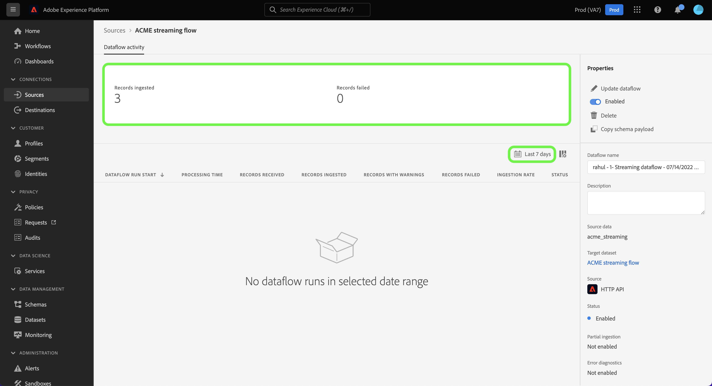
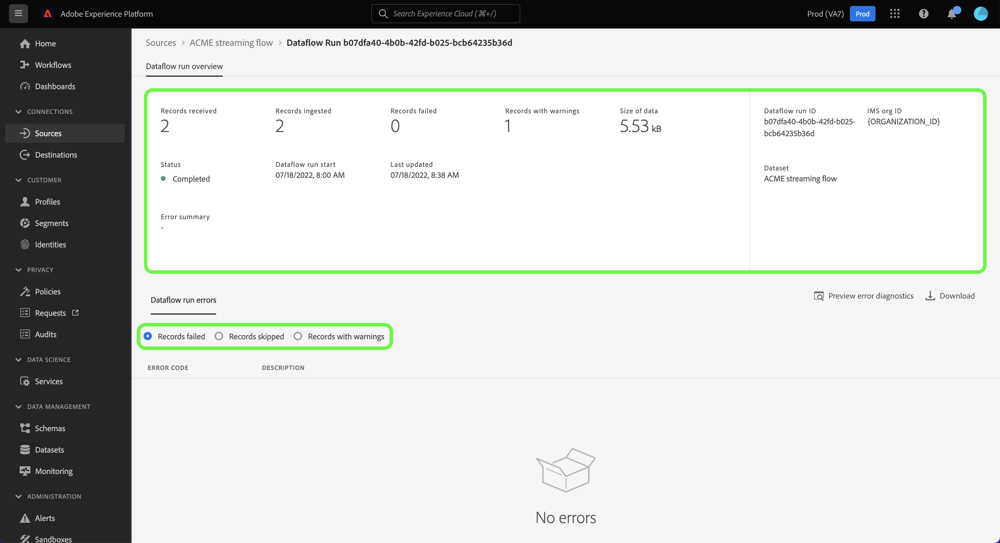

# 在UI中监控流源的数据流

本教程介绍了使用[!UICONTROL Sources]工作区监控流源的数据流的步骤。

## 快速入门

本教程需要对以下Adobe Experience Platform组件有一定的了解：

* [数据流](../../../dataflows/home.md)：数据流是跨Experience Platform移动数据的数据作业的表示形式。 数据流在不同服务之间配置，帮助将数据从源连接器移动到目标数据集、[!DNL Identity]和[!DNL Profile]以及[!DNL Destinations]。
   * [数据流运行](../../notifications.md)：数据流运行是基于所选数据流的频率配置的周期性计划作业。
* [源](../../home.md)： Experience Platform允许从各种源摄取数据，同时让您能够使用Experience Platform服务来构建、标记和增强传入数据。
* [沙盒](../../../sandboxes/home.md)： Experience Platform提供了将单个Experience Platform实例划分为多个单独的虚拟环境的虚拟沙盒，以帮助开发和改进数字体验应用程序。

## 监控流源的数据流

在Experience Platform UI中，从左侧导航栏中选择&#x200B;**[!UICONTROL Sources]**&#x200B;以访问[!UICONTROL Sources]工作区。 [!UICONTROL Catalog]屏幕显示各种来源，您可以使用这些来源创建帐户。

要查看流源的现有数据流，请从顶部标题中选择&#x200B;**[!UICONTROL Dataflows]**。

[!UICONTROL Dataflows]页面包含贵组织中所有现有数据流的列表，包括有关其源数据、帐户名称和数据流运行状态的信息。

选择要查看的数据流的名称。

下表包含有关数据流运行状态的更多信息：

| 状态 | 描述 |
| ------ | ----------- |
| 已完成 | `Completed`状态表示相应数据流运行的所有记录都在一小时内处理。 `Completed`状态在数据流运行中仍可能包含错误。 |
| 成功 | `Success`状态表示相应数据流运行的所有记录都在一小时期间进行处理，并且在数据流运行期间没有遇到错误。 |
| 正在处理 | `Processing`状态表示数据流尚未处于活动状态。 创建新数据流后，经常会立即出现此状态。 |
| 错误 | `Error`状态表示数据流的激活过程已中断。 |
| 没有运行 | `No runs`状态表示数据流已创建，但未启动数据流运行。 |

[!UICONTROL Dataflow Activity]页面显示有关您的流数据流的特定信息。 顶部的横幅包含在选定日期范围内所有流数据流运行中摄取和失败记录的累计数量。

默认情况下，显示的数据包含过去七天的摄取率。 选择&#x200B;**[!UICONTROL Last 7 days]**&#x200B;以调整所显示记录的时间范围。

此时会出现一个日历弹出窗口，为您提供替代摄取时间范围的选项。 您可以配置数据流运行时间范围以查看过去7天或过去30天的流运行。 或者，您可以配置交互式日历，以设置您选择的自定义时间范围。 完成后，选择&#x200B;**[!UICONTROL Apply]**。

页面下半部分显示有关每次流运行接收、引入和失败的记录数的信息。 每次流量运行均记录在一个每小时窗口中。

### 数据流运行量度 {#dataflow-run-metrics}

>[!CONTEXTUALHELP]
>id="platform_sources_dataflow_records_received"
>title="已接收的记录"
>abstract="“已接收的记录”量度指示数据流中接收的记录总数。"
>text="Learn more in documentation"

>[!CONTEXTUALHELP]
>id="platform_sources_dataflow_records_ingested"
>title="已提取的记录"
>abstract="“已提取的记录”量度指示已提取到数据湖中的记录总数。"
>text="Learn more in documentation"

>[!CONTEXTUALHELP]
>id="platform_sources_dataflow_records_failed"
>title="失败的记录"
>abstract="“失败的记录”量度指示因数据错误而未被提取到数据湖的记录总数。"
>text="Learn more in documentation"

>[!CONTEXTUALHELP]
>id="platform_sources_dataflow_records_warnings"
>title="带警告的记录"
>abstract="“带警告的记录”指示带映射器转换警告的已提取记录总数。所有映射器转换错误都报告为警告，部分提取的行被视为成功并显示警告"
>text="Learn more in documentation"

每次数据流运行都会显示以下详细信息：

* **[!UICONTROL Dataflow run start]**：数据流运行开始的时间。
* **[!UICONTROL Processing time]**：数据流处理所花费的时间。
* **[!UICONTROL Records Received]**：在来自源连接器的数据流中接收的记录总数。
* **[!UICONTROL Records Ingested]**：摄取到[!DNL Data Lake]中的记录总数。
* **[!UICONTROL Records with Warnings]**：已摄取带有警告的记录总数。 所有映射器转换错误均报告为警告，部分摄取的行标记为`success`并带有警告。 **注意**：仅对流源支持摄取带有警告的记录。
* **[!UICONTROL Records Failed]**：由于数据错误而未引入[!DNL Data Lake]的记录数。
* **[!UICONTROL Ingestion Rate]**：摄取到[!DNL Data Lake]中的记录的成功率。 此量度在启用[!UICONTROL Partial Ingestion]时适用。
* **[!UICONTROL Status]**：表示数据流所处的状态： [!UICONTROL Completed]或[!UICONTROL Processing]。 [!UICONTROL Completed]表示相应数据流运行的所有记录都在一小时内处理。 [!UICONTROL Processing]表示数据流运行尚未完成。

[!UICONTROL Dataflow run overview]页面包含有关数据流的附加信息，例如其对应的数据流运行ID、目标数据集和组织ID。

有错误的流运行还包含[!UICONTROL Dataflow run errors]面板，该面板显示导致运行失败的特定错误以及失败的记录总数。

### 查看有警告的记录 {#warnings}

[!UICONTROL Records with warnings]显示在流运行期间发生的映射器转换警告列表。 部分摄取的行被视为成功，如果发现任何映射器转换错误，则会附加警告。

默认情况下，所有映射器转换错误均被视为警告，除非它们属于以下任一情况：

* 语法错误
* 对不存在属性的引用
* XDM数据类型不匹配

要查看错误诊断，请选择&#x200B;**[!UICONTROL Preview error diagnostics]**。

[!UICONTROL Error diagnostics preview]窗口允许您预览有关数据流运行的最多100个错误和/或警告。 您还可以在此使用[!DNL Data Access] API下载摄取失败清单以了解更多信息。

## 后续步骤

通过完成本教程，您已成功使用[!UICONTROL Sources]工作区监视您的流数据流并识别导致任何失败的数据流的错误。 有关详细信息，请参阅以下文档：

* [源概述](../../home.md)
* [数据流概述](../../../dataflows/home.md)
