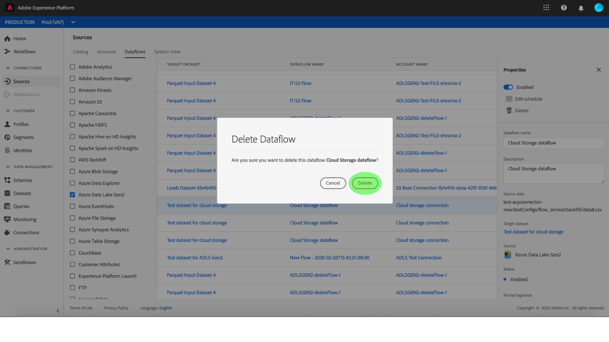

# 监视和删除数据流

Adobe Experience Platform中的源连接器提供按计划接收外部源数据的能力。 本教程提供了从“源”工作区查看现有帐户和数据 *[!UICONTROL 流的]* 步骤。 本教程还提供了从“源”工作区删除数据 *[!UICONTROL 流的]* 步骤。

## 入门指南

本教程需要对Adobe Experience Platform的以下组件有一定的了解：

- [体验数据模型(XDM)系统](../../../xdm/home.md): 组织客户体验数 [!DNL Experience Platform] 据的标准化框架。
   - [模式合成基础](../../../xdm/schema/composition.md): 了解XDM模式的基本构件，包括模式构成的主要原则和最佳做法。
   - [模式编辑器教程](../../../xdm/tutorials/create-schema-ui.md): 了解如何使用模式编辑器UI创建自定义模式。
- [实时客户用户档案](../../../profile/home.md): 基于来自多个来源的聚集数据提供统一、实时的消费者用户档案。

## 监视帐户

登录到 [Adobe Experience Platform](https://platform.adobe.com) ，然后从左 **[!UICONTROL 侧导航栏]** 中选 *[!UICONTROL 择源]* ，以访问源工作区。 “ *[!UICONTROL 目录]* ”屏幕显示各种源，您可以为其创建帐户和数据流。 每个源显示与它们关联的现有帐户和数据流的数量。

从顶 *[!UICONTROL 部标题]* 中选择帐户以视图现有帐户。

将显 *[!UICONTROL 示]* “帐户”页面。 本页是可查看帐户的列表，包括有关其源、用户名、数据流数和创建日期的信息。

选择左上角的漏斗图标以启动排序窗口。

排序面板允许您从特定源访问帐户。 选择要处理的源，并从右侧的列表中选择帐户。

在“帐 *[!UICONTROL 户]* ”页中，可以视图与您访问的帐户关联的现有数据流列表。 选择要视图的数据流。

出现 *[!UICONTROL “数据流活动]* ”屏幕。 此页以图表形式显示消息的消费率。

## 监视数据流

数据流可以直接从“目录”页 *[!UICONTROL 访问]* ，而无需查看 *[!UICONTROL 帐户]*。 从顶 *[!UICONTROL 部标题]* 中选择数据流，以视图现有数据流的列表。

出现一列表现有数据流。 本页是可查看数据流的列表，包括有关其源、用户名、数据流数和状态的信息。 选择左上角的漏斗图标进行排序。

将出现排序面板。 从滚动菜单中选择要访问的源，并从右侧的列表中选择数据流。

出现 *[!UICONTROL “数据流活动]* ”屏幕。 此页以图表形式显示消息的消费率。

有关监视数据流和摄取的详细信息，请参阅有关监视流数据 [流的教程](../../../ingestion/quality/monitor-data-flows.md)。

## 删除数据流

您可以通过访问数据流屏幕删除错误创建或不再需要的数据流。 使用排序漏斗图标找到要删除的数据流，然后选择数据流以打开“属 **[!UICONTROL 性]** ”面板。

要删除数据流，请 **[!UICONTROL 从右上]** 方的属性中选择删除。

将显示最终确认消息。 选择 **[!UICONTROL 删除]** ，以进行确认。

片刻后，屏幕底部将显示一个绿色确认框，确认成功删除。

或者，也可以从“帐户”屏幕中删 *[!UICONTROL 除数]* 据流。 使用排序漏斗图标找到要访问的帐户，并从列表中选择该帐户。

将显 *[!UICONTROL 示]* “帐户”页。 选择要删除的数据流，然后从属性 **[!UICONTROL 面板]** 中选择删除以完成该过程。

按照上述确认步骤完成该过程。

## 后续步骤

通过本教程，您成功访问了Sources工作区中的现有帐户和数 *[!UICONTROL 据流]* 。 现在，下游服务（如和）可 [!DNL Platform] 以使用传入 [!DNL Real-time Customer Profile] 数据 [!DNL Data Science Workspace]。 有关更多详细信息，请参阅以下文档:

- [实时客户用户档案概述](../../../profile/home.md)
- [数据科学工作区概述](../../../data-science-workspace/home.md)