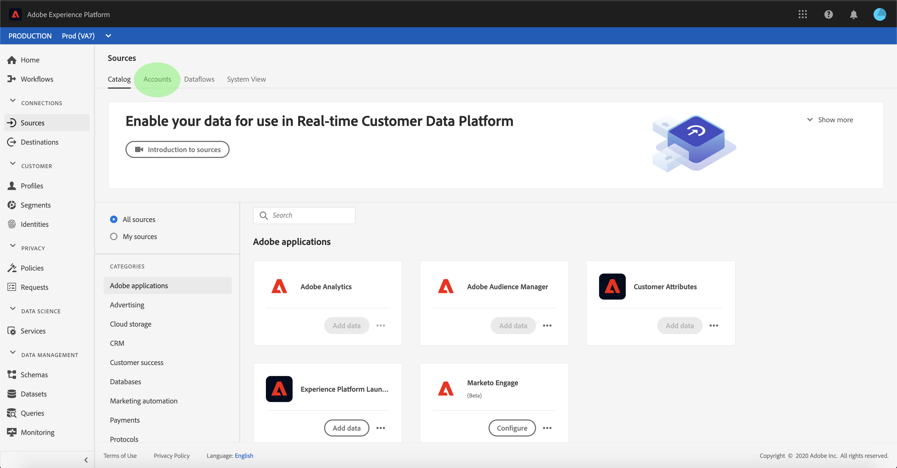

# 在UI中监视帐户和数据流

Adobe Experience Platform的源连接器提供按计划接收外部源数据的能力。 本教程提供了从“源”工作区查看现有帐户和数据 [!UICONTROL 流的] 步骤。

## 入门指南

本教程需要对Adobe Experience Platform的以下组件进行有效的理解：

- [[!DNL Experience Data Model] (XDM)系统](../../../xdm/home.md):组织客户体验数 [!DNL Experience Platform] 据的标准化框架。
   - [模式合成基础](../../../xdm/schema/composition.md):了解XDM模式的基本构件，包括模式构成的主要原则和最佳做法。
   - [模式编辑器教程](../../../xdm/tutorials/create-schema-ui.md):了解如何使用模式编辑器UI创建自定义模式。
- [[!DNL实时客户用户档案]](../../../profile/home.md):基于来自多个来源的聚集数据提供统一、实时的消费者用户档案。

## 监视帐户

登录到 [Adobe Experience Platform](https://platform.adobe.com) ，然后从左 **[!UICONTROL 侧导航栏]** 中选择 **[!UICONTROL “源”以访问]** “源”工作区。 “ **[!UICONTROL 目录]** ”屏幕显示各种源，您可以为其创建帐户和数据流。 每个源显示与它们关联的现有帐户和数据流的数量。

从顶 **[!UICONTROL 部标题]** 中选择帐户以视图现有帐户。

将显 **[!UICONTROL 示]** “帐户”页面。 本页是可查看帐户的列表，包括有关其源、用户名、数据流数和创建日期的信息。

选择左上角的漏斗图标以启动排序窗口。

排序面板允许您从特定源访问帐户。 选择要处理的源，并从右侧的列表中选择帐户。

在“帐 **[!UICONTROL 户]** ”页中，您可以视图与您访问的帐户关联的现有数据流或目标数据集的列表。

## 监视数据流

数据流可以直接从“目录”页 **[!UICONTROL 访问]** ，无需查看 **[!UICONTROL 帐户]**。 从顶 **[!UICONTROL 部标题]** 中选择数据流，以视图现有数据流的列表。

出现一列表现有数据流。 本页是可查看数据流的列表，包括有关其源、用户名、数据流数和状态的信息。 选择左上角的漏斗图标进行排序。

将出现排序面板。 从滚动菜单中选择要访问的源，并从右侧的列表中选择数据流。

“数 **[!UICONTROL 据流活动]** ”页包含有关摄取的记录数和失败记录数的详细信息，以及有关数据流状态和处理时间的信息。 选择数据流上方的日历图标以调整摄取记录的时间范围。

日历允许您视图不同时间段以获取记录。 您可以选择两个预设选项之一“过去7天 **[!UICONTROL ”或“过去]** 30 **[!UICONTROL 天”]**。 或者，也可以使用日历设置自定义时间范围。 选择您选择的时间范围，然后选择 **[!UICONTROL “应用]** ”以继续。

默认情况下，“ **[!UICONTROL 数据流]** ”活动 **[!UICONTROL 卡显示与]** 数据流关联的“属性”面板。 从列表中选择流运行以查看其关联的元数据，包括有关其唯一运行ID的信息。

选择 **[!UICONTROL 数据流运行开始]** ，以访问数据 **[!UICONTROL 流运行概述]**。

“数 **[!UICONTROL 据流”运行概述]** ，显示有关数据流的信息 **[!UICONTROL ，包括其元数据、]** 部分摄取状态 **[!UICONTROL ，以及分配的]**&#x200B;错误阈值。 上标题还包含错误 **[!UICONTROL 摘要]**。 错误 **[!UICONTROL 摘要包含]** 特定的顶级错误，该错误显示摄取过程在哪个步骤遇到错误。

请参阅下表，获取可在“错误”摘要中看到的错 **[!UICONTROL 误代码]**。

| 错误代码 | 错误消息 |
| ---------- | ----------- |
| `CONNECTOR-1001-500` | &quot;复制活动出现问题。&quot; |
| `CONNECTOR-2001-500` | “从Experience Platform源复制到数据集时出现问题。” |
| `CONNECTOR-3001-500` | &quot;使用批量摄取API创建批处理时，流提供程序出现问题。&quot; |

屏幕的下半部分包含有关Dataflow运 **[!UICONTROL 行错误的信息]**。 从此处，您还可以视图所摄取的文件、预览和下载错误诊断，或下载文件清单。

“数 **[!UICONTROL 据流运行]** 错误”部分显 **[!UICONTROL 示错误代码]**、失败的记录数以及描述错误的信息。

选择 **[!UICONTROL 预览错误诊断]** ，以查看有关摄取错误的详细信息。

出现 **[!UICONTROL “Error diagnostics(错误诊]** 断预览)”面板。 此屏幕显示有关摄取失败的特 **[!UICONTROL 定信息]**，包 **[!UICONTROL 括文件名]**、错误代码、发生错误的列的名称以及错误的说明。

此部分还包含包含错误的列的预览符。

>[!IMPORTANT]
>
>要启用 **[!UICONTROL 错误诊断预览]** ，在配置数据流时必 **[!UICONTROL 须激活“部]** 分摄取 **[!UICONTROL ”和“]** 错误诊断”。 这样做将允许系统扫描在流运行期间摄取的所有记录。

预览错误后，可从数据流 **[!UICONTROL 运行]** 概述面板 **[!UICONTROL 中选择]** “下载”以访问完整错误诊断并下载文件清单。 有关详细信息，请 [参阅错误诊](../../../ingestion/batch-ingestion/partial.md#retrieve-errors) 断 [和下载元数](../../../ingestion/batch-ingestion/partial.md#download-metadata) 据的文档。

有关监视数据流和摄取的详细信息，请参阅有关监视流数据 [流的教程](../../../ingestion/quality/monitor-data-flows.md)。

## 后续步骤

通过本教程，您成功访问了Sources工作区中的现有帐户和数 **[!UICONTROL 据流]** 。 现在，下游服务（如和）可 [!DNL Platform] 以使用传入 [!DNL Real-time Customer Profile] 数据 [!DNL Data Science Workspace]。 有关更多详细信息，请参阅以下文档:

- [实时客户用户档案概述](../../../profile/home.md)
- [数据科学工作区概述](../../../data-science-workspace/home.md)
