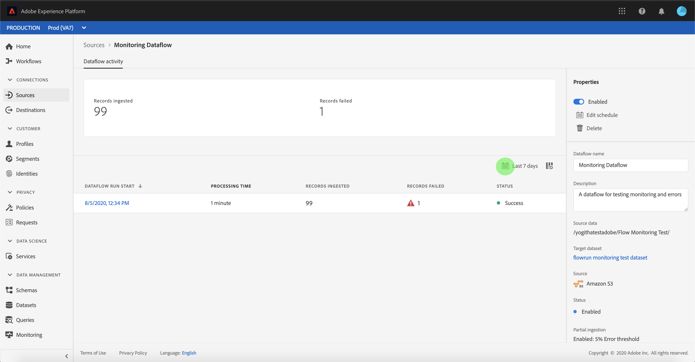
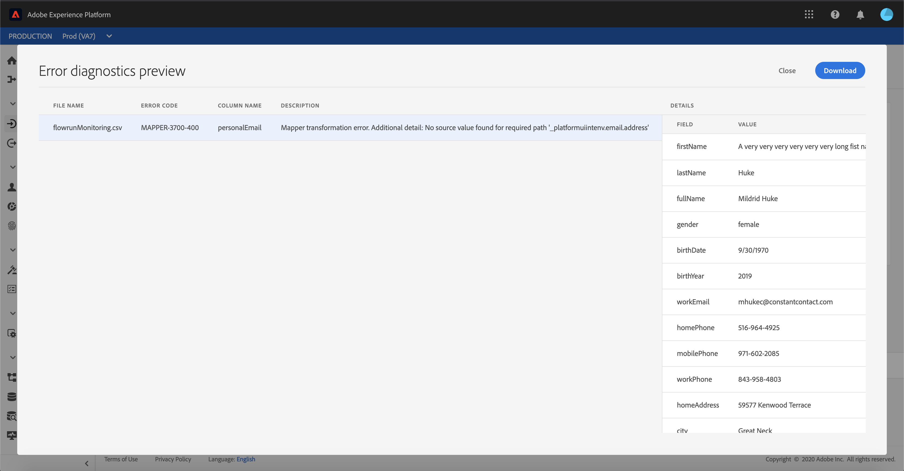

# 监视UI中的数据流

Adobe Experience Platform的源连接器提供按计划接收外部源数据的能力。 本教程提供了从“源”工作区查看现有数据 [!UICONTROL 流的] 步骤。

## 入门指南

本教程需要对Adobe Experience Platform的以下组件进行有效的理解：

- [[!DNL Experience Data Model (XDM)] 系统](../../../xdm/home.md):组织客户体验数 [!DNL Experience Platform] 据的标准化框架。
   - [模式合成基础](../../../xdm/schema/composition.md):了解XDM模式的基本构件，包括模式构成的主要原则和最佳做法。
   - [模式编辑器教程](../../../xdm/tutorials/create-schema-ui.md):了解如何使用模式编辑器UI创建自定义模式。
- [[!DNL Real-time Customer Profile]](../../../profile/home.md):基于来自多个来源的聚集数据提供统一、实时的消费者用户档案。

## 监视数据流

登录Experience Platform [UI](https://platform.adobe.com) ，然后从左 **[!UICONTROL 侧导航]** 中选择 [!UICONTROL “源] ”以访问“源”工作区。 从顶 **[!UICONTROL 部标题]** 中选择视图流，以便对现有数据流进行数据流。

出现一列表现有数据流。 本页是可查看数据流的列表，包括有关其源、用户名、数据流数和状态的信息。

有关状态的详细信息，请参阅下表：

| 状态 | 描述 |
| ------ | ----------- |
| 已启用 | 状 `Enabled` 态表示数据流处于活动状态，并且正在根据它提供的计划接收数据。 |
| 已禁用 | 状 `Disabled` 态表示数据流处于非活动状态，不接收任何数据。 |
| 处理时间 | 状 `Processing` 态表示数据流尚未激活。 创建新数据流后，通常会立即遇到此状态。 |
| 错误 | 状 `Error` 态表示数据流的激活进程已中断。 |

选择左上角的漏斗图标进行排序。

将出现排序面板。 从滚动菜单中选择要访问的源，并从右侧的列表中选择数据流。 您还可以选择省略号()`...`按钮，为所选数据流显示更多可用选项。

“数 **[!UICONTROL 据流活动]** ”页包含有关摄取的记录数和失败记录数的详细信息，以及有关数据流状态和处理时间的信息。 选择数据流上方的日历图标以调整摄取记录的时间范围。

日历允许您视图不同时间段以获取记录。 您可以选择两个预先设置的选项之一“[!UICONTROL 过去7天]”或“[!UICONTROL 过去30天]”。 或者，也可以使用日历设置自定义时间范围。 选择您选择的时间范围，然后选择 **[!UICONTROL “应用]** ”以继续。

默认情况下，“ **[!UICONTROL 数据流]** ”活动 **[!UICONTROL 卡显示与]** 数据流关联的“属性”面板。 从列表中选择流运行以查看其关联的元数据，包括有关其唯一运行ID的信息。

选择 **[!UICONTROL 数据流运行开始]** ，以访问数据 **[!UICONTROL 流运行概述]**。

“数 **[!UICONTROL 据流运行概述]** ”显示有关数据流的信息，包括其元数据、部分摄取状态和分配的错误阈值。 上标题还包含错误摘要。 错误 **[!UICONTROL 摘要包含]** 特定的顶级错误，该错误显示摄取过程在哪个步骤遇到错误。

有关错误摘要中可见的错误，请参阅下 **[!UICONTROL 表]**。

| 错误 | 描述 |
| ---------- | ----------- |
| `CONNECTOR-1001-500` | 从源复制数据时出错。 |
| `CONNECTOR-2001-500` | 将复制的数据处理到时出错 [!DNL Platform]。 此错误可能与分析、验证或转换相关。 |

屏幕的下半部分包含有关Dataflow运 **[!UICONTROL 行错误的信息]**。 从此处，您还可以视图所摄取的文件、预览和下载错误诊断，或下载文件清单。

“数 **[!UICONTROL 据流运行错误]** ”部分显示错误代码、失败记录数以及描述错误的信息。

选择 **[!UICONTROL 预览错误诊断]** ，以查看有关摄取错误的详细信息。

出现 **[!UICONTROL “Error diagnostics(错误诊]** 断预览)”面板。 此屏幕显示有关摄取失败的特定信息，包括文件名、错误代码、发生错误的列的名称以及错误的说明。

此部分还包含包含错误的列的预览符。

>[!IMPORTANT]
>
>要启用 **[!UICONTROL 错误诊断预览]** ，在配置数据流时必 **[!UICONTROL 须激活“部]** 分摄取 **[!UICONTROL ”和“]** 错误诊断”。 这样做将允许系统扫描在流运行期间摄取的所有记录。

预览错误后，可从数据流 **[!UICONTROL 运行]** 概述面板 **[!UICONTROL 中选择]** “下载”以访问完整错误诊断并下载文件清单。 有关详细信息，请 [参阅错误诊](../../../ingestion/batch-ingestion/partial.md#retrieve-errors) 断 [和下载元数](../../../ingestion/batch-ingestion/partial.md#download-metadata) 据的文档。

有关监视数据流和摄取的详细信息，请参阅有关监视流数据 [流的教程](../../../ingestion/quality/monitor-data-flows.md)。

## 后续步骤

通过本教程，您成功访问了Sources工作区中的现有帐户和数 **[!UICONTROL 据流]** 。 现在，下游服务（如和）可 [!DNL Platform] 以使用传入 [!DNL Real-time Customer Profile] 数据 [!DNL Data Science Workspace]。 有关更多详细信息，请参阅以下文档:

- [实时客户用户档案概述](../../../profile/home.md)
- [数据科学工作区概述](../../../data-science-workspace/home.md)
