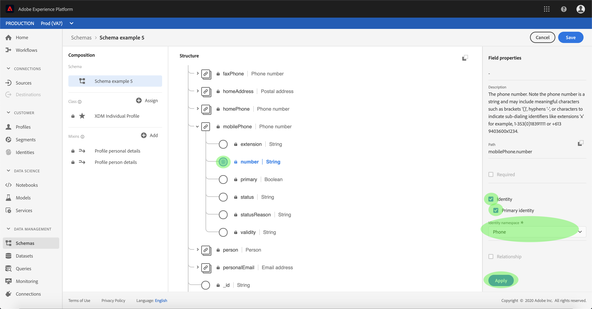

# 激活入站源数据以填充客户用户档案

来自源连接器的入站数据可用于丰富和填充实时客户用户档案数据。

## 入门指南

本教程需要对Adobe Experience Platform的以下组件有充分的了解：

- [体验数据模型(XDM)系统](../../../xdm/home.md): Experience Platform组织客户体验数据的标准化框架。
   - [模式合成基础](../../../xdm/schema/composition.md): 了解XDM模式的基本构件，包括模式构成的主要原则和最佳做法。
   - [模式编辑器教程](../../../xdm/tutorials/create-schema-ui.md): 了解如何使用模式编辑器UI创建自定义模式。
- [实时客户用户档案](../../../profile/home.md): 基于来自多个来源的聚集数据提供统一、实时的消费者用户档案。

此外，本教程要求您已经创建并配置了源连接器。  有关在UI中创建不同连接器的一列表教程，请参阅源 [连接器概述](../../home.md)。

## 填充您的实时客户用户档案数据

为了丰富客户用户档案,目标集的源模式必须兼容，才能用于实时客户用户档案。 兼容模式满足以下要求：

- 该模式至少具有一个指定为标识属性的属性。
- 模式具有定义为主标识的标识属性。
- 数据流中存在映射，其中主标识是目标属性。

在“源”工作区中，单击“浏 **览** ”选项卡以列表基本连接。 在显示的列表中，找到包含要用来填充用户档案的数据流的连接。 单击连接的名称以访问其详细信息。

出现连接的“ *源活动* ”屏幕，显示连接正在将源数据引入的数据集。 单击要启用用户档案的数据集的名称。

出现 *数据集活动* 屏幕。 屏 *幕右侧* 的“属性”列显示数据集的详细信息，包括一个 **用户档案开关** ，以及指向数据集所附带模式的链接。 单击模式的名称以视图其合成。

出 *现模式编辑* 器，在中心画布中显示模式的结构。 在画布中，选择要设置为主标识的字段。 在显示的 *字段属性* 选项卡下，选择“标 **识”复选** 框 **，然后选**&#x200B;择主标识。 最后，选择适当的 **身份命名空间**，然后单击 **应用**。

单击模式结构的顶级对象，将显示 *模式属性* 列。 通过切换模式开关启用用户档案 **进行** 用户档案。 单击 **保存** ，以完成更改。

现在，模式已启用用户档案，请返回“数 *据集活动* ”屏幕，并通过单击“属性”列中的 **用户档案** 切换来启 *用数据集* 。

在启用模式和数据集进行用户档案的情况下，引入到该数据集中的数据现在也将填充客户用户档案。

>[!NOTE] 最近启用的数据集中的现有数据不会被用户档案占用

## 后续步骤

通过遵循本教程，您成功激活了用户档案填充的入站数据。 有关详细信息，请参 [阅实时客户用户档案概述](../../../profile/home.md)。