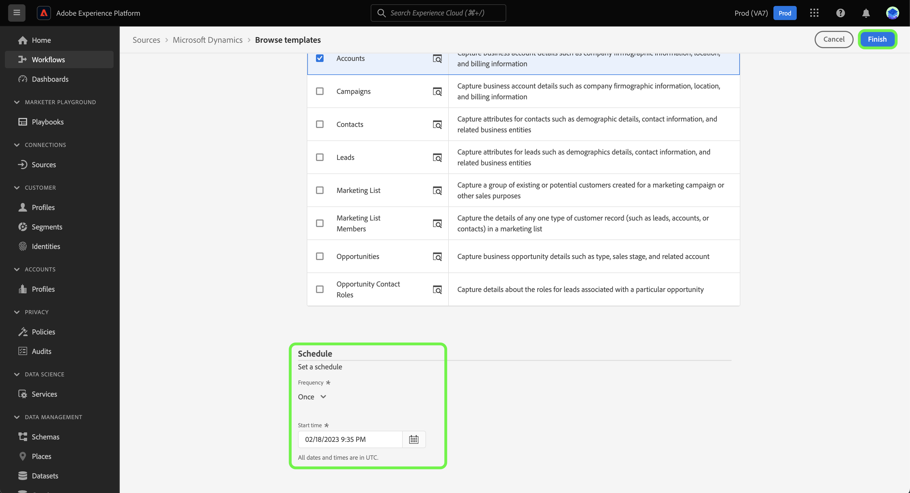

# （测试版）使用UI中的模板创建源数据流

>[!IMPORTANT]
>
>模板处于测试阶段，受以下来源支持：
>
>* [[!DNL Marketo Engage]](../../connectors/adobe-applications/marketo/marketo.md)
>* [[!DNL Microsoft Dynamics]](../../connectors/crm/ms-dynamics.md)
>* [[!DNL Salesforce]](../../connectors/crm/salesforce.md)
>
>文档和功能可能会发生更改。

Adobe Experience Platform提供了预配置的模板，您可以使用这些模板来加快数据摄取流程。 模板包括自动生成的资产，例如架构、数据集、身份、映射规则、身份命名空间和数据流，在将数据从源引入到Experience Platform时，可以使用这些资产。

使用模板，您可以：

* 通过加快创建模板化资产，缩短摄取的时间和价值实现过程。
* 最大限度地减少在手动数据获取过程中可能发生的错误。
* 随时更新自动生成的资产，以适合您的用例。

以下教程提供了有关如何在Platform UI中使用模板的步骤。

## 快速入门

本教程需要对Experience Platform的以下组件有一定的了解：

* [源](../../home.md):Experience Platform允许从各种源摄取数据，同时让您能够使用Platform服务来构建、标记和增强传入数据。
* [[!DNL Experience Data Model (XDM)] 系统](../../../xdm/home.md):Experience Platform组织客户体验数据的标准化框架。
* [沙箱](../../../sandboxes/home.md):Experience Platform提供将单个Platform实例分区为单独虚拟环境的虚拟沙盒，以帮助开发和改进数字体验应用程序。

## 在平台UI中使用模板 {#use-templates-in-the-platform-ui}

>[!CONTEXTUALHELP]
>id="platform_sources_templates_accounttype"
>title="选择业务类型"
>abstract="为您的用例选择适当的业务类型。您的访问权限可能因 Real-Time Customer Data Platform 订阅帐户而异。"
>additional-url="https://experienceleague.adobe.com/docs/experience-platform/rtcdp/overview.html?lang=zh-Hans" text="Real-Time CDP 概述"

在平台UI中，选择 **[!UICONTROL 源]** 从左侧导航访问 [!UICONTROL 源] 工作区，并查看Experience Platform中可用的源目录。

使用 *[!UICONTROL 类别]* 菜单来按类别筛选源。 或者，在搜索栏中输入源名称，以从目录中查找特定源。

转到 [!UICONTROL Adobe应用程序] 类别以查看 [!DNL Marketo Engage] 源卡，然后选择 [!UICONTROL 添加数据] 开始。

此时会出现一个弹出窗口，向您提供浏览模板或使用现有架构和数据集的选项。

* **浏览模板**:源模板会使用映射规则自动创建架构、身份、数据集和数据流。 您可以根据需要自定义这些资产。
* **使用我的现有资产**:使用您创建的现有数据集和架构摄取数据。 您还可以根据需要创建新数据集和架构。

要使用自动生成的资产，请选择 **[!UICONTROL 浏览模板]** 然后选择 **[!UICONTROL 选择]**.

### 身份验证

此时会显示身份验证步骤，提示您创建新帐户或使用现有帐户。

>[!BEGINTABS]

>[!TAB 使用现有帐户]

要使用现有帐户，请选择 [!UICONTROL 现有帐户] 然后，从显示的列表中选择要使用的帐户。

>[!TAB 创建新帐户]

要创建新帐户，请选择 **[!UICONTROL 新帐户]**，然后提供源连接详细信息和帐户身份验证凭据。 完成后，选择 **[!UICONTROL 连接到源]** 并留出一些时间建立新连接。

>[!ENDTABS]

### 选择模板

根据您选择的业务类型，将显示模板列表。 选择预览图标  模板名称旁边，以预览模板中的示例数据。

此时将显示预览窗口，用于浏览和检查模板中的示例数据。 完成后，选择 **[!UICONTROL 收到了]**.

接下来，从列表中选择要使用的模板。 您可以选择多个模板并一次创建多个数据流。 但是，每个帐户只能使用一次模板。 选择模板后，选择 **[!UICONTROL 完成]** 并允许一些时间生成资产。

如果从可用模板列表中选择一个或多个部分项，则仍将生成所有B2B架构和身份命名空间，以确保正确配置架构间的B2B关系。

>[!NOTE]
>
>将从选定范围中禁用已使用的模板。

### 设置计划

的 [!DNL Microsoft Dynamics] 和 [!DNL Salesforce] 源都支持调度数据流。

使用计划界面为数据流配置摄取计划。 将摄取频度设置为 **一次** 创建一次性摄取。

或者，您也可以将摄取频率设置为 **分钟**, **小时**, **日**&#x200B;或 **周**. 如果计划多个摄取的数据流，则必须设置一个间隔，以在每个摄取之间建立一个时间范围。 例如，摄取频度设置为 **小时** 和间隔设置为 **15** 表示您的数据流已计划在每次 **15小时**.

在此步骤中，您还可以启用 **回填** 并为数据的增量摄取定义一列。 回填用于摄取历史数据，而您为增量摄取定义的列允许将新数据与现有数据区分开。

完成摄取计划的配置后，选择 **[!UICONTROL 完成]**.

### 审核资产 {#review-assets}

>[!CONTEXTUALHELP]
>id="platform_sources_templates_review"
>title="查看自动生成的资产"
>abstract="生成所有资产最多需要五分钟时间。如果您选择离开页面，在生成完资产后，将向您发送通知以返回页面。您可以在资产生成后查看资产，并随时对数据流进行其他配置。"

的 [!UICONTROL 审核模板资产] 页面会将自动生成的资产显示为模板的一部分。 在本页中，您可以查看与源连接关联的自动生成的架构、数据集、身份命名空间和数据流。 生成所有资产最多需要五分钟时间。如果您选择离开页面，在生成完资产后，将向您发送通知以返回页面。您可以在资产生成后查看资产，并随时对数据流进行其他配置。

默认情况下，会启用自动生成的数据流。 选择省略号(`...`)，然后选择 **[!UICONTROL 预览映射]** 以查看为数据流创建的映射集。

此时会显示预览页，用于检查源数据字段和目标架构字段之间的映射关系。 查看数据流的映射后。 选择 **[!UICONTROL 明白了。]**

您可以在执行后随时更新数据流。 选择省略号(`...`)，然后选择 **[!UICONTROL 更新数据流]**. 您将转到源工作流页面，在该页面中可以更新数据流详细信息，包括部分摄取、错误诊断和警报通知的设置，以及数据流的映射。

您可以使用架构编辑器视图对自动生成的架构进行更新。 请访问 [使用架构编辑器](../../../xdm/tutorials/create-schema-ui.md) 以了解更多信息。

## 后续步骤

在本教程之后，您现在已使用模板创建数据流以及模式、数据集和身份命名空间等资产。 有关来源的一般信息，请访问 [源概述](../../home.md).

## 附录

以下部分提供了有关模板的其他信息。

### 使用通知面板可返回到审阅页面

Adobe Experience Platform警报支持模板，您可以使用通知面板接收有关资产状态的更新，还可以导航回审阅页面。

选择Platform UI顶部标题的通知图标，然后选择状态警报以查看您要查看的资产。

