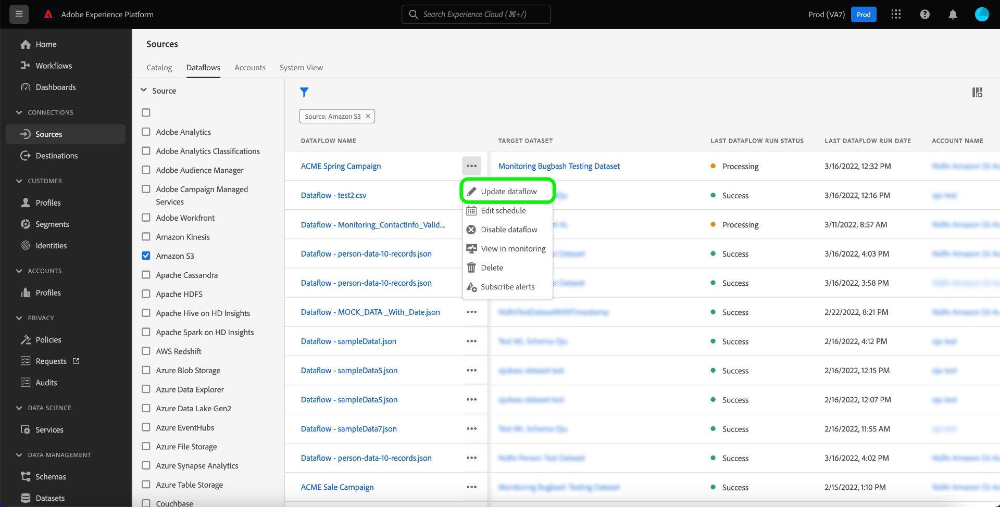

# 更新UI中的数据流

本教程提供了有关如何使用源工作区更新现有数据流（包括其计划和映射）的步骤。

## 快速入门

本教程需要对以下Adobe Experience Platform组件有一定的了解：

* [源](../../home.md)：Experience Platform允许从各种源摄取数据，同时允许您使用Platform服务来构建、标记和增强传入数据。
* [沙盒](../../../sandboxes/home.md)：Experience Platform提供了将单个Platform实例划分为多个单独的虚拟环境的虚拟沙盒，以帮助开发和改进数字体验应用程序。

## 更新数据流 {#update-dataflows}

>[!CONTEXTUALHELP]
>id="platform_sources_dataflows_daysRemaining"
>title="数据集到期"
>abstract="此列指示目标数据集在自动到期之前剩余的天数。 如果目标数据集到期，则数据流将失败。要防止数据流失败，请确保将目标数据集设置为在正确的日期到期。请参阅文档以了解如何更新到期日期。"

在Platform UI中，从左侧导航中选择&#x200B;**[!UICONTROL 源]**&#x200B;以访问[!UICONTROL 源]工作区。 从顶部标题中选择&#x200B;**[!UICONTROL 数据流]**&#x200B;以查看现有数据流列表。

[!UICONTROL 数据流]页面包含所有现有数据流的列表，包括有关其相应的目标数据集、源和帐户名称的信息。

要对列表进行排序，请选择左上角的过滤器图标以使用排序面板。

排序面板提供所有可用源的列表。 您可以从列表中选择多个源，以访问属于不同源的数据流的过滤选择。

选择要使用的源以查看其现有数据流的列表。 标识要更新的数据流后，选择数据流名称旁边的省略号(`...`)。

此时会显示一个下拉菜单，为您提供用于更新所选数据流的选项。 在此处，您可以选择更新数据流的映射集和摄取计划。 您还可以选择相应选项以在监视功能板中检查数据流、订阅警报以及禁用或删除数据流。

要更新数据流的信息，请选择&#x200B;**[!UICONTROL 更新数据流]**。

### 添加数据

出现[!UICONTROL 添加数据]步骤。 选择适当的数据格式以查看所选数据的内容，然后选择&#x200B;**[!UICONTROL 下一步]**&#x200B;以继续。

### 数据流详细信息

在[!UICONTROL 数据流详细信息]页面中，您可以为数据流提供更新的名称和描述，并重新配置数据流的错误阈值。 在此步骤中，您还可以配置或修改警报订阅的设置。

提供更新的值后，请选择&#x200B;**[!UICONTROL 下一步]**。

### 映射

>[!NOTE]
>
>以下源当前不支持编辑映射功能： Adobe Analytics、Adobe Audience Manager、HTTP API和[!DNL Marketo Engage]。

[!UICONTROL 映射]页面为您提供了一个界面，您可以在其中添加和删除与数据流关联的映射集。

映射界面显示数据流的现有映射集，而不是新的推荐映射集。 映射更新仅适用于计划在未来运行的数据流。 计划进行一次性摄取的数据流无法更新其映射集。

在此处，您可以使用映射界面修改应用于数据流的映射集。 有关如何使用映射界面的完整步骤，请参阅[数据准备UI指南](../../../data-prep/ui/mapping.md)以了解更多信息。

### 计划中

此时将显示[!UICONTROL 计划]步骤，允许您更新数据流的摄取计划并使用更新的映射自动摄取选定的源数据。

>[!NOTE]
>
>无法重新计划一次性摄取的数据流。

您还可以使用数据流页面中提供的内联更新选项更新数据流的摄取计划。

从数据流页面中，选择数据流名称旁边的省略号(`...`)，然后从显示的下拉菜单中选择&#x200B;**[!UICONTROL 编辑计划]**。

**[!UICONTROL 编辑计划]**&#x200B;对话框为您提供了更新数据流的摄取频率和间隔率的选项。 设置更新的频率和间隔值后，选择&#x200B;**[!UICONTROL 保存]**。

### 审查

此时将显示&#x200B;**[!UICONTROL 审核]**&#x200B;步骤，允许您在更新数据流之前对其进行审核。

查看数据流后，选择&#x200B;**[!UICONTROL 完成]**，并留出一些时间来创建具有新映射集的数据流。

## 后续步骤

通过学习本教程，您已成功使用[!UICONTROL 源]工作区来更新数据流的摄取计划和映射集。

有关如何使用[!DNL Flow Service] API以编程方式执行这些操作的步骤，请参阅有关[使用流服务API更新数据流](../../tutorials/api/update-dataflows.md)的教程。
